# 02. As-Is / To-Be 業務フロー

作成日: 2026-08-04

現行の業務フローを画面遷移とデータの流れから再構成し、新システムでのあるべき姿を定義する。現行フローで観測できていない部分は `[要確認]` を付す。

---

## 1. 全体像

### 1.1 As-Is（現行）

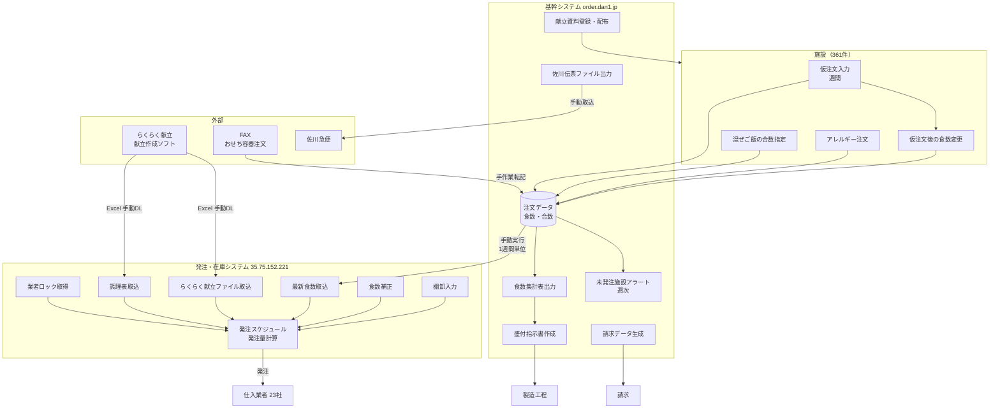

### 1.2 To-Be（新システム）

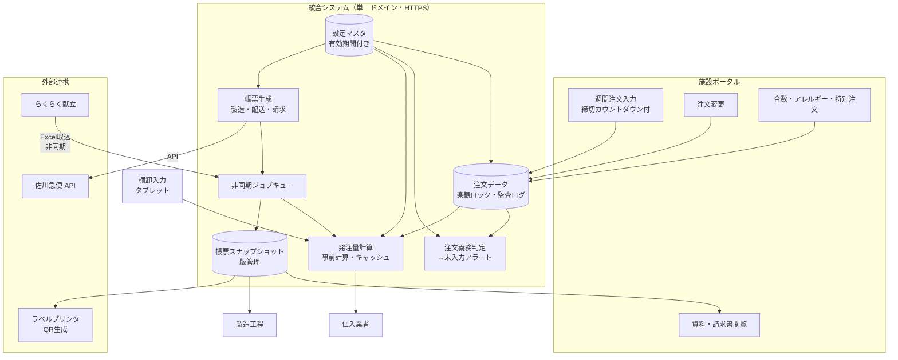

**主要な変更点**

| 観点 | As-Is | To-Be |
|------|-------|-------|
| システム境界 | 2システム（別ドメイン・別UI） | 1システム（単一ドメイン） |
| 業者ロック | ログイン後に必須取得 | 廃止。レコード単位の楽観ロック |
| データ取込 | 手動・同期・1週間制限 | 非同期ジョブ・期間制限なし |
| 発注量計算 | 画面表示時に都度計算 | 取込完了時に事前計算・キャッシュ |
| 帳票 | 参照時に現在の設定で描画 | 生成時点のスナップショットを保存 |
| 締切 | コード内固定（17:00）＋担当者依頼 | マスタ設定＋例外日設定 |
| おせち容器注文 | FAX → 手作業転記 | 施設ポータルの特別注文枠 |
| 佐川伝票 | ファイル出力 → 手動取込 | API 連携 |

---

## 2. 受注業務フロー

### 2.1 As-Is: 仮注文から確定まで

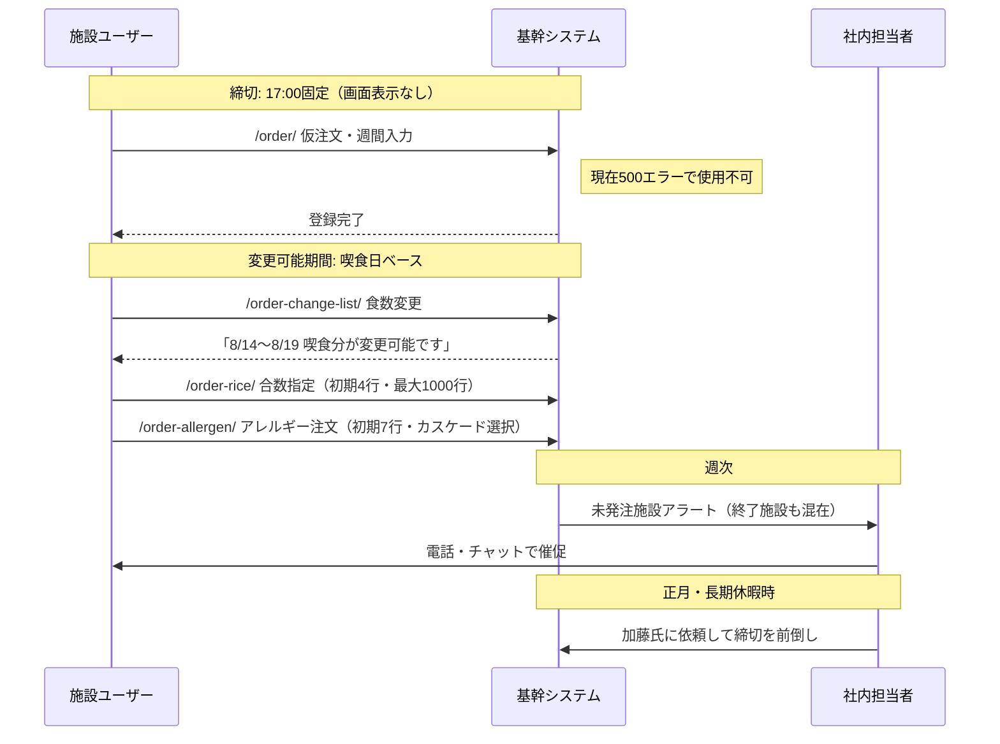

**確認された制約**

| 制約 | 内容 | 根拠 |
|------|------|------|
| 締切時刻が非表示 | 元旦注文（10時）以外は締切時刻が画面に出ない | REQ-13 |
| 変更可能期間の表示 | 「8月14日 〜 8月19日 喫食分が変更可能です」は実装済み | `05_order_ui_facility_99999.md` §3.1 |
| 週間入力画面が停止 | `/order/` が HTTP 500 | REQ-04 |
| 締切前倒しが手作業 | 社内担当者への依頼が必要 | REQ-13 |
| アラートの精度不足 | 終了施設が残り続ける | REQ-20 |

### 2.2 To-Be: 受注フロー

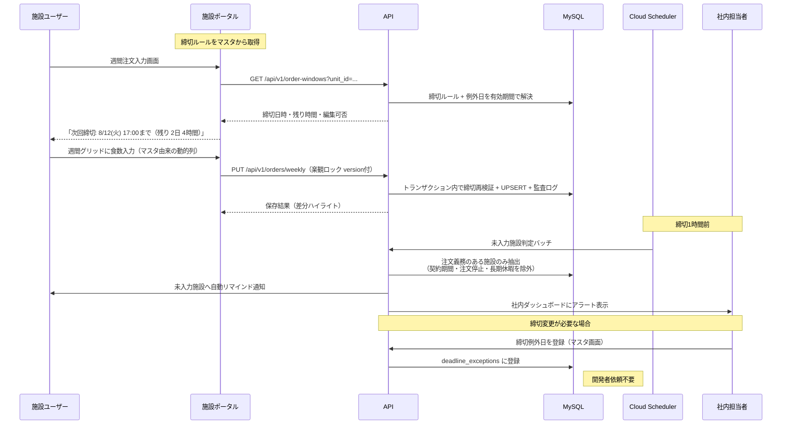

**新フローで解決される課題**

| REQ | 解決方法 |
|-----|---------|
| REQ-04 | 週間グリッドUIを新規設計。列構成をマスタから動的生成 |
| REQ-09 | 嚥下食追加時、マスタに区分を追加すれば注文画面の列が自動で増える |
| REQ-13 | 締切ルール・例外日をマスタ化。全画面に締切カウントダウンを表示 |
| REQ-20 | 未入力判定を「注文義務のある施設」に限定。契約終了・注文停止・長期休暇を除外 |

---

## 3. 発注・在庫業務フロー

### 3.1 As-Is: 発注量計算まで

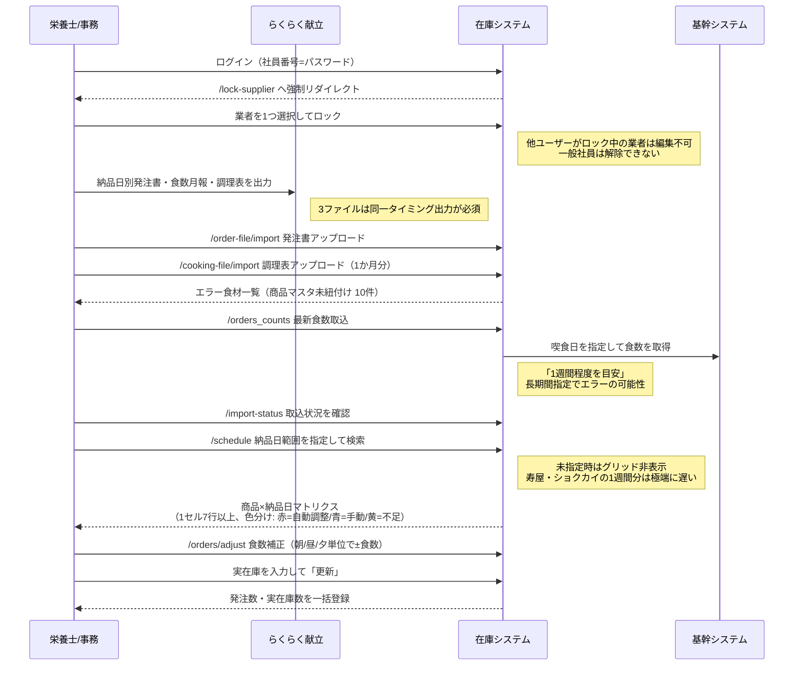

**確認された制約**

| 制約 | 内容 | 根拠 |
|------|------|------|
| 業者ロック必須 | 未選択時は `/lock-supplier` へリダイレクト | `02_screen_inventory_inventory.md` 制約1 |
| 3ファイル同時出力 | 発注書・食数月報・調理表は同一タイミング出力が前提 | 同 §3 |
| 食数取込の期間制限 | 1週間程度を推奨（画面注意書き） | 同 制約2 |
| 納品日必須 | `/schedule` は納品日範囲未指定でグリッド非表示 | `07_schedule_grid_survey.md` §1 |
| 商品絞込なし | 特定材料のみの出力ができない | REQ-23 |

### 3.2 To-Be: 発注・在庫フロー

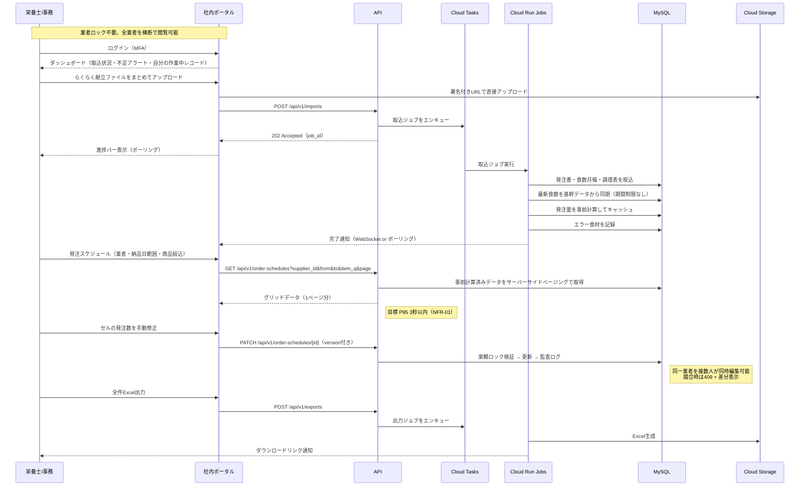

**新フローで解決される課題**

| REQ | 解決方法 |
|-----|---------|
| REQ-21 | 参照ロジックに「直近の合数を参照」を追加。フォールバック順序も設定可能 |
| REQ-22 | 業者ロック廃止 + 楽観ロック、サーバーサイドページング、発注量の事前計算 |
| REQ-23 | 商品名・カテゴリでの絞込、絞込条件の保存（ビュー）、大量出力の非同期化 |
| A-06 | エラー食材を取込時に検出し、商品マスタへの紐付けを画面から実施 |
| A-07 | 3ファイルを個別に取込可能にし、揃った時点で計算を実行 |

---

## 4. 献立資料・帳票フロー

### 4.1 As-Is: 資料生成と配布

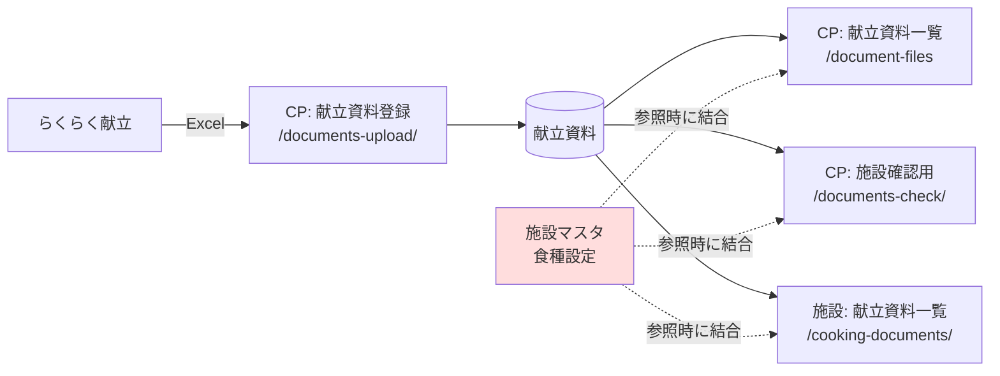

**問題の構造。** 施設マスタの食種設定が、資料の**参照時**に結合されていると推定される。そのため食種を「汁無し」に変更すると、過去に生成した資料の表示内容まで汁無しに変わる（REQ-16）。CP 側の献立資料管理に薄味が混入する事象（REQ-17）も同根と考えられる。

### 4.2 To-Be: 資料の版管理

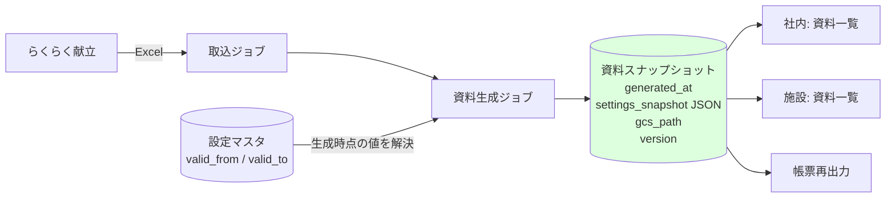

**設計方針**

| 方針 | 内容 |
|------|------|
| 設定に有効期間を持たせる | 施設の食種・献立種類・アレルギー設定に `valid_from` / `valid_to` を持たせ、「いつ時点の設定か」を解決できるようにする |
| 生成時点の設定を保存 | 資料・帳票の生成時に、適用した設定内容を `settings_snapshot`（JSON）として保存する |
| 参照時に再計算しない | 一度生成した資料は GCS 上のファイルとスナップショットのみを参照し、現在のマスタを結合しない |
| 再生成は明示操作 | 過去分を作り直す場合は「再生成」を明示的に実行し、新しいバージョンとして追加する（旧版は保持） |
| 食種変更は将来分のみ影響 | 食種を変更しても、変更日以降の喫食日を対象とする資料にのみ反映される |

### 4.3 To-Be: 配送帳票と QR

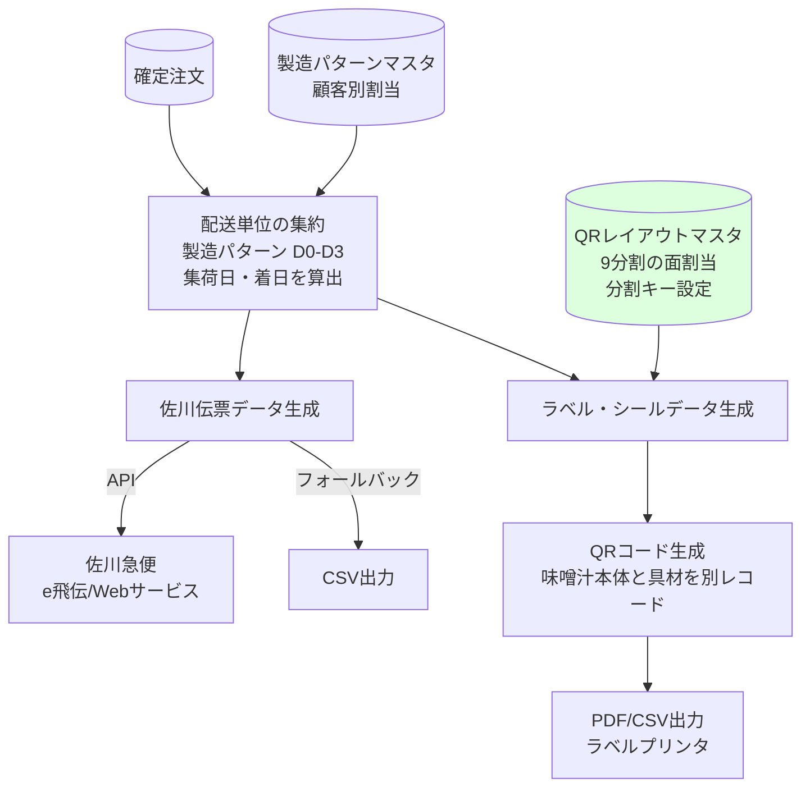

**QR の分割単位。** 現行は味噌汁と味噌汁具が同一 QR になっている（REQ-15）。新システムでは QR に載せる情報の分割キーをマスタで設定し、料理の構成要素（本体・具材）を別レコードとして扱う。9分割は1シートに9面のラベルを配置する印刷レイアウトを指し、面ごとにどのレコードを割り当てるかもマスタで設定する。`[要確認]` 現行の QR ペイロード仕様とラベルプリンタの機種。

---

## 5. 請求業務フロー

### 5.1 As-Is

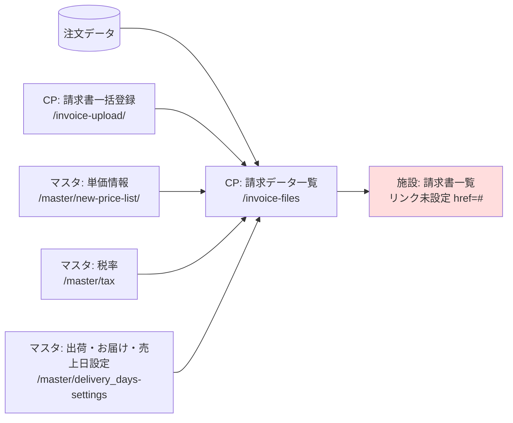

施設側の「請求書一覧」メニューは `href="#"` でリンクが設定されておらず、施設が請求書を閲覧できる状態か確認できなかった。社内から施設ごとの請求書発行状況を確認する手段も不明（REQ-03）。

### 5.2 To-Be

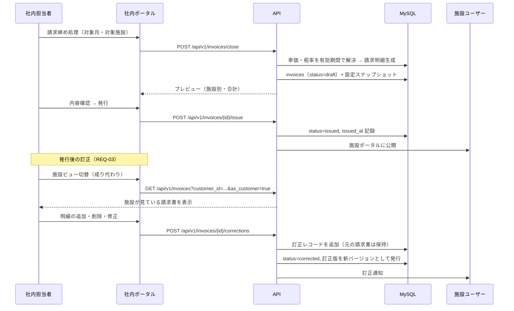

**設計方針**

| 方針 | 内容 |
|------|------|
| 発行済み請求書は不変 | 訂正は元データを書き換えず、訂正レコード＋新バージョンとして記録する |
| 成り代わり閲覧 | 社内担当者が施設ユーザーの画面を代理で確認できる。操作は監査ログに「代理操作」として記録 |
| 訂正履歴の可視化 | 施設側でも訂正前後の差分を確認できる |

---

## 6. 新規業務フロー

### 6.1 おせち容器注文（REQ-19）

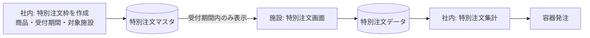

現行は FAX 受信 → 手作業転記。新システムでは期間限定の注文枠を社内が作成し、受付期間中のみ施設ポータルに注文欄が表示される。おせち容器はこの枠組みの一例として扱う。

### 6.2 試食会対応（REQ-24）

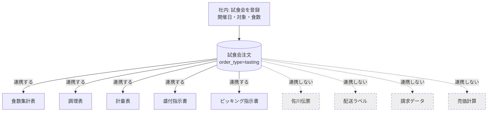

注文に区分（`order_type`）を持たせ、帳票生成時に区分ごとの連携可否をマスタで制御する。試食会は「製造帳票のみ連携」の区分として定義する。

---

## 7. 業務カレンダーと締切（To-Be）

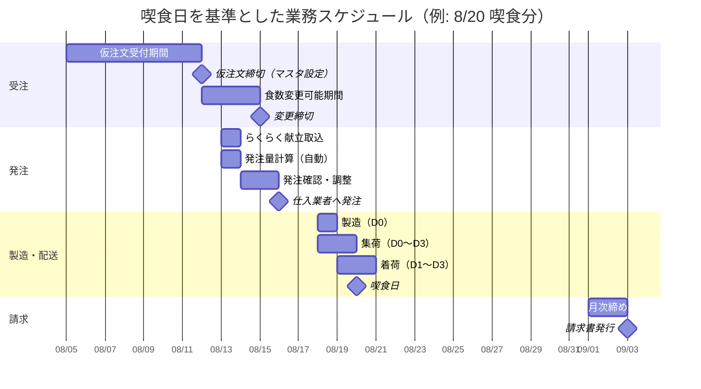

`[要確認]` 上記の日数関係は現行画面のメッセージ（「8月14日 〜 8月19日 喫食分が変更可能です」など調査日 8/4 時点の表示）から逆算した推定値。実際のリードタイム（仮注文締切から喫食日までの日数、変更可能期間の長さ）はクライアント確認が必要。

---

## 8. 関連ドキュメント

| 参照先 | 内容 |
|--------|------|
| `03_functional_requirements.md` | 各フローを機能要件に分解したもの |
| `06_master_management_spec.md` | 締切ルール・製造パターン・参照ロジックの設定仕様 |
| `07_screen_spec.md` | 各フローに対応する画面仕様 |
| `09_integration_spec.md` | らくらく献立・佐川急便・QR/ラベルの連携仕様 |
