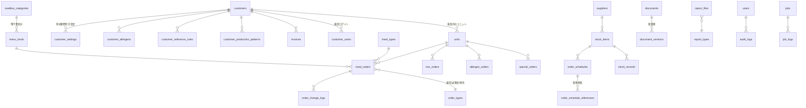

# 05. データモデル設計

作成日: 2026-08-04
DB: MySQL 8.0（新規構築） / ORM: Prisma

**位置づけ**: 既存 DB スキーマへのアクセスがないため、本設計は業務要件から導出した `[設計案]` である。既存データを移行する際は `12_migration_plan.md` のマッピング表と照合して確定させる。

---

## 1. 設計原則

### 1.1 命名規約

| 対象 | 規約 | 例 |
|------|------|-----|
| テーブル名 | スネークケース・複数形 | `meal_orders` |
| カラム名 | スネークケース | `service_date` |
| 主キー | `id`（BIGINT UNSIGNED AUTO_INCREMENT） | — |
| 外部キー | `<単数形テーブル名>_id` | `customer_id` |
| 業務コード | `<対象>_code` | `customer_code` |
| 日付 | `_date`（DATE）/ `_at`（DATETIME） | `service_date`, `created_at` |
| 真偽値 | `is_` / `has_` プレフィックス | `is_active` |
| 有効期間 | `valid_from` / `valid_to` | — |
| Prisma モデル名 | パスカルケース単数形 + `@@map` | `model MealOrder { @@map("meal_orders") }` |

### 1.2 共通カラム

全テーブルに以下を持たせる。

| カラム | 型 | 説明 |
|--------|----|------|
| `id` | BIGINT UNSIGNED | 主キー |
| `created_at` | DATETIME(3) | 作成日時 |
| `updated_at` | DATETIME(3) | 更新日時 |
| `created_by` | BIGINT UNSIGNED NULL | 作成者（`users.id`） |
| `updated_by` | BIGINT UNSIGNED NULL | 更新者 |

マスタ系テーブルは追加で以下を持つ。

| カラム | 型 | 説明 |
|--------|----|------|
| `deleted_at` | DATETIME(3) NULL | 論理削除。NULL が有効 |
| `sort_order` | INT | 表示順（FR-201） |
| `is_active` | BOOLEAN | 有効フラグ |

トランザクション系テーブルは追加で以下を持つ。

| カラム | 型 | 説明 |
|--------|----|------|
| `version` | INT | 楽観ロック用（FR-307） |

### 1.3 設計方針

**設定の有効期間管理（FR-202, REQ-16）。** 業務日付によって値が変わる設定は、更新時に既存行を書き換えず新しい有効期間の行を追加する。`valid_from` / `valid_to` を持つ設定テーブルを分離し、「特定日時点の設定」を解決するクエリで参照する。これにより食種変更が過去の帳票に遡及しない。

**帳票のスナップショット（FR-402, REQ-16, REQ-17）。** 帳票・資料テーブルは生成時に適用した設定を `settings_snapshot`（JSON）として保存する。参照時にマスタを結合しない。

**論理削除と参照整合性。** マスタは論理削除（`deleted_at`）とし、既に参照されている過去データは影響を受けない。外部キー制約は `ON DELETE RESTRICT` とし、物理削除を防ぐ。

**JSON カラムの使用範囲。** MySQL 8.0 の JSON 型は、スナップショット（`settings_snapshot`）、ジョブパラメータ（`params`）、監査ログの差分（`before` / `after`）に限定する。検索条件になる項目は必ず通常カラムとして持つ。

**金額と数量。** 金額は `DECIMAL(12,2)`、数量（食数）は `INT`、重量・容量は `DECIMAL(12,3)`（現行の発注スケジュールが `217.000` のように小数3桁を表示していることに合わせる）。浮動小数点型は使用しない。

**文字セット。** `utf8mb4` / `utf8mb4_0900_ai_ci`。施設名・商品名に全角括弧や記号（例: 「豚ミンチ（フ）」「寿屋商事 1」）が含まれるため4バイト文字に対応する。

---

## 2. ER 概要



### テーブル分類と件数見積

| 分類 | テーブル数 | 主なテーブル | 想定行数（3年後） |
|------|-----------|------------|-----------------|
| 認証・組織 | 8 | `users`, `customers`, `units` | 〜5,000 |
| マスタ | 24 | `meal_types`, `menu_kinds`, `swallow_categories` | 〜10,000 |
| 設定（有効期間付き） | 8 | `customer_settings`, `unit_prices` | 〜50,000 |
| 受注 | 10 | `meal_orders`, `rice_orders`, `allergen_orders` | 2,000万 |
| 資料・帳票 | 8 | `documents`, `report_files` | 150万 |
| 発注・在庫 | 14 | `order_schedules`, `stock_records` | 180万 |
| 請求 | 6 | `invoices`, `invoice_lines` | 50万 |
| 共通基盤 | 8 | `audit_logs`, `jobs`, `notifications` | 1,000万 |
| **合計** | **86** | — | — |

---

## 3. 認証・組織

### 3.1 users（社内ユーザー）

FR-101, FR-103, FR-104 に対応。

| カラム | 型 | NULL | 説明 |
|--------|----|------|------|
| `id` | BIGINT UNSIGNED | — | PK |
| `employee_no` | VARCHAR(20) | — | 社員番号。UNIQUE。ログインID（例: `100002`） |
| `haccp_no` | VARCHAR(20) | ○ | HACCPアプリ番号。UNIQUE（例: `00020`）。別名ログイン可（FR-103） |
| `name` | VARCHAR(100) | — | 氏名（例: `和田 洋宗`） |
| `email` | VARCHAR(255) | ○ | UNIQUE。通知送信先 |
| `password_hash` | VARCHAR(255) | — | Argon2id |
| `password_changed_at` | DATETIME(3) | ○ | 初回変更強制の判定用 |
| `mfa_secret` | VARCHAR(255) | ○ | TOTP シークレット（暗号化） |
| `mfa_enabled` | BOOLEAN | — | 既定 false |
| `role_id` | BIGINT UNSIGNED | — | FK → `roles` |
| `failed_login_count` | INT | — | 既定 0 |
| `locked_until` | DATETIME(3) | ○ | アカウントロック解除時刻 |
| `last_login_at` | DATETIME(3) | ○ | — |
| `is_active` | BOOLEAN | — | — |
| `deleted_at` | DATETIME(3) | ○ | — |

**インデックス**: `UNIQUE(employee_no)`, `UNIQUE(haccp_no)`, `UNIQUE(email)`, `INDEX(role_id)`

**移行時の注意**: 現行の在庫システムはパスワードが社員番号と同一（A-01）。移行時は全ユーザーに初期パスワードを再発行し、初回ログインで変更を強制する。

### 3.2 roles / permissions / role_permissions

FR-104 に対応。詳細は `10_auth_roles.md`。

`roles`: `code`（`system_admin` / `internal_admin` / `internal_staff` / `facility_admin` / `facility_staff`）, `name`, `scope`（`internal` / `facility`）

`permissions`: `code`（例: `order.create`, `master.deadline.update`, `invoice.correct`）, `name`, `category`

`role_permissions`: `role_id`, `permission_id` の複合PK

### 3.3 user_supplier_scopes（担当業者の制限）

社内一般ユーザーの操作可能業者を制限する。現行 `/user/lockable-suppliers/{id}` に相当。ただし**ロックではなく権限範囲**として扱う（REQ-22）。

| カラム | 型 | 説明 |
|--------|----|------|
| `user_id` | BIGINT UNSIGNED | FK → `users` |
| `supplier_id` | BIGINT UNSIGNED | FK → `suppliers` |

複合PK。レコードが存在しないユーザーは全業者を操作可能（管理者相当）。

### 3.4 customers（施設・顧客）

FR-106 に対応。現行の361件。

| カラム | 型 | NULL | 説明 |
|--------|----|------|------|
| `id` | BIGINT UNSIGNED | — | PK |
| `customer_code` | VARCHAR(20) | — | 施設番号。UNIQUE（例: `99999`） |
| `name` | VARCHAR(200) | — | 施設名 |
| `name_kana` | VARCHAR(200) | ○ | 検索用 |
| `short_name` | VARCHAR(100) | ○ | 帳票用 |
| `customer_group_id` | BIGINT UNSIGNED | ○ | FK → `customer_groups`。締切・設定の一括適用単位 |
| `postal_code` | VARCHAR(8) | ○ | — |
| `prefecture` | VARCHAR(10) | ○ | — |
| `address` | VARCHAR(255) | ○ | — |
| `phone` | VARCHAR(20) | ○ | — |
| `fax` | VARCHAR(20) | ○ | — |
| `contact_name` | VARCHAR(100) | ○ | 担当者名（個人情報。NFR-12） |
| `contract_start_date` | DATE | — | 契約開始日 |
| `contract_end_date` | DATE | ○ | 契約終了日。NULL は継続中 |
| `is_internal_test` | BOOLEAN | — | 社内テスト用（現行 99999 が該当する可能性） |
| `is_active` | BOOLEAN | — | — |
| `deleted_at` | DATETIME(3) | ○ | — |

**インデックス**: `UNIQUE(customer_code)`, `INDEX(customer_group_id)`, `INDEX(contract_start_date, contract_end_date)`, `INDEX(name_kana)`

**REQ-20 との関係**: 未入力施設アラートの判定で `contract_end_date` を使う。ただし契約終了日が未来でも実質注文がない施設を除外するため、`order_suspensions`（3.7）と併用する。

### 3.5 units（ユニット）

| カラム | 型 | NULL | 説明 |
|--------|----|------|------|
| `id` | BIGINT UNSIGNED | — | PK |
| `customer_id` | BIGINT UNSIGNED | — | FK → `customers` |
| `unit_code` | VARCHAR(20) | — | ユニットコード |
| `name` | VARCHAR(100) | — | ユニット名（例: `見本`, `針刺し用`, `保存`） |
| `sort_order` | INT | — | 表示順 |
| `delivery_address_id` | BIGINT UNSIGNED | ○ | FK → `delivery_addresses`。届け先 |
| `is_active` | BOOLEAN | — | — |
| `deleted_at` | DATETIME(3) | ○ | — |

**インデックス**: `UNIQUE(customer_id, unit_code)`, `INDEX(customer_id, sort_order)`

### 3.6 customer_users（施設ログインユーザー）

| カラム | 型 | NULL | 説明 |
|--------|----|------|------|
| `id` | BIGINT UNSIGNED | — | PK |
| `customer_id` | BIGINT UNSIGNED | — | FK → `customers` |
| `login_id` | VARCHAR(50) | — | UNIQUE |
| `name` | VARCHAR(100) | — | — |
| `email` | VARCHAR(255) | ○ | 通知送信先 |
| `password_hash` | VARCHAR(255) | — | — |
| `role_id` | BIGINT UNSIGNED | — | `facility_admin` / `facility_staff` |
| `is_active` | BOOLEAN | — | — |

`[要確認]` 現行は施設ごとに1アカウント（施設番号 = ログインID）と推定される。施設内で複数アカウントを発行する運用にするか確認が必要。

### 3.7 order_suspensions（注文停止・ログイン停止予約）

現行 `/master/stop-reservations` に相当。REQ-20 の判定に使用。

| カラム | 型 | NULL | 説明 |
|--------|----|------|------|
| `customer_id` | BIGINT UNSIGNED | — | FK → `customers` |
| `unit_id` | BIGINT UNSIGNED | ○ | NULL は施設全体 |
| `suspension_type` | ENUM | — | `order` / `login` / `both` |
| `start_date` | DATE | — | 停止開始 |
| `end_date` | DATE | ○ | NULL は無期限 |
| `reason` | VARCHAR(255) | ○ | — |

### 3.8 customer_groups（施設グループ）

締切ルール・設定の一括適用単位。現行に明示的な概念は確認できなかったが `[設計案]` として導入する。

---

## 4. マスタ

### 4.1 meal_types（食事区分）

現行 `web_order.mealdisplay` に相当。

| カラム | 型 | 説明 |
|--------|----|------|
| `code` | VARCHAR(20) | `breakfast` / `lunch` / `dinner` |
| `name` | VARCHAR(50) | 朝食 / 昼食 / 夕食 |
| `sort_order` | INT | — |

### 4.2 diet_types（食種）

REQ-11, REQ-16, REQ-17 の中心となるマスタ。現行の所在は未特定（`[要確認]`）。

| カラム | 型 | 説明 |
|--------|----|------|
| `code` | VARCHAR(20) | `normal` / `light_taste` / `no_soup` など |
| `name` | VARCHAR(50) | 常食 / 薄味 / 汁無し |
| `is_swallow` | BOOLEAN | 嚥下食かどうか |
| `swallow_category_id` | BIGINT UNSIGNED NULL | FK → `swallow_categories` |
| `sort_order` | INT | — |

### 4.3 swallow_categories（嚥下食区分）

REQ-07, REQ-09 に対応。FR-203。

| カラム | 型 | 説明 |
|--------|----|------|
| `code` | VARCHAR(20) | `soft` / `mixer` / `jelly` |
| `name` | VARCHAR(50) | ソフト食 / ミキサー食 / ゼリー食 |
| `sort_order` | INT | **初期値: soft=1, mixer=2, jelly=3**（REQ-07 の指定順） |
| `is_active` | BOOLEAN | — |

このテーブルの `sort_order` を注文画面・帳票・資料の全箇所で参照する。区分の追加はこのテーブルへの行追加のみで完了し、注文画面の列が自動的に増える（REQ-09）。

### 4.4 menu_kinds（献立種類）

現行 `web_order.menudisplay` に相当。

| カラム | 型 | 説明 |
|--------|----|------|
| `code` | VARCHAR(20) | — |
| `name` | VARCHAR(100) | — |
| `diet_type_id` | BIGINT UNSIGNED | FK → `diet_types` |
| `sort_order` | INT | — |

### 4.5 allergens（アレルギー種類）

現行 `web_order.allergenmaster`、`/master/allergens/`、`/master/common-allergens` に相当。

| カラム | 型 | 説明 |
|--------|----|------|
| `code` | VARCHAR(20) | — |
| `name` | VARCHAR(100) | — |
| `is_common` | BOOLEAN | 頻発アレルギー（現行 `/master/common-allergens` 相当） |
| `sort_order` | INT | — |

### 4.6 customer_allergens（施設別アレルギー設定）

REQ-12 に対応。FR-208。現行 `/master/allergen-settings/`、`web_order.allergendisplay` に相当。

| カラム | 型 | NULL | 説明 |
|--------|----|------|------|
| `customer_id` | BIGINT UNSIGNED | — | FK |
| `allergen_id` | BIGINT UNSIGNED | — | FK |
| `valid_from` | DATE | — | 適用開始日 |
| `valid_to` | DATE | ○ | 適用終了日。NULL は無期限 |
| `deleted_at` | DATETIME(3) | ○ | **論理削除。誤登録の消去に使用** |
| `deleted_by` | BIGINT UNSIGNED | ○ | 削除者 |
| `delete_reason` | VARCHAR(255) | ○ | 削除理由 |

**インデックス**: `UNIQUE(customer_id, allergen_id, valid_from)`, `INDEX(customer_id, valid_from, valid_to)`

削除は論理削除とし、既存の注文・帳票データには影響しない（FR-208）。削除時に影響を受ける未確定注文の件数を警告表示する。

### 4.6.1 customer_settings（施設別設定・有効期間付き）

FR-202 の中核テーブル。施設ごとの設定値を種別ごとに有効期間付きで保持する。**REQ-16 の解決の起点**。

| カラム | 型 | NULL | 説明 |
|--------|----|------|------|
| `id` | BIGINT UNSIGNED | — | PK |
| `customer_id` | BIGINT UNSIGNED | — | FK → `customers` |
| `setting_type` | VARCHAR(50) | — | `diet_type` / `menu_kinds` / `document_folder` / `setout_duration` / `pre_order_special` など |
| `value` | JSON | — | 設定値。`setting_type` ごとに構造を定義する |
| `valid_from` | DATE | — | 適用開始日 |
| `valid_to` | DATE | ○ | 適用終了日。NULL は無期限 |
| `change_reason` | VARCHAR(255) | ○ | 変更理由 |
| `deleted_at` | DATETIME(3) | ○ | — |

**インデックス**: `UNIQUE(customer_id, setting_type, valid_from)`, `INDEX(customer_id, setting_type, valid_from, valid_to)`

`value` の構造例

| setting_type | value の例 |
|-------------|-----------|
| `diet_type` | `{"dietTypeId": 3}` |
| `menu_kinds` | `{"menuKindIds": [11, 21, 22]}` |
| `document_folder` | `{"folderName": "2026年度", "documentTypeIds": [1, 2]}` |

検索条件になる項目（`customer_id` / `setting_type` / 有効期間）は通常カラムとして持ち、値のみを JSON にする（§1.3 の JSON 使用方針）。

### 4.7 production_patterns（製造パターン）

REQ-08 に対応。FR-204。

| カラム | 型 | NULL | 説明 |
|--------|----|------|------|
| `code` | VARCHAR(20) | — | UNIQUE |
| `name` | VARCHAR(100) | — | 例: `D0集荷-D1着` |
| `pickup_offset_days` | TINYINT | — | 製造日からの集荷オフセット。0〜3（D0〜D3） |
| `arrival_offset_days` | TINYINT | — | 製造日からの着荷オフセット。1〜3（D1〜D3） |
| `carrier_code` | VARCHAR(20) | ○ | 配送業者（`sagawa` など） |
| `applies_to_region` | VARCHAR(50) | ○ | 適用地域の条件 |
| `sort_order` | INT | — | — |

**制約**: `CHECK (pickup_offset_days BETWEEN 0 AND 3)`, `CHECK (arrival_offset_days BETWEEN 1 AND 3)`, `CHECK (arrival_offset_days >= pickup_offset_days)`

`[要確認]` D0〜D3 の定義（製造当日を D0 とする解釈）と、集荷・着荷の組み合わせパターンの実際の一覧。

### 4.8 customer_production_patterns（施設への製造パターン割当）

有効期間付き。FR-202, FR-505。

| カラム | 型 | NULL | 説明 |
|--------|----|------|------|
| `customer_id` | BIGINT UNSIGNED | — | FK |
| `unit_id` | BIGINT UNSIGNED | ○ | NULL は施設全体に適用 |
| `production_pattern_id` | BIGINT UNSIGNED | — | FK |
| `valid_from` | DATE | — | — |
| `valid_to` | DATE | ○ | — |

**インデックス**: `INDEX(customer_id, unit_id, valid_from, valid_to)`

### 4.9 order_deadline_rules（締切ルール）

REQ-13 に対応。FR-205。

| カラム | 型 | NULL | 説明 |
|--------|----|------|------|
| `id` | BIGINT UNSIGNED | — | PK |
| `order_type_id` | BIGINT UNSIGNED | — | FK → `order_types`。仮注文 / 食数変更 / 合数 / アレルギー / 元旦 / 特別注文 |
| `scope_type` | ENUM | — | `global` / `customer_group` / `customer` |
| `scope_id` | BIGINT UNSIGNED | ○ | `scope_type` に応じた対象ID。`global` は NULL |
| `lead_days` | INT | — | 喫食日の何日前が締切か |
| `deadline_weekday` | TINYINT | ○ | 曜日固定の場合（0=日〜6=土）。NULL は `lead_days` のみで判定 |
| `deadline_time` | TIME | — | 締切時刻。**既定 17:00:00**（現行踏襲） |
| `change_window_days` | INT | ○ | 締切後の変更可能期間（日数） |
| `valid_from` | DATE | — | — |
| `valid_to` | DATE | ○ | — |

**優先順位**: `customer` > `customer_group` > `global`。同一スコープで期間が重複しないことを検証する。

### 4.10 order_deadline_exceptions（締切例外日）

正月・長期休暇の前倒しに対応。REQ-13 の核心。

| カラム | 型 | NULL | 説明 |
|--------|----|------|------|
| `id` | BIGINT UNSIGNED | — | PK |
| `order_type_id` | BIGINT UNSIGNED | ○ | NULL は全注文種別 |
| `scope_type` | ENUM | — | `global` / `customer_group` / `customer` |
| `scope_id` | BIGINT UNSIGNED | ○ | — |
| `target_service_date_from` | DATE | — | 対象喫食日の範囲 |
| `target_service_date_to` | DATE | — | — |
| `deadline_at` | DATETIME | — | この期間の喫食分の締切日時（絶対指定） |
| `recurrence` | ENUM | — | `none` / `yearly`。`yearly` は毎年同月日に適用 |
| `reason` | VARCHAR(255) | ○ | 例: `正月前倒し` |

このテーブルへの行追加のみで正月の締切前倒しが完了する。開発者依頼が不要になる（REQ-13）。

### 4.11 long_holidays（長期休暇設定）

現行 `/master/long-holidays-list/`、`web_order.holidaylist` に相当。REQ-20 の未入力判定に使用。

| カラム | 型 | 説明 |
|--------|----|------|
| `start_date` | DATE | — |
| `end_date` | DATE | — |
| `name` | VARCHAR(100) | 例: `年末年始` |
| `scope_type` | ENUM | `global` / `customer_group` / `customer` |
| `scope_id` | BIGINT UNSIGNED NULL | — |

### 4.12 business_calendar（営業日カレンダー）

製造日・集荷日・着日の算出に使用。FR-505。

| カラム | 型 | 説明 |
|--------|----|------|
| `calendar_date` | DATE | PK |
| `is_holiday` | BOOLEAN | 祝日 |
| `is_production_day` | BOOLEAN | 製造可能日 |
| `is_delivery_day` | BOOLEAN | 配送可能日 |
| `note` | VARCHAR(255) | — |

### 4.13 setout_directions（献立定型文）

REQ-18 に対応。FR-207。現行 `/master/set-out-directions/` に相当。

| カラム | 型 | NULL | 説明 |
|--------|----|------|------|
| `id` | BIGINT UNSIGNED | — | PK |
| `code` | VARCHAR(20) | ○ | — |
| `short_name` | VARCHAR(100) | — | 短縮名（現行の一覧に存在） |
| `body` | TEXT | — | 本文。**全文検索対象** |
| `body_preview` | VARCHAR(200) | — | 一覧表示用の先頭抜粋（生成カラム） |
| `target_type` | ENUM | — | `basic` / `swallow`（基本食用 / 嚥下用。現行踏襲） |
| `swallow_category_id` | BIGINT UNSIGNED | ○ | 嚥下用の場合の区分 |
| `category_id` | BIGINT UNSIGNED | ○ | FK → `setout_direction_categories` |
| `usage_count` | INT | — | 使用回数（REQ-18 の整理支援） |
| `last_used_at` | DATETIME(3) | ○ | 最終使用日 |
| `body_hash` | CHAR(64) | — | 重複検出用（本文の正規化ハッシュ） |
| `is_archived` | BOOLEAN | — | 未使用の一括アーカイブ用 |
| `sort_order` | INT | — | — |
| `deleted_at` | DATETIME(3) | ○ | — |

**インデックス**: `FULLTEXT(body, short_name) WITH PARSER ngram`（日本語全文検索）, `INDEX(target_type, category_id)`, `INDEX(body_hash)`, `INDEX(is_archived, last_used_at)`

`ngram` パーサーを使用して日本語の部分一致検索に対応する（REQ-18「検索がしにくい」）。`body_hash` で重複候補を検出する（REQ-18「同じようなものが増えている」）。

### 4.14 setout_direction_tags / setout_direction_tag_links

定型文へのタグ付け。REQ-18 の整理機能。

### 4.15 user_list_preferences（一覧の並び順・絞込の永続化）

REQ-18「並び替えても作業をすると元に戻る」に対応。FR-005。

| カラム | 型 | 説明 |
|--------|----|------|
| `user_id` | BIGINT UNSIGNED | FK。社内・施設のいずれか |
| `user_type` | ENUM | `internal` / `facility` |
| `screen_key` | VARCHAR(100) | 画面識別子（例: `setout_directions`） |
| `preferences` | JSON | 並び順・絞込・表示件数・列表示 |
| `view_name` | VARCHAR(100) NULL | 名前付きビューの場合の名称 |
| `is_default` | BOOLEAN | 既定ビュー |

**インデックス**: `UNIQUE(user_id, user_type, screen_key, view_name)`

### 4.16 document_output_rules（資料出力ルール）

REQ-11 に対応。FR-209。

| カラム | 型 | NULL | 説明 |
|--------|----|------|------|
| `diet_type_id` | BIGINT UNSIGNED | — | FK → `diet_types` |
| `document_type_id` | BIGINT UNSIGNED | — | FK → `document_types` |
| `is_output` | BOOLEAN | — | 出力対象かどうか |
| `valid_from` | DATE | — | — |
| `valid_to` | DATE | ○ | — |

施設固有の上書きは `customer_document_output_rules`（`customer_id` 付き）で表現する。

### 4.17 その他のマスタ

FR-210 に列挙したマスタに対応する。

| テーブル | 現行の所在 | 主要カラム |
|---------|-----------|-----------|
| `unit_prices` | `/master/new-price-list/`, `web_order.newunitprice` | `customer_id`, `menu_kind_id`, `price`, `valid_from`, `valid_to` |
| `tax_rates` | `/master/tax` | `rate`, `valid_from`, `valid_to` |
| `everyday_sellings` | `/master/everydayselling-list/`, `web_order.everydayselling` | `product_name`, `unit_price`, `is_active` |
| `new_year_settings` | `/master/new_year_settings/`, `web_order.newyeardaysetting` | `target_year`, `deadline_at`, `is_enabled` |
| `pre_order_settings` | `/master/pre-order-settings/` | `customer_id`, `special_rule`, `valid_from` |
| `mix_rice_masters` | `/master/mix-rice-plates`, `web_order.aggmeasuremixricemaster` | `service_date`, `name`, `ingredient`, `amount_per_person`, `ingredient_ratio` |
| `mix_rice_packages` | `/master/mix-rice-packages/` | `size_name`, `capacity` |
| `raw_plates` | `/master/raw-plates` | `plate_name`, `is_raw_shipping` |
| `setout_durations` | `/master/setout-duration-setting/maintenance/`, `web_order.setoutduration` | `customer_id`, `start_date`, `end_date`, `is_suspended` |
| `document_folders` | `/master/document-folders/`, `web_order.documentdirdisplay` | `customer_id`, `folder_name`, `document_type_id` |
| `delivery_day_settings` | `/master/delivery_days-settings` | `customer_id`, `shipping_day_rule`, `arrival_day_rule`, `sales_day_rule`, `valid_from` |
| `delivery_addresses` | `/master/sagawa-unit-settings` | `unit_id`, `postal_code`, `address`, `phone`, `recipient_name` |
| `enge_directions` | `web_order.engedirection` | `menu_kind_id`, `swallow_category_id`, `direction_text` |

---

## 5. 受注

### 5.1 order_types（注文区分）

REQ-24 に対応。FR-902。試食会の帳票連携制御の基点となる。

| カラム | 型 | 説明 |
|--------|----|------|
| `code` | VARCHAR(20) | `normal` / `tasting` / `special` / `new_year` |
| `name` | VARCHAR(50) | 通常 / 試食会 / 特別注文 / 元旦注文 |
| `links_to_production_reports` | BOOLEAN | 製造帳票へ連携するか |
| `links_to_shipping` | BOOLEAN | 佐川伝票・配送ラベルへ連携するか |
| `links_to_invoice` | BOOLEAN | 請求データへ連携するか |
| `links_to_sales_price` | BOOLEAN | 売価計算へ連携するか |

**初期データ**

| code | 製造帳票 | 配送 | 請求 | 売価 |
|------|---------|------|------|------|
| `normal` | ✅ | ✅ | ✅ | ✅ |
| `tasting` | ✅ | ❌ | ❌ | ❌ |
| `special` | ✅ | ✅ | ✅ | ✅ |
| `new_year` | ✅ | ✅ | ✅ | ✅ |

`tasting` の連携可否が REQ-24「佐川急便及び売上データに紐づけない。製造関係の帳票のデータは紐づける」の実装そのものになる。

### 5.2 meal_orders（食数注文）

最大テーブル。現行 `web_order.order` に相当。年間約2,000万行（NFR-04-5）。

| カラム | 型 | NULL | 説明 |
|--------|----|------|------|
| `id` | BIGINT UNSIGNED | — | PK |
| `unit_id` | BIGINT UNSIGNED | — | FK → `units` |
| `service_date` | DATE | — | 喫食日。**パーティションキー** |
| `meal_type_id` | BIGINT UNSIGNED | — | FK → `meal_types` |
| `menu_kind_id` | BIGINT UNSIGNED | — | FK → `menu_kinds` |
| `order_type_id` | BIGINT UNSIGNED | — | FK → `order_types` |
| `quantity` | INT | — | 食数 |
| `status` | ENUM | — | `draft` / `provisional` / `confirmed` / `cancelled` |
| `provisional_quantity` | INT | ○ | 仮注文時点の食数（変更差分の追跡用） |
| `confirmed_at` | DATETIME(3) | ○ | 締切通過時に確定 |
| `ordered_by_type` | ENUM | — | `facility` / `internal`（代理入力） |
| `ordered_by_id` | BIGINT UNSIGNED | — | 操作者 |
| `version` | INT | — | 楽観ロック（FR-307） |

**インデックス**

```sql
UNIQUE KEY uk_meal_orders (unit_id, service_date, meal_type_id, menu_kind_id, order_type_id)
KEY idx_service_date_status (service_date, status)
KEY idx_unit_service (unit_id, service_date)
KEY idx_order_type (order_type_id, service_date)
```

一意制約により同一の組み合わせが重複登録されない。週間注文入力は UPSERT（`ON DUPLICATE KEY UPDATE`）で保存する。

**パーティション**: `service_date` による RANGE パーティション（月単位）。§7.2 参照。

### 5.3 order_change_logs（注文変更履歴）

FR-302 の変更履歴表示に使用。監査ログ（`audit_logs`）とは別に、業務画面で参照する変更履歴として持つ。

| カラム | 型 | 説明 |
|--------|----|------|
| `meal_order_id` | BIGINT UNSIGNED | FK |
| `changed_at` | DATETIME(3) | — |
| `changed_by_type` | ENUM | `facility` / `internal` |
| `changed_by_id` | BIGINT UNSIGNED | — |
| `quantity_before` | INT | — |
| `quantity_after` | INT | — |
| `reason` | VARCHAR(255) NULL | 変更理由 |

### 5.4 rice_orders（混ぜご飯の合数注文）

現行 `web_order.orderrice` に相当。

| カラム | 型 | NULL | 説明 |
|--------|----|------|------|
| `unit_id` | BIGINT UNSIGNED | — | FK |
| `service_date` | DATE | — | 喫食日 |
| `gou` | DECIMAL(8,2) | — | 合数 |
| `status` | ENUM | — | `draft` / `confirmed` |
| `version` | INT | — | — |

**インデックス**: `UNIQUE(unit_id, service_date)`, `KEY(service_date)`

### 5.5 allergen_orders（アレルギー注文）

現行 `/order-allergen/` に対応。通常の食数に**追加**される注文として扱う（現行画面の説明文どおり）。

| カラム | 型 | 説明 |
|--------|----|------|
| `unit_id` | BIGINT UNSIGNED | FK |
| `service_date` | DATE | — |
| `meal_type_id` | BIGINT UNSIGNED | FK |
| `menu_kind_id` | BIGINT UNSIGNED | FK |
| `allergen_id` | BIGINT UNSIGNED | FK |
| `quantity` | INT | — |
| `status` | ENUM | — |
| `version` | INT | — |

**インデックス**: `UNIQUE(unit_id, service_date, meal_type_id, menu_kind_id, allergen_id)`

### 5.6 special_order_windows / special_orders（特別注文）

REQ-19 に対応。FR-901。おせち容器注文を含む期間限定の注文枠。

`special_order_windows`（注文枠）

| カラム | 型 | 説明 |
|--------|----|------|
| `name` | VARCHAR(200) | 例: `2027年おせち容器` |
| `product_name` | VARCHAR(200) | — |
| `unit_label` | VARCHAR(50) | 例: `個`, `セット` |
| `unit_price` | DECIMAL(12,2) NULL | — |
| `accept_from` | DATETIME | 受付開始 |
| `accept_to` | DATETIME | 受付終了（締切） |
| `max_quantity_per_unit` | INT NULL | 上限数 |
| `target_scope_type` | ENUM | `all` / `customer_group` / `customer` |
| `is_published` | BOOLEAN | — |

`special_orders`（注文）

| カラム | 型 | 説明 |
|--------|----|------|
| `special_order_window_id` | BIGINT UNSIGNED | FK |
| `unit_id` | BIGINT UNSIGNED | FK |
| `quantity` | INT | — |
| `ordered_at` | DATETIME(3) | — |
| `version` | INT | — |

### 5.7 tasting_events（試食会）

REQ-24 に対応。FR-902。

| カラム | 型 | 説明 |
|--------|----|------|
| `name` | VARCHAR(200) | — |
| `event_date` | DATE | 開催日 |
| `service_date` | DATE | 喫食日（製造帳票の対象日） |
| `venue` | VARCHAR(200) NULL | 開催場所 |
| `customer_id` | BIGINT UNSIGNED NULL | 対象施設（あれば） |
| `unit_id` | BIGINT UNSIGNED NULL | 製造帳票の集計単位に使う仮想ユニット |
| `note` | TEXT NULL | — |

試食会の食数は `meal_orders` に `order_type_id = tasting` として登録する。これにより製造帳票の集計ロジックを通常注文と共通化でき、連携可否は `order_types` のフラグで制御される。

---

## 6. 資料・帳票（スナップショット管理）

REQ-16, REQ-17 の解決の中核。FR-402。

### 6.1 document_types / report_types

| テーブル | 説明 |
|---------|------|
| `document_types` | 献立資料の種別（献立表・栄養月報・アレルギー表など） |
| `report_types` | 帳票の種別（食数集計表・調理表・計量表・盛付指示書・ピッキング指示書・配送ラベル・佐川伝票など） |

`report_types` の主要カラム

| カラム | 型 | 説明 |
|--------|----|------|
| `code` | VARCHAR(50) | `meal_count_summary`, `cooking_sheet`, `measure_sheet`, `setout_instruction`, `picking_list`, `shipping_label`, `sagawa_slip` など |
| `name` | VARCHAR(100) | — |
| `category` | ENUM | `production` / `shipping` / `billing` / `document` |
| `output_formats` | JSON | `["xlsx", "pdf", "csv"]` |

`category` が `order_types` の連携フラグと対応する。試食会注文は `category = production` の帳票にのみ含まれる。

### 6.2 documents（献立資料）

| カラム | 型 | NULL | 説明 |
|--------|----|------|------|
| `id` | BIGINT UNSIGNED | — | PK |
| `document_type_id` | BIGINT UNSIGNED | — | FK |
| `customer_id` | BIGINT UNSIGNED | ○ | NULL は全施設共通 |
| `target_year_month` | CHAR(7) | — | `2026-08` |
| `target_date_from` | DATE | ○ | 対象期間 |
| `target_date_to` | DATE | ○ | — |
| `current_version_id` | BIGINT UNSIGNED | ○ | FK → `document_versions`。最新版へのポインタ |
| `is_published` | BOOLEAN | — | 施設への公開状態 |

### 6.3 document_versions（資料の版）

**このテーブルが REQ-16 の解決点である。**

| カラム | 型 | NULL | 説明 |
|--------|----|------|------|
| `id` | BIGINT UNSIGNED | — | PK |
| `document_id` | BIGINT UNSIGNED | — | FK → `documents` |
| `version_no` | INT | — | 世代番号（1から連番） |
| `file_id` | BIGINT UNSIGNED | — | FK → `files`。Cloud Storage 上の実ファイル |
| `settings_snapshot` | JSON | — | **生成時に適用した設定の完全なコピー** |
| `generated_at` | DATETIME(3) | — | 生成日時 |
| `generated_by` | BIGINT UNSIGNED | — | 生成者 |
| `generation_reason` | VARCHAR(255) | ○ | 初回生成 / 再生成（理由） |
| `superseded_at` | DATETIME(3) | ○ | 新版に置き換えられた日時 |

**制約**: このテーブルは INSERT のみ許可し、UPDATE・DELETE を行わない（NFR-08-6）。アプリケーション層で保証し、必要なら DB ユーザーの権限で強制する。

`settings_snapshot` の内容例

```json
{
  "resolved_at": "2026-08-04T10:00:00+09:00",
  "customer": { "id": 361, "code": "10123", "name": "○○苑" },
  "diet_type": { "id": 3, "code": "no_soup", "name": "汁無し", "valid_from": "2026-07-01" },
  "menu_kinds": [{ "id": 5, "name": "常食", "sort_order": 1 }],
  "swallow_categories": [
    { "id": 1, "code": "soft", "name": "ソフト食", "sort_order": 1 },
    { "id": 2, "code": "mixer", "name": "ミキサー食", "sort_order": 2 },
    { "id": 3, "code": "jelly", "name": "ゼリー食", "sort_order": 3 }
  ],
  "document_output_rules": [{ "document_type_id": 2, "is_output": true }]
}
```

食種を「汁無し」から変更しても、この JSON と GCS 上のファイルは書き換わらない。参照時に `customers` や `diet_types` を結合しないため、過去の資料が変化しない（REQ-16, REQ-17）。

### 6.4 report_files（生成済み帳票）

| カラム | 型 | NULL | 説明 |
|--------|----|------|------|
| `id` | BIGINT UNSIGNED | — | PK |
| `report_type_id` | BIGINT UNSIGNED | — | FK |
| `target_date_from` | DATE | — | 対象喫食日・納品日の範囲 |
| `target_date_to` | DATE | — | — |
| `scope_type` | ENUM | — | `all` / `customer` / `supplier` / `unit` |
| `scope_id` | BIGINT UNSIGNED | ○ | — |
| `params` | JSON | — | 生成条件（絞込条件を含む） |
| `settings_snapshot` | JSON | — | 適用設定のスナップショット |
| `file_id` | BIGINT UNSIGNED | — | FK → `files` |
| `version_no` | INT | — | 同一条件での再生成回数 |
| `job_id` | BIGINT UNSIGNED | ○ | FK → `jobs`。生成ジョブ |
| `generated_at` | DATETIME(3) | — | — |
| `generated_by` | BIGINT UNSIGNED | — | — |

**インデックス**: `KEY(report_type_id, target_date_from, target_date_to)`, `KEY(scope_type, scope_id)`, `KEY(generated_at)`

### 6.5 setout_instructions（盛付指示書）

FR-403。

| カラム | 型 | 説明 |
|--------|----|------|
| `service_date` | DATE | 喫食日 |
| `menu_kind_id` | BIGINT UNSIGNED | FK |
| `swallow_category_id` | BIGINT UNSIGNED NULL | 嚥下食区分 |
| `customer_id` | BIGINT UNSIGNED NULL | 施設固有の指示がある場合 |
| `report_file_id` | BIGINT UNSIGNED NULL | 出力済みファイル |

`setout_instruction_lines`（明細）

| カラム | 型 | 説明 |
|--------|----|------|
| `setout_instruction_id` | BIGINT UNSIGNED | FK |
| `setout_direction_id` | BIGINT UNSIGNED NULL | FK → `setout_directions`（定型文） |
| `body_snapshot` | TEXT | **定型文の本文コピー**。定型文をアーカイブしても内容が変わらない（FR-207） |
| `sort_order` | INT | — |

### 6.6 qr_layouts / qr_payload_rules（QR設定）

REQ-15 に対応。FR-503。

`qr_layouts`（面付けレイアウト）

| カラム | 型 | 説明 |
|--------|----|------|
| `code` | VARCHAR(20) | `9split` など |
| `name` | VARCHAR(100) | 9分割 |
| `rows` | TINYINT | 3 |
| `cols` | TINYINT | 3 |
| `cell_width_mm` | DECIMAL(6,2) | `[要確認]` 物理寸法 |
| `cell_height_mm` | DECIMAL(6,2) | — |
| `assignment_rule` | JSON | 面ごとの割当ルール |

`qr_payload_rules`（QRの内容定義）

| カラム | 型 | 説明 |
|--------|----|------|
| `code` | VARCHAR(50) | — |
| `name` | VARCHAR(100) | — |
| `split_key` | JSON | **分割キー**。例: `["service_date","unit_id","menu_kind_id","dish_component_id"]` |
| `payload_fields` | JSON | QRに含める項目と順序 |
| `delimiter` | VARCHAR(5) | 区切り文字 |
| `encoding` | VARCHAR(20) | `utf8` / `shift_jis` |
| `error_correction_level` | ENUM | `L` / `M` / `Q` / `H` |

`dish_components`（料理の構成要素）

REQ-15「味噌汁と味噌汁具を別QRに」の実装単位。

| カラム | 型 | 説明 |
|--------|----|------|
| `dish_id` | BIGINT UNSIGNED | 料理 |
| `component_type` | ENUM | `main` / `ingredient` / `soup` / `soup_ingredient` |
| `name` | VARCHAR(100) | 例: `味噌汁`, `味噌汁具` |
| `is_separate_qr` | BOOLEAN | **個別QRを発行するか** |
| `sort_order` | INT | — |

`split_key` に `dish_component_id` を含めることで、味噌汁本体と具材が別 QR レコードになる。分割単位の変更はマスタ操作のみで完結する。

### 6.7 shipping_slips（佐川伝票）

REQ-14 に対応。FR-504。

| カラム | 型 | NULL | 説明 |
|--------|----|------|------|
| `id` | BIGINT UNSIGNED | — | PK |
| `service_date` | DATE | — | 喫食日 |
| `shipping_date` | DATE | — | 集荷日（製造パターンから算出） |
| `arrival_date` | DATE | — | 着荷日 |
| `unit_id` | BIGINT UNSIGNED | — | FK |
| `delivery_address_snapshot` | JSON | — | 生成時点の届け先情報 |
| `production_pattern_snapshot` | JSON | — | 適用した製造パターン |
| `package_count` | INT | — | 個口数 |
| `carrier_code` | VARCHAR(20) | — | `sagawa` |
| `tracking_no` | VARCHAR(50) | ○ | API から取得した追跡番号 |
| `api_status` | ENUM | — | `pending` / `sent` / `failed` / `fallback_csv` |
| `api_request` | JSON | ○ | 送信内容（個人情報を含むため保持期間に注意） |
| `api_response` | JSON | ○ | 応答 |
| `sent_at` | DATETIME(3) | ○ | — |

`api_status = fallback_csv` は API 連携が使えない場合の CSV 出力を表す（NFR-20-2）。

---

## 7. 発注・在庫

### 7.1 suppliers（仕入業者）

現行23社。

| カラム | 型 | 説明 |
|--------|----|------|
| `supplier_code` | VARCHAR(20) | UNIQUE |
| `name` | VARCHAR(200) | 例: `寿屋商事 1`, `ショクカイ`, `エスフーズ` |
| `order_method` | ENUM | `email` / `fax` / `web` / `csv` `[要確認]` |
| `order_lead_days` | INT | 発注リードタイム |
| `sort_order` | INT | — |

### 7.2 stock_items（業者別商品）

1業者あたり119件（寿屋商事の実測）。全業者で約2,700件と推定。

| カラム | 型 | NULL | 説明 |
|--------|----|------|------|
| `id` | BIGINT UNSIGNED | — | PK |
| `supplier_id` | BIGINT UNSIGNED | — | FK |
| `item_code` | VARCHAR(50) | ○ | 業者品番 |
| `name` | VARCHAR(200) | — | 例: `豚ミンチ（フ）` |
| `name_kana` | VARCHAR(200) | ○ | 検索用（REQ-23 の商品絞込） |
| `category_id` | BIGINT UNSIGNED | ○ | FK → `stock_item_categories`。REQ-23 の絞込軸 |
| `order_unit` | VARCHAR(20) | — | 発注単位（`kg`, `g`, `個`） |
| `lot_size` | DECIMAL(12,3) | ○ | ロットサイズ。発注量の丸めに使用 |
| `unit_price` | DECIMAL(12,2) | ○ | — |
| `is_active` | BOOLEAN | — | — |

**インデックス**: `UNIQUE(supplier_id, item_code)`, `KEY(supplier_id, is_active)`, `FULLTEXT(name, name_kana) WITH PARSER ngram`

商品名の全文検索インデックスが REQ-23「特定の材料だけスケジュールを出せたら良い」の絞込性能を支える。

### 7.3 stock_packages（パッケージ単位）

現行 `/stock_packages`。g/kg 以外の発注単位への換算。

| カラム | 型 | 説明 |
|--------|----|------|
| `stock_item_id` | BIGINT UNSIGNED | FK |
| `package_name` | VARCHAR(100) | — |
| `quantity_per_package` | DECIMAL(12,3) | 1パッケージあたりの基本単位量 |
| `base_unit` | VARCHAR(20) | — |

### 7.4 order_schedules（発注スケジュール）

**システムの中核テーブル。** 現行 `/schedule` のグリッド1セルに相当する。年間約180万行（NFR-04-6）。

| カラム | 型 | NULL | 説明 |
|--------|----|------|------|
| `id` | BIGINT UNSIGNED | — | PK |
| `supplier_id` | BIGINT UNSIGNED | — | FK |
| `stock_item_id` | BIGINT UNSIGNED | — | FK |
| `delivery_date` | DATE | — | 納品日。**パーティションキー** |
| `pre_calc_required_qty` | DECIMAL(12,3) | ○ | 計算前必要量 |
| `pre_calc_order_meals` | INT | ○ | 計算前注文数(食) |
| `required_qty` | DECIMAL(12,3) | ○ | 必要量 |
| `order_meals` | INT | ○ | 注文数(食) |
| `order_qty` | DECIMAL(12,3) | ○ | 発注数（ロット補正・在庫差引後） |
| `provisional_stock` | DECIMAL(12,3) | ○ | 仮在庫 |
| `expected_stock` | DECIMAL(12,3) | ○ | 見込み在庫 |
| `actual_stock` | DECIMAL(12,3) | ○ | 実在庫（手入力） |
| `adjust_source` | ENUM | — | `auto` / `manual`。現行の色分け（赤=自動調整 / 青=手動更新）に対応 |
| `is_shortage` | BOOLEAN | — | 不足フラグ。現行の黄背景に対応 |
| `unentered_customer_codes` | JSON | ○ | 仮注文未入力の施設番号（現行はセル内に表示） |
| `calculated_at` | DATETIME(3) | ○ | 事前計算の実行時刻（FR-703） |
| `calculation_basis` | JSON | ○ | 計算根拠。参照ロジックの適用結果を含む |
| `is_order_confirmed` | BOOLEAN | — | 発注確認済み |
| `order_confirmed_at` | DATETIME(3) | ○ | — |
| `version` | INT | — | 楽観ロック（FR-307）。**業者ロック廃止の前提** |

**インデックス**

```sql
UNIQUE KEY uk_order_schedules (stock_item_id, delivery_date)
KEY idx_supplier_delivery (supplier_id, delivery_date)
KEY idx_delivery_shortage (delivery_date, is_shortage)
KEY idx_calculated (calculated_at)
```

`idx_supplier_delivery` が発注スケジュール画面の主クエリ（業者＋納品日範囲）を支える。商品絞込は `stock_items` との JOIN で全文検索インデックスを使う。

**性能設計の要点（NFR-01-4: P95 3秒）**

| 対策 | 内容 |
|------|------|
| 事前計算 | `calculated_at` を持ち、取込完了時にバッチで計算・保存する。画面表示時は SELECT のみ |
| サーバーサイドページング | 商品行を既定20件ずつ取得する。全119件を一度に返さない |
| 列の遅延取得 | セル内の詳細項目（計算根拠・未入力施設）は展開時に個別取得する |
| カバリングインデックス | 一覧表示に必要な列をインデックスに含める検討 |

### 7.5 order_schedule_references（喫食参照）

現行のセル内に表示される `[8/10 昼]` のようなラベルに対応する。

| カラム | 型 | 説明 |
|--------|----|------|
| `order_schedule_id` | BIGINT UNSIGNED | FK |
| `service_date` | DATE | 喫食日 |
| `meal_type_id` | BIGINT UNSIGNED | FK |
| `required_qty` | DECIMAL(12,3) | この喫食分の必要量 |
| `order_meals` | INT | 注文数(食) |
| `meal_ratio` | DECIMAL(8,4) | 食数比率 |
| `soup_ingredient_ratio` | DECIMAL(8,4) | 汁具比率 |

現行のサブテーブル（喫食日 / 食事区分 / 必要量 / 単位 / 注文数(食) / 補正注文数(食) / 補正後注文数(食) / 食数比率 / 汁具比率）に対応する。

### 7.6 reference_rules / customer_reference_rules（参照ロジック）

REQ-21 に対応。FR-704。現行 `/reference-rule-settings`（361施設）。

`reference_rules`（参照パターン）

| カラム | 型 | 説明 |
|--------|----|------|
| `code` | VARCHAR(30) | — |
| `name` | VARCHAR(100) | — |
| `strategy` | ENUM | `same_menu_past` / **`latest_actual`** / `fixed_value` / `none` |
| `max_age_days` | INT NULL | `same_menu_past` の参照上限日数。超過時はフォールバック |
| `fallback_rule_id` | BIGINT UNSIGNED NULL | フォールバック先の参照ルール |
| `fixed_value` | DECIMAL(12,3) NULL | `fixed_value` の場合の値 |
| `weekday_filter` | JSON NULL | 曜日条件（現行の「月火木土のみ注文」に対応） |
| `meal_type_filter` | JSON NULL | 食事区分条件（現行の「昼のみ注文」「朝のみ注文」に対応） |

**初期データ**（現行の確認済みパターン + 新規追加）

| code | name | strategy | 備考 |
|------|------|----------|------|
| `basic` | 基本パターン | `same_menu_past` | 現行の既定 |
| `latest` | **直近の実績を参照** | `latest_actual` | **REQ-21 で新規追加** |
| `contract_expired_zero` | 契約切れ注文0 | `none` | 現行 |
| `lunch_only` | 昼のみ注文 | `same_menu_past` | `meal_type_filter` で昼のみ |
| `breakfast_only` | 朝のみ注文 | `same_menu_past` | 同 |
| `mon_tue_thu_sat` | 月火木土のみ注文 | `same_menu_past` | `weekday_filter` |

`same_menu_past` に `max_age_days`（例: 180日）と `fallback_rule_id`（`latest` を指定）を設定することで、REQ-21 の「1年に1回しか入っていないものは直近を参照」が設定で実現できる。

`customer_reference_rules`（施設への割当）

| カラム | 型 | 説明 |
|--------|----|------|
| `customer_id` | BIGINT UNSIGNED | FK |
| `menu_kind_id` | BIGINT UNSIGNED NULL | 献立単位の設定。NULL は施設全体 |
| `reference_rule_id` | BIGINT UNSIGNED | FK |
| `valid_from` | DATE | 有効期間 |
| `valid_to` | DATE NULL | — |

### 7.7 meal_count_adjustments（食数補正）

現行 `/orders/adjust`。FR-705。

| カラム | 型 | 説明 |
|--------|----|------|
| `customer_id` | BIGINT UNSIGNED | FK |
| `service_date` | DATE | 喫食日 |
| `meal_type_id` | BIGINT UNSIGNED | FK |
| `adjust_meals` | INT | 補正数（±食数） |
| `reason` | VARCHAR(255) NULL | 補正理由 |
| `version` | INT | — |

**インデックス**: `UNIQUE(customer_id, service_date, meal_type_id)`

### 7.8 stock_records（棚卸）

現行 `/stock-records/input`。FR-707。

| カラム | 型 | 説明 |
|--------|----|------|
| `supplier_id` | BIGINT UNSIGNED | FK |
| `stock_item_id` | BIGINT UNSIGNED | FK |
| `counted_date` | DATE | 棚卸実施日 |
| `counted_at` | DATETIME(3) | 実施時刻 |
| `quantity` | DECIMAL(12,3) | 在庫量 |
| `unit` | VARCHAR(20) | 単位 |
| `counted_by` | BIGINT UNSIGNED | 実施者 |
| `version` | INT | — |

**インデックス**: `UNIQUE(stock_item_id, counted_date)`, `KEY(supplier_id, counted_date)`

### 7.9 imports（データ取込）

現行 `/order-file/import`, `/cooking-file/import`, `/orders_counts` を統合。FR-701, FR-702, FR-708。

| カラム | 型 | NULL | 説明 |
|--------|----|------|------|
| `id` | BIGINT UNSIGNED | — | PK |
| `import_type` | ENUM | — | `order_sheet` / `meal_count_monthly` / `cooking_sheet` / `meal_count_sync` |
| `supplier_id` | BIGINT UNSIGNED | ○ | 業者別の取込の場合 |
| `target_date_from` | DATE | — | 対象期間 |
| `target_date_to` | DATE | — | — |
| `file_id` | BIGINT UNSIGNED | ○ | アップロードファイル |
| `file_hash` | CHAR(64) | ○ | 重複取込の検出用 |
| `job_id` | BIGINT UNSIGNED | ○ | FK → `jobs` |
| `status` | ENUM | — | `pending` / `processing` / `completed` / `failed` / `rolled_back` |
| `row_count` | INT | ○ | 取込行数 |
| `error_count` | INT | ○ | エラー件数 |
| `executed_by` | BIGINT UNSIGNED | — | 実施者（現行も「実施者」を履歴に記録） |
| `executed_at` | DATETIME(3) | — | — |

**インデックス**: `KEY(import_type, target_date_from, target_date_to)`, `KEY(file_hash)`, `KEY(status)`

### 7.10 import_errors（取込エラー）

現行 `/cooking-drection/error-items`（調理表エラー食材10件）。A-06 の解消。

| カラム | 型 | 説明 |
|--------|----|------|
| `import_id` | BIGINT UNSIGNED | FK |
| `row_no` | INT | 元ファイルの行番号 |
| `error_type` | ENUM | `item_not_found` / `item_not_linked` / `invalid_value` / `duplicate` |
| `raw_item_name` | VARCHAR(200) | 元ファイル上の食材名 |
| `message` | VARCHAR(500) | — |
| `resolved_stock_item_id` | BIGINT UNSIGNED NULL | 画面で紐付けた商品 |
| `resolved_at` | DATETIME(3) NULL | 解消日時 |

`resolved_stock_item_id` を画面から設定することで、エラー食材を商品マスタへ紐付けられる（FR-701）。

### 7.11 item_name_mappings（食材名の別名マッピング）

同じ食材が調理表で異なる表記になる場合の対応。A-06 の再発防止。

| カラム | 型 | 説明 |
|--------|----|------|
| `raw_name` | VARCHAR(200) | 調理表上の表記 |
| `stock_item_id` | BIGINT UNSIGNED | FK |
| `is_auto_learned` | BOOLEAN | エラー解消操作から自動学習したか |

### 7.12 mix_rice_logs（合数ログ）

現行 `/gosu-log`。FR-709。

| カラム | 型 | 説明 |
|--------|----|------|
| `service_date` | DATE | 喫食日 |
| `customer_id` | BIGINT UNSIGNED | FK |
| `applied_rule_id` | BIGINT UNSIGNED | 適用した参照ルール |
| `source_service_date` | DATE NULL | 参照元の喫食日 |
| `gou_before` | DECIMAL(8,2) NULL | — |
| `gou_after` | DECIMAL(8,2) | 採用値 |
| `report_file_id` | BIGINT UNSIGNED NULL | 出力ファイル |

`applied_rule_id` と `source_service_date` を記録することで、REQ-21 の「どの施設がどのデータを参照したか」を検証できる。

---

## 8. 請求・売価

### 8.1 invoices（請求書）

REQ-03 に対応。FR-601, FR-602。

| カラム | 型 | NULL | 説明 |
|--------|----|------|------|
| `id` | BIGINT UNSIGNED | — | PK |
| `customer_id` | BIGINT UNSIGNED | — | FK |
| `invoice_no` | VARCHAR(30) | — | 請求書番号。UNIQUE |
| `target_year_month` | CHAR(7) | — | `2026-08` |
| `period_from` | DATE | — | 計上期間 |
| `period_to` | DATE | — | — |
| `subtotal` | DECIMAL(12,2) | — | 税抜合計 |
| `tax_amount` | DECIMAL(12,2) | — | 消費税額 |
| `total` | DECIMAL(12,2) | — | 税込合計 |
| `status` | ENUM | — | `draft` / `issued` / `corrected` / `cancelled` |
| `version_no` | INT | — | 訂正版の世代番号 |
| `original_invoice_id` | BIGINT UNSIGNED | ○ | 訂正元の請求書 |
| `settings_snapshot` | JSON | — | 適用した単価・税率のスナップショット |
| `file_id` | BIGINT UNSIGNED | ○ | PDF |
| `issued_at` | DATETIME(3) | ○ | — |
| `issued_by` | BIGINT UNSIGNED | ○ | — |

**インデックス**: `UNIQUE(invoice_no)`, `KEY(customer_id, target_year_month)`, `KEY(status)`

発行済み（`issued`）の請求書は金額を書き換えない。訂正時は `original_invoice_id` で元を参照する新しい行を作り、元の行は `status = corrected` にする（FR-602）。

### 8.2 invoice_lines（請求明細）

| カラム | 型 | 説明 |
|--------|----|------|
| `invoice_id` | BIGINT UNSIGNED | FK |
| `unit_id` | BIGINT UNSIGNED NULL | — |
| `service_date` | DATE NULL | — |
| `meal_type_id` | BIGINT UNSIGNED NULL | — |
| `menu_kind_id` | BIGINT UNSIGNED NULL | — |
| `description` | VARCHAR(255) | 摘要 |
| `quantity` | INT | 数量 |
| `unit_price` | DECIMAL(12,2) | 単価 |
| `amount` | DECIMAL(12,2) | 金額 |
| `tax_rate` | DECIMAL(5,2) | 適用税率 |
| `line_type` | ENUM | `normal` / `correction_add` / `correction_remove` |
| `source_meal_order_id` | BIGINT UNSIGNED NULL | 明細の元になった注文 |

`line_type` により訂正で追加・削除された明細を区別する。削除も物理削除ではなく `correction_remove` の行として記録するため、訂正の履歴が残る。

### 8.3 invoice_corrections（訂正履歴）

| カラム | 型 | 説明 |
|--------|----|------|
| `invoice_id` | BIGINT UNSIGNED | 訂正後の請求書 |
| `original_invoice_id` | BIGINT UNSIGNED | 訂正前の請求書 |
| `reason` | VARCHAR(500) | 訂正理由 |
| `corrected_by` | BIGINT UNSIGNED | 訂正者 |
| `corrected_at` | DATETIME(3) | — |
| `notified_at` | DATETIME(3) NULL | 施設への通知日時 |

### 8.4 sales_prices（売価計算）

現行 `/sales-price-management/`。FR-604。試食会注文（`order_types.links_to_sales_price = false`）は集計対象から除外する。

### 8.5 inquiry_threads / inquiry_messages（問い合わせチャット）

現行 `/chat/`（施設側）・`/chat-all/`（社内側）。FR-309。

**設計方針**

- 1 施設につき複数スレッドを持てる（件名で区別。件名未設定も可）
- メッセージはスレッドに紐づく。スレッド削除時はメッセージも CASCADE 削除
- 施設ユーザーは自施設のスレッドのみ。社内ユーザーは全施設を閲覧可能（`/chat-all/` 相当）
- 既読はメッセージ単位（`read_at`）。相手側が開いた時点で更新
- リアルタイム配信は Phase 7 初期ではポーリング。WebSocket は将来拡張

**inquiry_threads**

| カラム | 型 | 説明 |
|--------|----|------|
| `customer_id` | BIGINT UNSIGNED | FK → `customers` |
| `subject` | VARCHAR(200) NULL | 件名（任意） |
| `status` | VARCHAR(20) | `open` / `closed` |
| `last_message_at` | DATETIME(3) NULL | 一覧ソート用 |
| `created_by_type` | VARCHAR(20) NULL | `internal` / `facility` |
| `created_by_id` | BIGINT UNSIGNED NULL | 作成者ユーザー ID |

**インデックス**: `KEY(customer_id, status)`, `KEY(last_message_at)`

**inquiry_messages**

| カラム | 型 | 説明 |
|--------|----|------|
| `thread_id` | BIGINT UNSIGNED | FK → `inquiry_threads` |
| `sender_type` | VARCHAR(20) | `internal` / `facility` |
| `sender_user_id` | BIGINT UNSIGNED NULL | 送信者 |
| `body` | TEXT | 本文（プレーンテキスト。HTML は Phase 7 では非対応） |
| `read_at` | DATETIME(3) NULL | 相手が既読にした日時 |

**インデックス**: `KEY(thread_id, created_at)`

**権限**: `inquiry.read`, `inquiry.create`, `inquiry.reply`（施設・社内双方に付与）

---

## 9. 共通基盤

### 9.1 audit_logs（監査ログ）

FR-001。年間約1,000万行（NFR-04-7）。

| カラム | 型 | NULL | 説明 |
|--------|----|------|------|
| `id` | BIGINT UNSIGNED | — | PK |
| `occurred_at` | DATETIME(3) | — | **パーティションキー** |
| `actor_type` | ENUM | — | `internal` / `facility` / `system` |
| `actor_id` | BIGINT UNSIGNED | ○ | 操作者 |
| `impersonated_customer_id` | BIGINT UNSIGNED | ○ | **成り代わり時の対象施設**（FR-105） |
| `entity_type` | VARCHAR(50) | — | テーブル名 |
| `entity_id` | BIGINT UNSIGNED | ○ | 対象レコード |
| `action` | ENUM | — | `create` / `update` / `delete` / `restore` / `bulk_update` / `login` / `export` / `impersonate` |
| `before` | JSON | ○ | 変更前 |
| `after` | JSON | ○ | 変更後 |
| `request_id` | CHAR(36) | ○ | Cloud Logging との紐付け |
| `ip_address` | VARBINARY(16) | ○ | — |

**インデックス**: `KEY(entity_type, entity_id, occurred_at)`, `KEY(actor_type, actor_id, occurred_at)`, `KEY(occurred_at)`

**制約**: INSERT のみ。UPDATE・DELETE を行わない。DB ユーザーの権限で強制する。

### 9.2 jobs / job_logs（非同期ジョブ）

FR-002。

`jobs`

| カラム | 型 | NULL | 説明 |
|--------|----|------|------|
| `id` | BIGINT UNSIGNED | — | PK |
| `job_type` | VARCHAR(50) | — | `import_order_sheet` / `calc_order_schedule` / `generate_report` / `export_excel` / `generate_invoice` など |
| `params` | JSON | — | 実行パラメータ |
| `params_hash` | CHAR(64) | — | 重複実行の検出用 |
| `status` | ENUM | — | `queued` / `running` / `completed` / `failed` / `cancelled` |
| `progress` | TINYINT | — | 0〜100 |
| `progress_message` | VARCHAR(255) | ○ | 例: `調理表 3/12 ファイル処理中` |
| `result_file_id` | BIGINT UNSIGNED | ○ | 出力ファイル |
| `error_message` | TEXT | ○ | — |
| `retry_count` | INT | — | — |
| `queued_at` | DATETIME(3) | — | — |
| `started_at` | DATETIME(3) | ○ | — |
| `finished_at` | DATETIME(3) | ○ | — |
| `requested_by` | BIGINT UNSIGNED | — | — |

**インデックス**: `KEY(status, queued_at)`, `KEY(job_type, params_hash, status)`, `KEY(requested_by, queued_at)`

`KEY(job_type, params_hash, status)` により同一パラメータのジョブが実行中かを判定し、重複登録を防ぐ（FR-002）。

### 9.3 files

FR-004。

| カラム | 型 | NULL | 説明 |
|--------|----|------|------|
| `id` | BIGINT UNSIGNED | — | PK |
| `gcs_bucket` | VARCHAR(100) | — | — |
| `gcs_path` | VARCHAR(500) | — | オブジェクトパス |
| `original_name` | VARCHAR(255) | — | アップロード時のファイル名 |
| `content_type` | VARCHAR(100) | — | — |
| `size_bytes` | BIGINT UNSIGNED | — | — |
| `checksum` | CHAR(64) | ○ | SHA-256 |
| `file_category` | ENUM | — | `upload` / `report` / `document` / `export` / `label` |
| `retention_until` | DATE | ○ | 保持期限（NFR-05） |
| `uploaded_by` | BIGINT UNSIGNED | ○ | — |

**インデックス**: `UNIQUE(gcs_bucket, gcs_path)`, `KEY(file_category, created_at)`, `KEY(checksum)`

### 9.4 notifications

FR-003。

| カラム | 型 | NULL | 説明 |
|--------|----|------|------|
| `id` | BIGINT UNSIGNED | — | PK |
| `recipient_type` | ENUM | — | `internal_user` / `facility_user` / `internal_all` / `customer` |
| `recipient_id` | BIGINT UNSIGNED | ○ | — |
| `notification_type` | VARCHAR(50) | — | `job_completed` / `job_failed` / `deadline_reminder` / `unentered_alert` / `data_inconsistency` / `invoice_corrected` |
| `title` | VARCHAR(200) | — | — |
| `body` | TEXT | ○ | — |
| `link_url` | VARCHAR(500) | ○ | 遷移先 |
| `severity` | ENUM | — | `info` / `warning` / `error` |
| `read_at` | DATETIME(3) | ○ | — |
| `archived_at` | DATETIME(3) | ○ | 自動アーカイブ（既定90日） |

**インデックス**: `KEY(recipient_type, recipient_id, read_at, created_at)`, `KEY(notification_type, created_at)`

現行の在庫システムで570件蓄積している通知に対し、`notification_type` と `read_at` による絞込で一覧性を確保する（A-10）。

### 9.5 announcements（お知らせ）

FR-308。現行380件超（A-10）。

| カラム | 型 | 説明 |
|--------|----|------|
| `title` | VARCHAR(200) | — |
| `body` | TEXT | — |
| `category_id` | BIGINT UNSIGNED NULL | 分類 |
| `severity` | ENUM | `info` / `important` |
| `is_pinned` | BOOLEAN | 固定表示 |
| `publish_from` | DATETIME | 掲載開始 |
| `publish_to` | DATETIME NULL | **掲載終了。期間外は自動非表示** |
| `target_scope_type` | ENUM | `all` / `customer_group` / `customer` |
| `target_scope_id` | BIGINT UNSIGNED NULL | — |

`publish_to` による自動非表示が、380件が蓄積し続ける現状の解決策になる。

### 9.6 record_locks（編集中インジケータ）

**排他ロックではない。** FR-307 の楽観ロックを補完する「誰が今この画面を開いているか」の表示用。

| カラム | 型 | 説明 |
|--------|----|------|
| `entity_type` | VARCHAR(50) | — |
| `entity_id` | BIGINT UNSIGNED | — |
| `user_id` | BIGINT UNSIGNED | — |
| `acquired_at` | DATETIME(3) | — |
| `expires_at` | DATETIME(3) | 既定5分。ハートビートで延長 |

**インデックス**: `UNIQUE(entity_type, entity_id, user_id)`, `KEY(expires_at)`

現行の業者ロック（`/lock-supplier`）はこのテーブルに置き換わるが、**編集を禁止しない**点が決定的に異なる。有効期限切れのレコードは定期ジョブで削除する。これにより REQ-22 の「ロックが残って作業できない」問題が構造的に発生しなくなる。

### 9.7 settings（システム設定）

環境依存しない業務パラメータのキーバリュー保持。

| カラム | 型 | 説明 |
|--------|----|------|
| `setting_key` | VARCHAR(100) | PK |
| `setting_value` | JSON | — |
| `description` | VARCHAR(255) | — |
| `is_editable_by_admin` | BOOLEAN | 画面から変更可能か |

例: 非同期切替の行数閾値（既定1,000）、通知アーカイブ日数（既定90）、ジョブタイムアウト（既定30分）。NFR-16-3「業務ルールをコードに埋め込まない」の受け皿となる。

---

## 10. インデックス・パーティション設計

### 10.1 パーティション対象

| テーブル | 方式 | 粒度 | 保持 |
|---------|------|------|------|
| `meal_orders` | RANGE（`service_date`） | 月単位 | オンライン3年（NFR-05-1） |
| `order_schedules` | RANGE（`delivery_date`） | 月単位 | オンライン3年 |
| `audit_logs` | RANGE（`occurred_at`） | 月単位 | オンライン2年（NFR-05-4） |
| `order_change_logs` | RANGE（`changed_at`） | 月単位 | オンライン3年 |

```sql
-- meal_orders のパーティション定義（抜粋）
ALTER TABLE meal_orders
PARTITION BY RANGE (TO_DAYS(service_date)) (
  PARTITION p202608 VALUES LESS THAN (TO_DAYS('2026-09-01')),
  PARTITION p202609 VALUES LESS THAN (TO_DAYS('2026-10-01')),
  -- 以降月次で追加
  PARTITION pmax VALUES LESS THAN MAXVALUE
);
```

MySQL のパーティションキーは主キー・一意キーに含める必要がある。`meal_orders` の一意制約は `(unit_id, service_date, meal_type_id, menu_kind_id, order_type_id)` で `service_date` を含むため要件を満たす。主キーは `(id, service_date)` の複合とする。

月次パーティションの追加は定期ジョブで自動化する（12か月先まで先行作成）。

### 10.2 全文検索インデックス

| テーブル | 対象カラム | 用途 |
|---------|-----------|------|
| `setout_directions` | `body`, `short_name` | REQ-18 の定型文検索 |
| `stock_items` | `name`, `name_kana` | REQ-23 の商品絞込 |
| `customers` | `name`, `name_kana` | 361施設の検索 |

```sql
ALTER TABLE setout_directions
  ADD FULLTEXT INDEX ft_body (body, short_name) WITH PARSER ngram;
```

`ngram` パーサー（既定 `ngram_token_size = 2`）により日本語の2文字以上の部分一致に対応する。

### 10.3 主要クエリと対応インデックス

| 画面・処理 | クエリ条件 | 使用インデックス |
|-----------|-----------|----------------|
| 週間注文入力 | `unit_id` + `service_date BETWEEN` | `idx_unit_service` |
| 注文履歴（月次） | `unit_id` + `service_date` 範囲 | `idx_unit_service` + パーティション枝刈り |
| 未入力施設アラート | `service_date` + `status` | `idx_service_date_status` |
| 発注スケジュール | `supplier_id` + `delivery_date BETWEEN` | `idx_supplier_delivery` + パーティション枝刈り |
| 発注スケジュール（商品絞込） | 上記 + 商品名 LIKE/MATCH | `stock_items` の FULLTEXT との JOIN |
| 不足在庫の抽出 | `delivery_date` + `is_shortage` | `idx_delivery_shortage` |
| 監査ログ検索 | `entity_type` + `entity_id` | `KEY(entity_type, entity_id, occurred_at)` |
| ジョブ重複判定 | `job_type` + `params_hash` + `status` | `KEY(job_type, params_hash, status)` |

---

## 11. 有効期間を持つ設定の解決

FR-202 の中核ロジック。REQ-16 の解決に直結する。

### 11.1 解決クエリの共通形

```sql
-- 指定日時点の施設の食種を解決する
SELECT cs.*
FROM customer_settings cs
WHERE cs.customer_id = ?
  AND cs.setting_type = 'diet_type'
  AND cs.valid_from <= ?          -- 基準日
  AND (cs.valid_to IS NULL OR cs.valid_to >= ?)
  AND cs.deleted_at IS NULL
LIMIT 1;
```

基準日には**業務上の基準日**（喫食日・納品日・請求対象日）を渡す。`NOW()` を使わない。これが「過去の資料が現在の設定で描画される」問題（REQ-16）を防ぐ設計上の要点である。

### 11.2 期間重複の防止

同一対象の有効期間が重複しないことを保証する。MySQL には期間の排他制約がないため、以下を組み合わせる。

| 手段 | 内容 |
|------|------|
| 一意制約 | `UNIQUE(customer_id, setting_type, valid_from)` で同一開始日の重複を防ぐ |
| アプリ検証 | 保存時にトランザクション内で期間重複をチェックする（`SELECT ... FOR UPDATE`） |
| 整合性検査ジョブ | 定期的に重複を検出して通知する（FR-803） |

### 11.3 設定変更の操作フロー

```
現状: valid_from=2026-01-01, valid_to=NULL, diet_type=常食

「2026-09-01 から 汁無し に変更」を実行

結果:
  行1: valid_from=2026-01-01, valid_to=2026-08-31, diet_type=常食   ← valid_to を更新
  行2: valid_from=2026-09-01, valid_to=NULL,       diet_type=汁無し ← 新規追加
```

既存行の `valid_to` を閉じ、新しい行を追加する。過去の帳票は基準日で行1を解決するため内容が変わらない。

### 11.4 有効期間を持つテーブル一覧

| テーブル | 対象設定 | 対応REQ |
|---------|---------|---------|
| `customer_settings` | 施設の食種・その他の施設別設定 | REQ-11, REQ-16 |
| `customer_allergens` | 施設別アレルギー | REQ-12 |
| `customer_production_patterns` | 製造パターン割当 | REQ-08 |
| `customer_reference_rules` | 参照ロジック割当 | REQ-21 |
| `order_deadline_rules` | 締切ルール | REQ-13 |
| `document_output_rules` | 資料出力ルール | REQ-11 |
| `unit_prices` | 単価 | — |
| `tax_rates` | 税率 | — |
| `delivery_day_settings` | 出荷・お届け・売上日 | REQ-08 |

---

## 12. Prisma スキーマ（抜粋）

設計の意図が実装に落ちる形を示すため、中核となる3モデルを例示する。

```prisma
// packages/database/prisma/schema.prisma

generator client {
  provider = "prisma-client-js"
}

datasource db {
  provider = "mysql"
  url      = env("DATABASE_URL")
}

model SwallowCategory {
  id        BigInt    @id @default(autoincrement()) @db.UnsignedBigInt
  code      String    @unique @db.VarChar(20)
  name      String    @db.VarChar(50)
  sortOrder Int       @map("sort_order")
  isActive  Boolean   @default(true) @map("is_active")
  deletedAt DateTime? @map("deleted_at") @db.DateTime(3)
  createdAt DateTime  @default(now()) @map("created_at") @db.DateTime(3)
  updatedAt DateTime  @updatedAt @map("updated_at") @db.DateTime(3)

  dietTypes DietType[]

  @@index([sortOrder])
  @@map("swallow_categories")
}

model MealOrder {
  id          BigInt   @default(autoincrement()) @db.UnsignedBigInt
  unitId      BigInt   @map("unit_id") @db.UnsignedBigInt
  serviceDate DateTime @map("service_date") @db.Date
  mealTypeId  BigInt   @map("meal_type_id") @db.UnsignedBigInt
  menuKindId  BigInt   @map("menu_kind_id") @db.UnsignedBigInt
  orderTypeId BigInt   @map("order_type_id") @db.UnsignedBigInt
  quantity    Int
  status      MealOrderStatus
  version     Int      @default(0)
  createdAt   DateTime @default(now()) @map("created_at") @db.DateTime(3)
  updatedAt   DateTime @updatedAt @map("updated_at") @db.DateTime(3)

  unit      Unit      @relation(fields: [unitId], references: [id])
  mealType  MealType  @relation(fields: [mealTypeId], references: [id])
  menuKind  MenuKind  @relation(fields: [menuKindId], references: [id])
  orderType OrderType @relation(fields: [orderTypeId], references: [id])

  // パーティションキーを主キーに含める
  @@id([id, serviceDate])
  @@unique([unitId, serviceDate, mealTypeId, menuKindId, orderTypeId])
  @@index([serviceDate, status])
  @@index([unitId, serviceDate])
  @@map("meal_orders")
}

model DocumentVersion {
  id               BigInt    @id @default(autoincrement()) @db.UnsignedBigInt
  documentId       BigInt    @map("document_id") @db.UnsignedBigInt
  versionNo        Int       @map("version_no")
  fileId           BigInt    @map("file_id") @db.UnsignedBigInt
  settingsSnapshot Json      @map("settings_snapshot")
  generatedAt      DateTime  @map("generated_at") @db.DateTime(3)
  generatedBy      BigInt    @map("generated_by") @db.UnsignedBigInt
  supersededAt     DateTime? @map("superseded_at") @db.DateTime(3)

  document Document @relation(fields: [documentId], references: [id])
  file     File     @relation(fields: [fileId], references: [id])

  @@unique([documentId, versionNo])
  @@index([generatedAt])
  @@map("document_versions")
}

enum MealOrderStatus {
  draft
  provisional
  confirmed
  cancelled
}
```

### 12.1 Prisma 利用上の注意

| 項目 | 対応 |
|------|------|
| パーティション | Prisma はパーティションを直接サポートしない。`prisma migrate` の生成 SQL に手動で `ALTER TABLE ... PARTITION BY` を追記する |
| 論理削除 | Prisma のグローバル除外機能がないため、リポジトリ層で `deletedAt: null` を必ず付与するラッパを用意する |
| 全文検索 | `FULLTEXT ... WITH PARSER ngram` は raw SQL で作成する。検索は `$queryRaw` で `MATCH ... AGAINST` を使う |
| 発注スケジュールの集計 | 複雑な集計は `$queryRaw` + 手動型定義とする。Prisma の型生成に依存しない |
| BigInt | JSON シリアライズ時に文字列へ変換する共通処理を API 層に置く |
| 楽観ロック | `updateMany({ where: { id, version }, data: { ..., version: { increment: 1 } } })` で更新件数0なら競合と判定する |

---

## 13. 未確定事項

| # | 項目 | 影響 |
|---|------|------|
| 1 | 既存DBのスキーマ・データ内容 | 移行マッピングが確定できない。`12_migration_plan.md` |
| 2 | 食種（`diet_types`）の現行の所在と値の一覧 | REQ-11, REQ-16 の設計精度 |
| 3 | D0〜D3 の正確な定義 | `production_patterns` の設計 |
| 4 | QR のペイロード仕様・9分割の物理寸法 | `qr_layouts`, `qr_payload_rules` |
| 5 | 施設ユーザーのアカウント発行単位（施設1件か複数か） | `customer_users` |
| 6 | ユニット数の実数 | データ量見積（NFR-04-2） |
| 7 | 料理・献立のデータ構造（らくらく献立の出力形式） | `dish_components` の設計 |
| 8 | 参照ロジックの全パターン（現行361施設の設定内容） | `reference_rules` の初期データ |
| 9 | 仕入業者ごとの発注方法（メール・FAX・Web） | `suppliers.order_method` |
| 10 | データ保持期間の法令要件（HACCP帳票） | パーティション・アーカイブ設計 |

`14_open_questions.md` に集約する。

---

## 14. 関連ドキュメント

| 参照先 | 内容 |
|--------|------|
| `04_non_functional_requirements.md` | NFR-04 データ量、NFR-08 データ整合性 |
| `06_master_management_spec.md` | マスタテーブルの項目定義と画面仕様 |
| `08_api_spec.md` | 本モデルに対応する API |
| `12_migration_plan.md` | 既存データからのマッピング |
