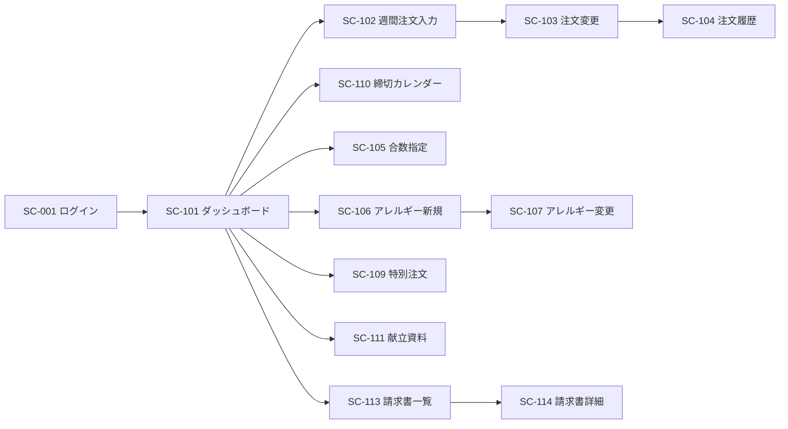
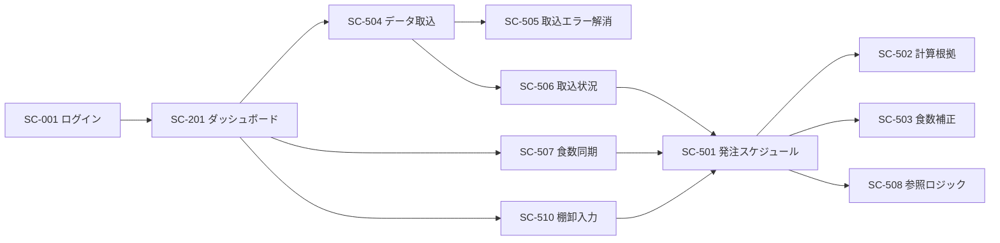
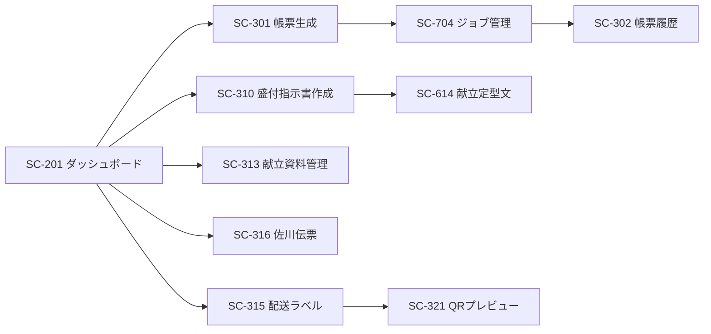

# 07. 画面仕様

作成日: 2026-08-04  
更新日: 2026-08-04  
フロントエンド: Next.js 15（App Router）/ TypeScript / Tailwind CSS

**UIデザインの正本は [`15_ui_design_spec.md`](./15_ui_design_spec.md) とする。**  
ビジュアル・レイアウトは `/Users/kohei/Projects/misaki-reports` と同一系統で構築する。本ドキュメントは画面一覧・機能仕様・主要画面の情報設計に集中する。

**信頼度の表記**

| 記号 | 意味 |
|------|------|
| ✅ | 現行画面をクロールで確認済み。項目・操作を踏襲できる |
| ⚠️ | 現行画面のURLは確認したが詳細未確認 |
| ❓ | 現行に該当画面がない、または500エラーで観測できなかった |
| 🆕 | 新規設計 |

---

## 1. 画面構成の全体方針

### 1.1 ルーティング構造

Next.js App Router のルートグループで施設向け・社内向けを分離する。単一ドメイン・単一デプロイとし、現行の2システム間リダイレクト問題（A-03）を構造的に解消する。

```
apps/web/src/app/
├── (auth)/                    # 未認証
│   ├── login/
│   └── password-reset/
├── (facility)/                # 施設ユーザー
│   ├── dashboard/
│   ├── orders/
│   ├── documents/
│   ├── invoices/
│   └── announcements/
├── (internal)/                # 社内ユーザー
│   ├── dashboard/
│   ├── orders/
│   ├── procurement/           # 発注・在庫（旧: 在庫システム）
│   ├── reports/               # 帳票（旧: コントロールパネル）
│   ├── invoices/
│   ├── masters/
│   └── admin/
└── api/                       # BFF（認証・セッション処理のみ）
```

### 1.2 共通レイアウト（misaki-reports 準拠）

グローバルヘッダーは置かない。**左サイドバー + メインコンテンツ** のシェルとする（misaki-reports の `AppLayout` / `Sidebar` と同じ）。詳細は `15_ui_design_spec.md` §3。

| 領域 | 内容 |
|------|------|
| サイドバー | 幅 `w-56`・ sticky・白背景・右ボーダー。ブランドマーク + アプリ名 / カテゴリ付きナビ（lucide）/ 現在ユーザー（社内は `【社員番号】氏名`）/ 通知導線 / ログアウト / バージョン番号 |
| メイン | `flex-1 overflow-auto`。内側余白 `px-5 py-6 lg:px-8` |
| PageHeader | 各ページ先頭。タイトル + 任意の説明 + 右上アクション（misaki の `PageHeader`） |
| 成り代わりバー | 該当時のみメイン最上段に固定（FR-105）。misaki にない dan1 固有要素 |
| ログイン | 中央カード（`max-w-[380px]`）。ソーシャルログイン UI は置かない |

パンくずは原則使わない。階層はサイドバーのアクティブ状態と PageHeader タイトルで示す。

### 1.3 共通UIパターン

見た目は `15_ui_design_spec.md` §4 のコンポーネントに従う。業務パターンは以下。

| パターン | 適用画面 | 仕様 |
|---------|---------|------|
| 一覧テーブル | 全一覧画面 | サーバーサイドページング、絞込、並び替え、表示件数変更、状態のURL反映。テーブル見た目は misaki 準拠（13px・sticky ヘッダー・`hover:bg-bg`） |
| ワークスペース枠 | マスタ・帳票などサブナビ付き一覧 | `rounded-xl border bg-surface shadow-sm` + 左サブナビ + 右リスト（misaki `ReportsWorkspace`） |
| 期間メッセージ | 注文系画面 | 画面上部に操作可能期間を明示（現行踏襲: 「8月14日 〜 8月19日 喫食分が変更可能です」） |
| 締切バナー | 注文系画面 | 次回締切日時と残り時間（FR-206）。接近時 warning / 超過時 danger |
| ジョブ進捗 | 取込・出力画面 | 進捗バー + 進捗メッセージ。完了時に通知 |
| 影響範囲確認 | マスタ編集・削除 | 保存前に影響件数を表示 |
| 楽観ロック競合 | 編集画面 | 409 時に差分を表示し、上書き / 破棄 / マージを選択 |
| 編集中インジケータ | 共同編集される画面 | 他ユーザーが同一レコードを開いている旨を表示（ロックはしない） |
| 印刷レイアウト | 帳票・一覧 | `@media print` で A4 対応 |

### 1.4 デザイントークン

カラー・角丸・フォント・コンポーネント寸法の正本は `15_ui_design_spec.md` §2（misaki-reports の `#5E6AD2` プライマリ、Inter + Noto Sans JP 等）。

発注スケジュールのような高密度な表組みのみ、標準より小さいフォントを使う（NFR-18-2）。

| 用途 | フォントサイズ | 行高 |
|------|--------------|------|
| 通常のテキスト | 14px | 1.5 |
| 一覧テーブル | 13px | 1.4 |
| 高密度グリッド（発注スケジュール） | 12px | 1.3 |
| 数値セル | 12px / `tabular-nums` / 右揃え | 1.3 |

状態を色で示す箇所には必ずアイコンまたはラベルを併記する（NFR-19-2）。

---

## 2. 画面一覧

### 2.1 認証（SC-0xx）

| ID | 画面名 | パス | 信頼度 | 現行 |
|----|--------|------|--------|------|
| SC-001 | ログイン | `/login` | ✅ | `/accounts/login/` |
| SC-002 | パスワード変更 | `/password/change` | ✅ | `/accounts/password/change/` |
| SC-003 | パスワードリセット | `/password-reset` | 🆕 | 現行に該当なし |
| SC-004 | 多要素認証（TOTP） | `/login/mfa` | 🆕 | FR-102 |

現行のログイン画面にある「Sign in with」ソーシャルログインアイコンは `javascript:void(0)` で機能していない（A-05）。新システムでは実装しない。

### 2.2 施設向け（SC-1xx）

| ID | 画面名 | パス | 信頼度 | 現行 | FR |
|----|--------|------|--------|------|-----|
| SC-101 | ダッシュボード | `/dashboard` | ⚠️ | `/`（お知らせ380件超） | FR-308 |
| SC-102 | **週間注文入力** | `/orders/weekly` | ❓ | `/order/`（**500エラー**） | FR-301 |
| SC-103 | 注文変更 | `/orders/changes` | ✅ | `/order-change-list/` | FR-302 |
| SC-104 | 注文履歴 | `/orders/history` | ✅ | `/order-list/` | FR-303 |
| SC-105 | 混ぜご飯の合数指定 | `/orders/rice` | ✅ | `/order-rice/` | FR-304 |
| SC-106 | アレルギー注文（新規） | `/orders/allergen/new` | ✅ | `/order-allergen/` | FR-305 |
| SC-107 | アレルギー注文（変更） | `/orders/allergen` | ✅ | `/order-allergen-list/` | FR-305 |
| SC-108 | 元旦注文 | `/orders/new-year` | ✅ | `/order-new-year/` | FR-306 |
| SC-109 | 特別注文（おせち容器等） | `/orders/special` | 🆕 | FAX運用 | FR-901 |
| SC-110 | 締切カレンダー | `/orders/deadlines` | 🆕 | 現行に該当なし | FR-206 |
| SC-111 | 献立資料一覧 | `/documents` | ⚠️ | `/cooking-documents/` | FR-401 |
| SC-112 | 盛付指示書一覧 | `/setout-instructions` | ⚠️ | `/setout-files` | FR-403 |
| SC-113 | 請求書一覧 | `/invoices` | ❓ | `/#`（**リンク未設定**） | FR-603 |
| SC-114 | 請求書詳細 | `/invoices/[id]` | 🆕 | — | FR-603 |
| SC-115 | お知らせ一覧 | `/announcements` | ⚠️ | トップページ内 | FR-308 |
| SC-116 | 問い合わせチャット | `/chat` | ⚠️ | `/chat/` | FR-309 |
| SC-117 | 操作マニュアル | `/manual` | ✅ | `/static/dan_order_manual.pdf` | — |

### 2.3 社内向け・受注管理（SC-2xx）

| ID | 画面名 | パス | 信頼度 | 現行 | FR |
|----|--------|------|--------|------|-----|
| SC-201 | 社内ダッシュボード | `/dashboard` | ⚠️ | `/control-panel` | FR-802 |
| SC-202 | 未入力施設アラート | `/orders/alerts` | ⚠️ | CPトップ + `/order-alert/list` | FR-801 |
| SC-203 | 注文一覧（全施設） | `/orders` | ⚠️ | `/master/order/maintenance/` | FR-303 |
| SC-204 | 注文編集（代理入力） | `/orders/[id]/edit` | ⚠️ | `/master/order/maintenance/` | FR-105 |
| SC-205 | 合数一覧・変更 | `/orders/rice` | ⚠️ | `/master/rice-orders/` | FR-304 |
| SC-206 | 注文食数確認 | `/orders/counts` | ⚠️ | `/cooking-produce` | FR-501 |
| SC-207 | 施設ビュー切替（成り代わり） | `/customers/[id]/impersonate` | 🆕 | 現行に該当なし | FR-105 |
| SC-208 | 特別注文枠の管理 | `/orders/special-windows` | 🆕 | — | FR-901 |
| SC-209 | 試食会管理 | `/tasting-events` | 🆕 | — | FR-902 |

### 2.4 社内向け・帳票（SC-3xx）

現行コントロールパネルの50機能超をカテゴリ再編する。生成系は共通の「生成条件指定 → 非同期ジョブ → 履歴一覧」パターンに統一する。

| ID | 画面名 | パス | 信頼度 | 現行 |
|----|--------|------|--------|------|
| SC-301 | 帳票生成（共通） | `/reports/generate` | 🆕 | 各機能に分散 |
| SC-302 | 帳票履歴一覧 | `/reports` | ⚠️ | 各 `*-files` 画面 |
| SC-303 | 食数集計表 | `/reports/meal-counts` | ⚠️ | `/cooking-files` |
| SC-304 | 製造作成表 | `/reports/production` | ⚠️ | `/cooking-produce-files` |
| SC-305 | 変換後調理表 | `/reports/cooking-sheets` | ⚠️ | `/converted-cooking-files` |
| SC-306 | 計量表 | `/reports/measures` | ⚠️ | `/measure-files` |
| SC-307 | 加熱加工記録簿 | `/reports/heating` | ⚠️ | `/heating-processing` |
| SC-308 | 書き起こし票 | `/reports/transcriptions` | ⚠️ | `/kakiokoshi/output` |
| SC-309 | アレルギー連携表 | `/reports/allergen-relations` | ⚠️ | `/plate-relation` |
| SC-310 | 盛付指示書作成 | `/setout-instructions/create` | ⚠️ | `/food-register/` |
| SC-311 | 盛付指示書管理 | `/setout-instructions` | ⚠️ | `/setout-files/management` |
| SC-312 | 献立資料登録 | `/documents/upload` | ⚠️ | `/documents-upload/` |
| SC-313 | 献立資料管理 | `/documents` | ⚠️ | `/document-files`, `/documents-check/` |
| SC-314 | 栄養月報変換 | `/documents/nutrition-report` | ⚠️ | `/monthly-report-upload/` |
| SC-315 | 配送ラベル | `/shipping/labels` | ⚠️ | `/label-files` |
| SC-316 | 佐川伝票 | `/shipping/sagawa` | ⚠️ | `/sagawa-files` |
| SC-317 | ピッキング指示書 | `/picking` | ⚠️ | `/picking-output/`, `/picking-files/` |
| SC-318 | ピッキング結果追跡 | `/picking/results` | ⚠️ | `/picking/results`, `/picking/histories` |
| SC-319 | シール・パウチ出力 | `/shipping/seals` | ⚠️ | `/seal-csv-output/`, `/design-seal-csv-output/`, `/pouch-output/` |
| SC-320 | P7印刷用CSV | `/reports/print-csv` | ⚠️ | `/print-csv-output/` |
| SC-321 | QRプレビュー | `/shipping/qr-preview` | 🆕 | 現行に該当なし（REQ-15） |

### 2.5 社内向け・請求（SC-4xx）

| ID | 画面名 | パス | 信頼度 | 現行 | FR |
|----|--------|------|--------|------|-----|
| SC-401 | 請求締め処理 | `/invoices/close` | ⚠️ | `/invoice-files` | FR-601 |
| SC-402 | 請求書一覧（全施設） | `/invoices` | ⚠️ | `/invoice-files` | FR-602 |
| SC-403 | 請求書詳細・訂正 | `/invoices/[id]` | ❓ | 現行に該当なし | FR-602 |
| SC-404 | 請求書一括登録 | `/invoices/upload` | ⚠️ | `/invoice-upload/` | FR-601 |
| SC-405 | 売価計算 | `/sales-prices` | ⚠️ | `/sales-price-output/` 他 | FR-604 |

### 2.6 社内向け・発注在庫（SC-5xx）

| ID | 画面名 | パス | 信頼度 | 現行 | FR |
|----|--------|------|--------|------|-----|
| SC-501 | **発注スケジュール** | `/procurement/schedules` | ✅ | `/schedule` | FR-706 |
| SC-502 | 発注量の計算根拠 | `/procurement/schedules/[id]/basis` | 🆕 | 現行に該当なし | FR-703 |
| SC-503 | 食数補正 | `/procurement/adjustments` | ✅ | `/orders/adjust` | FR-705 |
| SC-504 | データ取込 | `/procurement/imports` | ✅ | `/order-file/import`, `/cooking-file/import` | FR-701 |
| SC-505 | 取込エラー解消 | `/procurement/imports/errors` | ✅ | `/cooking-drection/error-items` | FR-701 |
| SC-506 | 取込状況カレンダー | `/procurement/imports/status` | ✅ | `/import-status` | FR-708 |
| SC-507 | 食数同期 | `/procurement/meal-count-sync` | ✅ | `/orders_counts` | FR-702 |
| SC-508 | 参照ロジック設定一覧 | `/masters/reference-rules` | ✅ | `/reference-rule-settings` | FR-704 |
| SC-509 | 参照ロジック設定詳細 | `/masters/reference-rules/[id]` | ✅ | `/reference-rule-setting/{id}` | FR-704 |
| SC-510 | 棚卸入力 | `/procurement/stock-records/input` | ✅ | `/stock-records/input` | FR-707 |
| SC-511 | 棚卸結果一覧 | `/procurement/stock-records` | ✅ | `/stock-records/list` | FR-707 |
| SC-512 | 合数ログ | `/procurement/rice-logs` | ✅ | `/gosu-log` | FR-709 |
| SC-513 | 変更履歴 | `/procurement/change-logs` | ✅ | `/update-records` | FR-804 |

**廃止する画面**

| 現行画面 | 廃止理由 |
|---------|---------|
| `/lock-supplier`（編集業者選択） | 業者ロックの廃止（REQ-22, FR-307） |
| `/user/unlock-supplier/`（編集可能業者解除） | 同上。ロックが存在しないため解除も不要 |
| `/admin/`（Django Admin） | マスタ画面に機能を吸収（A-12, `06_master_management_spec.md` §1.2） |

現行ではログイン直後に `/lock-supplier` へ強制リダイレクトされ、業者を選択しないと業務画面に入れない。新システムではこのステップがなくなる。

### 2.7 社内向け・マスタ（SC-6xx）

| ID | 画面名 | パス | 信頼度 | FR |
|----|--------|------|--------|-----|
| SC-601 | マスタ一覧（ハブ） | `/masters` | ⚠️ | FR-201 |
| SC-602 | 施設一覧 | `/masters/customers` | ⚠️ | FR-106 |
| SC-603 | 施設編集（タブ構成） | `/masters/customers/[id]` | 🆕 | FR-106 |
| SC-604 | 施設新規登録ウィザード | `/masters/customers/new` | 🆕 | FR-106 |
| SC-605 | 締切ルール | `/masters/deadline-rules` | 🆕 | FR-205 |
| SC-606 | 締切例外日 | `/masters/deadline-exceptions` | 🆕 | FR-205 |
| SC-607 | 嚥下食区分 | `/masters/swallow-categories` | 🆕 | FR-203 |
| SC-608 | 食種 | `/masters/diet-types` | ❓ | FR-210 |
| SC-609 | 食事区分 | `/masters/meal-types` | ⚠️ | FR-210 |
| SC-610 | 献立種類 | `/masters/menu-kinds` | ⚠️ | FR-210 |
| SC-611 | アレルギー種類 | `/masters/allergens` | ⚠️ | FR-208 |
| SC-612 | 施設別アレルギー設定 | `/masters/customer-allergens` | ⚠️ | FR-208 |
| SC-613 | 製造パターン | `/masters/production-patterns` | 🆕 | FR-204 |
| SC-614 | 献立定型文 | `/masters/setout-directions` | ⚠️ | FR-207 |
| SC-615 | 資料出力ルール | `/masters/document-output-rules` | 🆕 | FR-209 |
| SC-616 | 単価情報 | `/masters/unit-prices` | ⚠️ | FR-210 |
| SC-617 | 税率 | `/masters/tax-rates` | ⚠️ | FR-210 |
| SC-618 | 長期休暇 | `/masters/long-holidays` | ⚠️ | FR-210 |
| SC-619 | 営業日カレンダー | `/masters/business-calendar` | 🆕 | FR-505 |
| SC-620 | 仕入業者 | `/masters/suppliers` | ✅ | FR-210 |
| SC-621 | 業者別商品 | `/masters/stock-items` | ✅ | FR-210 |
| SC-622 | 混ぜご飯 | `/masters/mix-rice` | ✅ | FR-210 |
| SC-623 | QRレイアウト | `/masters/qr-layouts` | 🆕 | FR-503 |
| SC-624 | QRペイロードルール | `/masters/qr-payload-rules` | 🆕 | FR-503 |
| SC-625 | 注文停止予約 | `/masters/order-suspensions` | ⚠️ | FR-210 |
| SC-626 | お知らせ管理 | `/masters/announcements` | ⚠️ | FR-308 |

### 2.8 社内向け・管理（SC-7xx）

| ID | 画面名 | パス | 信頼度 | FR |
|----|--------|------|--------|-----|
| SC-701 | ユーザー管理 | `/admin/users` | ✅ | FR-104 |
| SC-702 | ロール・権限設定 | `/admin/roles` | 🆕 | FR-104 |
| SC-703 | 監査ログ検索 | `/admin/audit-logs` | ⚠️ | FR-804 |
| SC-704 | ジョブ管理 | `/admin/jobs` | 🆕 | FR-002 |
| SC-705 | 通知一覧 | `/notifications` | ✅ | FR-003 |
| SC-706 | システム設定 | `/admin/settings` | 🆕 | FR-201 |
| SC-707 | データ整合性検査 | `/admin/consistency-checks` | 🆕 | FR-803 |

### 2.9 画面数サマリー

| 分類 | 画面数 | うち新規 |
|------|--------|---------|
| 認証 | 4 | 2 |
| 施設向け | 17 | 4 |
| 社内・受注 | 9 | 3 |
| 社内・帳票 | 21 | 2 |
| 社内・請求 | 5 | 1 |
| 社内・発注在庫 | 13 | 1 |
| 社内・マスタ | 26 | 10 |
| 社内・管理 | 7 | 5 |
| **合計** | **102** | **28** |

現行のコントロールパネル50機能超をカテゴリ統合したため、総画面数は現行と同等規模に収まる。

---

## 3. 主要画面の詳細仕様

改善要望の中心となる画面について詳細を定義する。他の画面は §1.3 の共通パターンに従う。

### SC-102 週間注文入力

REQ-04, REQ-07, REQ-09 に対応。FR-301。**現行 `/order/` が500エラーのため観測できておらず、業務要件からの新規設計となる。**

#### レイアウト

```
┌─────────────────────────────────────────────────────────────┐
│ 週間注文入力                                                  │
├─────────────────────────────────────────────────────────────┤
│ ⏰ 次回締切: 8月12日(火) 17:00まで（残り 2日 4時間）          │
├─────────────────────────────────────────────────────────────┤
│ [◀ 前週] 2026年8月17日(月) 〜 8月23日(日) [今週] [翌週 ▶]     │
│ ユニット: [全て ▼]  [前週の内容をコピー]  [Excel出力]         │
├──────────┬──────┬──────┬──────┬──────┬──────┬──────┬──────┤
│          │ 8/17 │ 8/18 │ 8/19 │ 8/20 │ 8/21 │ 8/22 │ 8/23 │
│          │ 月   │ 火   │ 水   │ 木   │ 金   │ 土   │ 日   │
├──────────┼──────┼──────┼──────┼──────┼──────┼──────┼──────┤
│ ■ Aユニット                                                  │
│  朝食                                                        │
│   常食    │  12  │  12  │  12  │  12  │  12  │  10  │  10  │
│   薄味    │   3  │   3  │   3  │   3  │   3  │   3  │   3  │
│   ソフト食 │   2  │   2  │   2  │   2  │   2  │   2  │   2  │
│   ミキサー食│  1  │   1  │   1  │   1  │   1  │   1  │   1  │
│   ゼリー食 │   0  │   0  │   0  │   0  │   0  │   0  │   0  │
│  昼食 ...                                                    │
│  小計     │  18  │  18  │  18  │  18  │  18  │  16  │  16  │
├──────────┼──────┼──────┼──────┼──────┼──────┼──────┼──────┤
│ 合計      │  ..  │  ..  │  ..  │  ..  │  ..  │  ..  │  ..  │
└──────────┴──────┴──────┴──────┴──────┴──────┴──────┴──────┘
                          [下書き保存]  [この内容で注文する]
```

#### 行構成（動的生成）

行は `ユニット` × `食事区分` × `献立種類` の階層で生成する。ハードコードしない。

| 階層 | データソース | 並び順 |
|------|------------|--------|
| ユニット | `units`（施設に紐づくもの） | `units.sort_order` |
| 食事区分 | `meal_types` | `meal_types.sort_order` |
| 献立種類 | `menu_kinds`（施設の食種で絞込） | `menu_kinds.sort_order` |
| 嚥下食 | `swallow_categories` 経由 | **`swallow_categories.sort_order`**（REQ-07） |

嚥下食区分をマスタに追加すると行が自動的に増える（REQ-09）。

#### 入力仕様

| 項目 | 仕様 |
|------|------|
| 入力値 | 0以上の整数。上限は `[要確認]`（施設の契約上限があるか） |
| 未入力とゼロの区別 | 未入力セルは背景をグレーに、`0` は明示的に `0` を表示 |
| キーボード操作 | Tab / Shift+Tab で横移動、Enter で下移動、矢印キーでセル移動 |
| 一括入力 | 行ヘッダークリックで行全体、列ヘッダークリックで列全体に同一値を設定 |
| 前週コピー | 前週の入力内容を当週に複製。既存入力がある場合は確認 |
| 自動保存 | 30秒ごとに下書きとして保存。ブラウザを閉じても復元 |
| 締切超過セル | 非活性 + ツールチップで締切日時を表示 |
| 合計表示 | ユニット小計・全体合計をリアルタイム再計算 |

#### 保存時の処理

```
1. クライアント側で変更セルのみを抽出
2. PUT /api/v1/orders/weekly に差分を送信（version 付き）
3. サーバー側で以下を検証
   a. 締切の再判定（クライアントの表示が古い可能性があるため必須）
   b. 楽観ロックのバージョン照合
   c. 入力値のバリデーション
4. トランザクション内で UPSERT + 監査ログ記録
5. 結果を返却
   - 成功: 保存済みセルをハイライト表示
   - 締切超過: 該当セルを明示してエラー表示
   - 競合(409): 他ユーザーの変更内容との差分を表示し、上書き/破棄を選択
```

#### 状態遷移

```
draft（下書き）
  ↓ 「この内容で注文する」
provisional（仮注文）
  ↓ 締切通過（自動）
confirmed（確定）
  ↓ 変更可能期間内の変更
confirmed（version++、変更履歴に記録）
```

---

### SC-103 注文変更

REQ-05 に対応。FR-302。現行 `/order-change-list/` は5列テーブルで絞込機能がなかった。

#### 画面上部

| 要素 | 内容 |
|------|------|
| 期間メッセージ | `8月14日 〜 8月19日 喫食分が変更可能です`（現行の表現を踏襲） |
| 絞込 | ユニット / 喫食日範囲 / 食事区分 / 献立種類 / 変更有無 |
| 表示形式 | 一覧 / 週間グリッド（SC-102 と同じ形式で変更する） |

#### 一覧の列

| 列 | 内容 | 編集 |
|----|------|------|
| ユニット名 | — | — |
| 喫食日 | — | — |
| 食事区分 | — | — |
| 献立種類 | — | — |
| 現在の食数 | 確定済みの値 | — |
| 変更後の食数 | 入力欄（インライン編集） | ○ |
| 差分 | `+2` / `-1` を色分け表示 | — |
| 変更理由 | 入力欄（任意） | ○ |

現行は「食数」1列のみで、変更前後の比較ができなかった。差分列を追加して変更内容を確認しやすくする。

#### 操作

| 操作 | 仕様 |
|------|------|
| インライン編集 | セルをクリックして直接入力 |
| 変更内容の確認 | 保存前に変更行のみを抽出して差分一覧を表示 |
| 一括保存 | 複数行の変更をまとめて保存 |
| 表示件数 | 10 / 15 / 30 / 50 / 100 / 200（現行踏襲） |

---

### SC-104 注文履歴

REQ-06 に対応。FR-303。現行 `/order-list/` は6列のフラットな明細一覧のみだった。

#### 表示形式の切替

現行の課題は「1施設が複数ユニット×複数食事区分×日数分の行を目で追う」構造にある。集計ビューを追加する。

| 形式 | 内容 |
|------|------|
| 明細一覧 | 現行踏襲。ユニット名 / 喫食日 / 食事区分 / 献立種類 / アレルギー種類 / 食数 |
| ユニット別集計 | 行=ユニット、列=食事区分。期間合計を表示 |
| 日別集計 | 行=喫食日、列=献立種類。日ごとの合計を表示 |
| カレンダー | 月間カレンダーの各日に合計食数を表示。クリックで明細へ |

#### 操作

| 操作 | 仕様 |
|------|------|
| 期間ナビゲーション | `◀ 前月` / `今月分を表示する` / `翌月 ▶`（現行踏襲）+ 任意期間指定 |
| 絞込 | ユニット / 食事区分 / 献立種類 / アレルギー / 注文区分 |
| 出力 | クリップボードにコピー / 印刷する / Excel / CSV（現行踏襲 + 追加） |
| 表示件数 | 10 / 30 / 60 / 100（現行踏襲） |
| 変更履歴 | 行を展開して当該注文の変更履歴を表示 |

---

### SC-501 発注スケジュール

REQ-22, REQ-23 に対応。FR-706。**システムの中核画面かつ性能改善の最重要対象**（NFR-01-4: P95 3秒）。

#### 現行との差分

| 項目 | 現行 | 新システム |
|------|------|----------|
| 業者の選択 | `/lock-supplier` でロック取得が必須 | セレクトボックスで切替。ロックなし |
| 商品の絞込 | なし | **商品名・カテゴリで絞込**（REQ-23） |
| データ取得 | 全商品を同期取得 | サーバーサイドページング |
| 発注量計算 | 表示時に都度計算 | 事前計算済みデータの取得のみ |
| セル内の表示 | 常に全項目（7行以上） | 表示項目を選択可。簡易モードあり |
| 同時編集 | 業者単位で排他 | レコード単位の楽観ロック |
| 大量出力 | 同期処理（極端に遅い） | 非同期ジョブ |

#### 検索・操作エリア

| 要素 | 仕様 |
|------|------|
| 対象業者 | セレクトボックス。担当業者に制限がある場合はその範囲のみ表示 |
| 納品日 | `from_date` 〜 `to_date`（現行踏襲。必須） |
| 商品絞込 | 商品名の部分一致（全文検索）+ カテゴリ選択（**新規**） |
| 状態絞込 | 不足のみ / 手動更新済みのみ / 未確認のみ（**新規**） |
| 表示モード | 詳細（現行相当） / 簡易（発注数と在庫のみ）（**新規**） |
| ビュー保存 | 絞込条件を名前付きで保存（**新規**、FR-005） |
| 発注確認済み(納品日) | 別の日付範囲 + 「更新」ボタン（現行踏襲） |
| 操作ボタン | 印刷 / Excel出力（非同期）/ 食数補正へ移動（現行踏襲） |
| 凡例 | 赤=自動調整 / 青=手動更新 / 黄背景=不足（現行踏襲）+ **アイコン併記**（NFR-19-2） |

#### グリッド構造

**固定列（左）**

| 列 | 内容 |
|----|------|
| 商品名 | 例: `豚ミンチ（フ）` |
| 合計発注量 | 期間内合計（例: `217.000`） |
| 単位 | `kg` 等 |

**日付列**（納品日ごと。ヘッダー例: `8/3 (月) 納品`）

セル内の階層（現行踏襲）

| 行 | 項目 | 簡易モード |
|----|------|-----------|
| 1 | 計算前必要量 / 計算前注文数(食) | 非表示 |
| 2 | 必要量 / 注文数(食) | 非表示 |
| 3 | 喫食参照ラベル（`[8/10 昼]` 等） | 非表示 |
| 4 | **発注数**（ロット補正・在庫差引後） | 表示 |
| 5 | 仮在庫 | 非表示 |
| 6 | 見込み在庫 | 表示 |
| 7 | **実在庫**（入力欄） | 表示 |
| 8 | 注意（仮注文未入力の施設番号） | アイコンのみ |

簡易モードは行数を8行から3行に削減し、描画要素数を約6割減らす。これが NFR-01-4 の達成手段の一つとなる。

#### 性能設計

| 対策 | 内容 | 効果 |
|------|------|------|
| 事前計算 | 取込完了時に発注量を計算して `order_schedules` に保存 | 表示時の計算をゼロにする |
| サーバーサイドページング | 商品行を既定20件ずつ取得 | 119商品×7日 = 833セルから 20×7 = 140セルへ |
| 列の遅延取得 | 計算根拠・未入力施設リストは展開時に個別取得 | 初期ペイロードの削減 |
| 仮想スクロール | 表示領域外の行を DOM から除外 | 描画コストの削減 |
| インデックス | `idx_supplier_delivery` + パーティション枝刈り | クエリ時間の短縮 |

#### セル編集

| 操作 | 仕様 |
|------|------|
| 発注数の編集 | セルをクリックして直接入力。`adjust_source` が `manual` になり青色表示 |
| 実在庫の入力 | 同様にインライン編集 |
| 保存 | セルからフォーカスが外れた時点で個別に保存（`version` 付き） |
| 競合時 | 該当セルに警告アイコンを表示し、相手の値との差分をポップオーバー表示 |
| 編集中インジケータ | 他ユーザーが同一商品を編集中の場合、行に表示（**編集は禁止しない**） |
| 計算根拠 | セルの詳細アイコンから SC-502 を開き、参照ロジックの適用結果を確認 |

#### 一括更新（現行踏襲）

「発注確認済み(納品日)」に日付範囲を入力して「更新」すると、発注数・実在庫数を一括登録する。日付を削除して更新するとクリアされる（現行の説明文どおり）。実行前に対象件数を表示して確認を求める（NFR-18-7）。

---

### SC-605 / SC-606 締切ルール・締切例外日

REQ-13 に対応。FR-205。現行に該当画面がなく、社内担当者が開発者へ依頼していた作業をこの2画面で完結させる。

詳細な項目定義は `06_master_management_spec.md` §3 を参照。

#### SC-606 締切例外日の操作フロー（正月の前倒し）

```
1. 「例外日を追加」
2. 例外名: 2027年正月前倒し
   対象喫食日: 2027-01-01 〜 2027-01-03
   締切日時: 2026-12-20 10:00
   繰り返し: 毎年
3. 「影響を確認」
   → 対象施設: 361件
   → 該当喫食日の注文入力状況: 未入力 361件
   → 通常の締切: 2026-12-28 17:00 → 変更後: 2026-12-20 10:00（8日前倒し）
4. 「保存」
5. 対象施設へ通知を自動送信
```

---

### SC-614 献立定型文

REQ-18 に対応。FR-207。要望原文で4課題が明示された画面。

#### 一覧の列

| 列 | 内容 | 現行との差分 |
|----|------|------------|
| 短縮名 | 現行踏襲 | — |
| **本文プレビュー** | 先頭100文字。ホバーで全文をポップオーバー表示 | **新規**（「クリックしないと内容が分からない」への対応） |
| 対象区分 | 基本食用 / 嚥下用（嚥下用は区分名も表示） | 現行踏襲 |
| カテゴリ | — | **新規** |
| タグ | 複数表示 | **新規** |
| **使用回数** | 降順ソート可 | **新規**（整理の判断材料） |
| **最終使用日** | 未使用は `—` | **新規** |
| 状態 | 有効 / アーカイブ済 | **新規** |

#### 絞込

| 条件 | 形式 |
|------|------|
| キーワード | 本文・短縮名の全文検索（MySQL ngram） |
| 対象区分 | 基本食用 / 嚥下用 |
| 嚥下食区分 | select |
| カテゴリ | select |
| タグ | multi-select |
| 使用状況 | 全て / 未使用のみ / N日以上未使用 |
| 状態 | 有効 / アーカイブ済 / 全て |

#### 整理機能

| 機能 | 仕様 |
|------|------|
| 並び替えの永続化 | 列ヘッダーでの並び替えとドラッグでの手動並び順をユーザー単位で保存（「並び替えても元に戻る」への対応） |
| 重複検出 | 「重複候補を表示」で本文ハッシュが一致するものを一覧表示。統合操作を提供 |
| 一括アーカイブ | 「180日以上未使用」等で抽出して一括アーカイブ |
| 復元 | アーカイブ済みから個別復元 |

アーカイブしても過去の盛付指示書の内容は変わらない（`setout_instruction_lines.body_snapshot` を保持しているため）。

---

### SC-313 献立資料管理（版管理）

REQ-16, REQ-17 に対応。FR-401, FR-402。

#### 一覧の列

| 列 | 内容 |
|----|------|
| 資料種別 | 献立表 / 栄養月報 / アレルギー表 等 |
| 対象施設 | 施設名（全施設共通の場合は「共通」） |
| 対象年月 | `2026-08` |
| 最新版 | `v3`（クリックで版履歴） |
| 生成日時 | — |
| 生成者 | — |
| **適用食種** | 生成時点の食種（スナップショットから表示） |
| 公開状態 | 公開 / 非公開 |

「適用食種」列がスナップショットから読み出される点が REQ-16, REQ-17 の解決を可視化する。現在のマスタ値ではなく生成時点の値を表示する。

#### 版履歴パネル

| 列 | 内容 |
|----|------|
| 版 | `v1` / `v2` / `v3` |
| 生成日時 | — |
| 生成者 | — |
| 生成理由 | 初回生成 / 再生成（理由） |
| 適用設定 | スナップショットの内容を展開表示 |
| ファイル | ダウンロード |
| 操作 | 版間の設定差分を比較 |

再生成しても旧版は保持され、いつでも過去の内容を取得できる。

---

### SC-403 請求書詳細・訂正

REQ-03 に対応。FR-602。現行に該当画面がなく、施設側のリンクも `href="#"` で未実装だった。

#### 画面構成

| 領域 | 内容 |
|------|------|
| ヘッダー | 請求書番号 / 施設名 / 対象年月 / 状態（下書き / 発行済 / 訂正済）/ 版番号 |
| 金額サマリー | 税抜合計 / 消費税 / 税込合計 |
| 明細 | ユニット / 喫食日 / 食事区分 / 献立種類 / 数量 / 単価 / 金額 / 明細区分 |
| 操作 | 施設ビューで確認 / 訂正 / PDF出力 / 訂正履歴 |

#### 訂正操作

```
1. 「訂正」をクリック
2. 明細の追加・削除・数量修正を行う
   - 削除は行を消さず「取消」としてマークする（line_type=correction_remove）
   - 追加行は correction_add としてマークする
3. 訂正理由を入力（必須）
4. 「訂正版を発行」
   - 元の請求書は status=corrected になり保持される
   - 新しい版が version_no+1 で作成される
   - 施設へ通知が送信される
5. 施設側では最新版と旧版の両方が閲覧できる
```

#### 施設ビューでの確認（FR-105）

「施設ビューで確認」から成り代わり表示に切り替え、施設ユーザーが見ている請求書画面をそのまま確認できる。画面上部に成り代わり中の警告バーが表示され、操作は監査ログに記録される。

---

### SC-202 未入力施設アラート

REQ-20 に対応。FR-801。現行は終了施設が混在していた。

#### 一覧の列

| 列 | 内容 |
|----|------|
| 施設名 | — |
| 施設コード | — |
| 対象喫食日 | — |
| 締切日時 | マスタから解決した締切（FR-205） |
| 残り時間 | 締切までの時間 |
| 未入力の内容 | 食数 / 合数 / 両方 |
| 前回の注文実績 | 参考情報 |
| 対応状況 | 未対応 / 連絡済み / 対応不要（記録可） |

#### 判定条件（REQ-20 の解決）

以下すべてを満たす施設のみ表示する。

| 条件 | 内容 |
|------|------|
| 契約期間内 | 対象喫食日が `contract_start_date` 〜 `contract_end_date` の範囲内 |
| 注文停止でない | `order_suspensions` に該当期間の停止設定がない |
| 長期休暇でない | `long_holidays` に該当期間の休暇設定がない |
| 曜日条件に合致 | 参照ロジックの曜日・食事区分条件で注文が発生する日である |
| 未入力である | 該当喫食日の注文レコードが存在しない、または `draft` のまま |

現行は契約終了日のみで判定していたため、実質注文が発生しない施設が残り続けていた。上記4条件を追加することで解消する。

---

## 4. 画面遷移図（主要フロー）

### 4.1 施設ユーザーの注文フロー



### 4.2 社内ユーザーの発注フロー



現行では `SC-001 ログイン` の直後に `/lock-supplier`（業者選択）が挟まっていたが、新システムでは削除される。

### 4.3 社内ユーザーの帳票フロー



---

## 5. 未確定事項

| # | 項目 | 影響画面 |
|---|------|---------|
| 1 | 週間注文入力の現行UI（500エラーで観測不可） | SC-102 |
| 2 | 実際の施設のユニット構成・献立種類（99999は社内テスト用ユニットの可能性） | SC-102, SC-103 |
| 3 | 食数の入力上限（契約上の制約があるか） | SC-102 |
| 4 | 施設側の利用環境（ブラウザ・端末） | 全施設向け画面 |
| 5 | 9分割QRの物理レイアウト寸法 | SC-321, SC-623 |
| 6 | 現行の発注スケジュールの実測応答時間 | SC-501（性能目標の妥当性検証） |

---

## 6. 関連ドキュメント

| 参照先 | 内容 |
|--------|------|
| **`15_ui_design_spec.md`** | **UIデザイン・レイアウト・コンポーネントの正本（misaki-reports 準拠）** |
| `03_functional_requirements.md` | 各画面に対応するFR |
| `06_master_management_spec.md` | マスタ画面（SC-6xx）の詳細仕様 |
| `08_api_spec.md` | 各画面が呼び出すAPI |
| `10_auth_roles.md` | 画面ごとのアクセス権限 |
