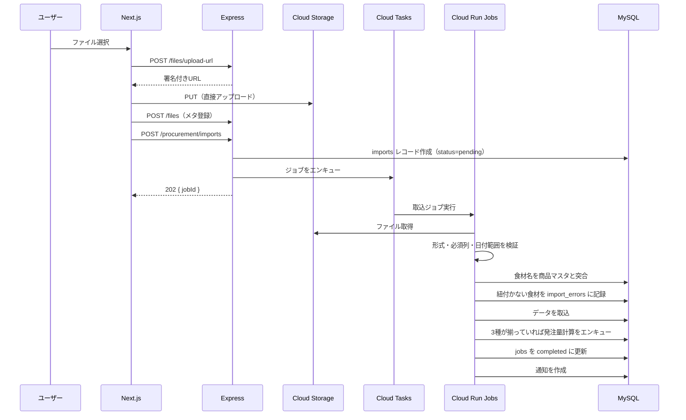

# 09. 外部連携仕様

作成日: 2026-08-04

---

## 1. 連携先の一覧

| # | 連携先 | 方向 | 方式 | 現行の状態 | 確度 |
|---|--------|------|------|-----------|------|
| 1 | らくらく献立（献立作成ソフト） | 受信 | Excel ファイル取込 | 実装済み。手動アップロード | ✅ 確認済 |
| 2 | 佐川急便 | 送信 | ファイル出力（現行）→ API（新） | ファイル出力まで実装済み | ⚠️ API 契約の有無が未確定 |
| 3 | ラベルプリンタ | 送信 | CSV / PDF 出力 | CSV 出力あり。QR 生成の所在は不明 | ❓ 仕様未確定 |
| 4 | HACCP アプリ | なし（番号の対応管理のみ） | — | ログインIDに社員番号を使用 | ✅ 確認済 |
| 5 | 会計システム | 送信 | `[要確認]` | 連携先が不明 | ❓ 存在自体が未確認 |
| 6 | メール配信 | 送信 | SMTP / API | `[要確認]` 現行の通知手段が不明 | ❓ |

現行調査では、基幹システムと発注・在庫システムの間の連携（食数取込）が最も重要な連携だったが、新システムでは両者が統合されるため**内部処理**になる。外部連携として残るのは上記のみである。

---

## 2. らくらく献立との連携

### 2.1 現行の運用

現行の在庫システムでは、らくらく献立から出力した Excel を手動でアップロードしている。

| 取込対象 | 現行の画面 | 内容 |
|---------|-----------|------|
| 納品日別発注書 | `/order-file/import` | 納品日ごとの発注量 |
| 食数月報 | `/order-file/import` | 月次の食数集計 |
| 調理表 | `/cooking-file/import` | 1か月分。混ぜご飯・喫食日/製造日の関係を含む |

**現行の制約**

| 制約 | 内容 | 根拠 |
|------|------|------|
| 3ファイルの同時出力が前提 | 「納品日別発注書・食数月報・調理表は同一タイミング出力が必須」 | `02_screen_inventory_inventory.md` §3 |
| エラー食材の発生 | 調理表の食材が商品マスタと紐付かず10件のエラー | `/cooking-drection/error-items` |
| 期間制限 | 食数取込は「1週間程度を目安」 | 画面の注意書き |

### 2.2 新システムでの取込仕様

FR-701。

| 項目 | 仕様 |
|------|------|
| アップロード方式 | Cloud Storage への署名付きURL直接アップロード（API サーバーを経由しない） |
| 取込タイミング | 3ファイルを**個別に**取込可能。揃った時点で発注量計算を自動実行 |
| 処理方式 | 非同期ジョブ（Cloud Tasks → Cloud Run Jobs） |
| 期間制限 | 撤廃（NFR-02-1: 1か月分を5分以内） |
| 重複検出 | ファイルの SHA-256 ハッシュで判定。重複時は 409 を返し、強制取込オプションを提供 |
| ロールバック | 取込単位で取消可能 |

### 2.3 取込処理のフロー



### 2.4 ファイル形式の検証

`[要確認]` 実際の Excel の列構成が未確認のため、検証ルールは実ファイルの提供を受けて確定する。

| 検証項目 | 内容 | エラー時の扱い |
|---------|------|--------------|
| ファイル形式 | `.xlsx` / `.xls` | 取込を中止 |
| シート名 | 想定シートの存在 | 取込を中止 |
| 必須列 | ヘッダー行の列名一致 | 取込を中止 |
| 日付範囲 | 指定した対象期間と一致するか | 警告して続行の可否を確認 |
| 食材名 | 商品マスタとの突合 | `import_errors` に記録して続行 |
| 数値項目 | 数値として解釈可能か | 該当行をエラーとして記録 |

### 2.5 食材名の突合とエラー解消

A-06（エラー食材10件）の解消手段。

```
1. 調理表の食材名で stock_items を検索（完全一致）
2. 見つからない場合、item_name_mappings（別名テーブル）を検索
3. それでも見つからない場合、import_errors に error_type='item_not_found' で記録
4. 画面（SC-505）でユーザーが商品を指定して紐付ける
5. 紐付け時に item_name_mappings へ自動学習（is_auto_learned=true）
6. 次回以降の取込では自動的に解決される
```

自動学習により、同じ食材名のエラーが繰り返し発生しなくなる。

### 2.6 変更リスク

らくらく献立は外部パッケージであり、バージョンアップで出力形式が変わる可能性がある（NFR-20-1）。以下で影響を緩和する。

| 対策 | 内容 |
|------|------|
| 列マッピングの設定化 | ヘッダー名とシステム側項目の対応をマスタで管理し、形式変更時にコード修正を不要にする |
| 検証エラーの詳細表示 | どの列が期待と異なるかを画面に表示する |
| 取込前プレビュー | 先頭N行を画面に表示して内容を確認できるようにする |

---

## 3. 佐川急便との連携

### 3.1 現行の状態

CP に `/sagawa-files`（佐川伝票用ファイル一覧）があり、ファイル出力までは実装されている。マスタに `/master/sagawa-unit-settings`（ユニット配送情報変更）がある。出力後の工程は未確認だが、要望が「完全自動化」であることから**手動でのファイル取込が残っている**と推定される（REQ-14）。

### 3.2 新システムでの方針

FR-504。`[要確認]` 佐川急便との API 契約状況が未確定のため、2つの方式を用意して切り替え可能にする。

| 方式 | 内容 | 前提 |
|------|------|------|
| **方式A（第一候補）** | 佐川急便の Web サービス API に送り状データを送信し、追跡番号を受信 | API 利用契約が必要 |
| **方式B（フォールバック）** | e飛伝等に取り込める CSV を自動生成し、指定の場所へ配置（Cloud Storage / SFTP） | 契約不要 |

いずれの方式でも、システム内での操作は「生成」ボタン1回または定期実行のみとし、人がファイルを移動する工程をなくす。

### 3.3 送り状データの生成ロジック

```
1. 対象喫食日の確定注文を取得（order_types.links_to_shipping = true のみ）
   → 試食会注文（tasting）は除外される（REQ-24）
2. ユニット単位に集約
3. 製造パターンを有効期間で解決（customer_production_patterns）
4. 製造日・集荷日・着日を算出（営業日カレンダーで調整）
5. 届け先情報を delivery_addresses から解決
6. 個口数を算出（[要確認] 算出ルール）
7. shipping_slips レコードを作成（届け先・製造パターンをスナップショット）
8. 方式A: API 送信 → 追跡番号を保存
   方式B: CSV 生成 → Cloud Storage に配置
```

届け先情報をスナップショットとして保存する理由は、後から施設の住所が変わっても過去の送り状の内容が変わらないようにするためである（REQ-16 と同じ設計思想）。

### 3.4 API 連携の設計（方式A）

`[要確認]` 佐川急便の API 仕様は契約後に確定する。以下は一般的な運送会社 API を想定した設計。

| 項目 | 仕様 |
|------|------|
| 認証 | API キーまたは OAuth。Secret Manager で管理（NFR-09-4） |
| 送信単位 | 1リクエストに複数件をまとめる（バッチ上限は API 仕様に従う） |
| リトライ | 指数バックオフで最大3回。恒久エラーは即座に失敗として記録 |
| 冪等性 | リクエストに一意キー（`shipping_slips.id`）を付与し、重複発行を防ぐ |
| エラー処理 | `api_status` に記録し、失敗分を画面で確認・再送信できる |
| 定期実行 | Cloud Scheduler で締切後の自動発行に対応 |

### 3.5 フォールバック（方式B）

| 項目 | 仕様 |
|------|------|
| 出力形式 | CSV（文字コード・列構成は `[要確認]`。現行の出力ファイルを参照して確定） |
| 配置先 | Cloud Storage の指定バケット。または SFTP 転送 |
| 通知 | 生成完了時に担当者へ通知 |
| 状態 | `shipping_slips.api_status = 'fallback_csv'` として記録 |

方式Bでも現行より工程が減る（出力操作の自動化と配置の自動化）。

---

## 4. QRコード・ラベル印刷

### 4.1 現行の状態

**Web UI 上に QR 関連の表記・操作項目が全調査画面で未検出。** 配送ラベル（`/label-files`）、シール印刷用CSV（`/seal-csv-output/`）、パウチシール印刷用（`/design-seal-csv-output/`）、パウチ設計図（`/pouch-output/`）、ピッキング指示書（`/picking-output/`）を含め、QR の記述がなかった（`04_findings_notes.md` §3.3）。

このため QR は**CSV 出力後に別システムまたはラベルプリンタ側で生成されている**可能性が高い。REQ-15「9分割のQRコードで味噌汁と味噌汁具のQRコードは今は同じですが、別々にしてほしい」の実装先を特定できていない。

### 4.2 新システムでの方針

FR-503。QR 生成をシステム内に取り込む前提で設計する。理由は、分割単位をマスタで設定可能にするには生成処理をシステムが持つ必要があるためである。

| 項目 | 仕様 |
|------|------|
| 生成ライブラリ | Node.js の QR 生成ライブラリ（`qrcode` 等） |
| 出力形式 | PDF（面付け済み）と CSV（QR文字列を列として含む）の両方 |
| 分割キー | `qr_payload_rules.split_key` でマスタ設定（JSON配列） |
| ペイロード項目 | `qr_payload_rules.payload_fields` でマスタ設定 |
| 面付けレイアウト | `qr_layouts` でマスタ設定（9分割 = 3行×3列） |
| 検証 | 生成後にデコードして内容を照合する自動検証 |
| プレビュー | SC-321 で生成前に内容を確認 |

### 4.3 味噌汁と具の分離（REQ-15）

分離は `dish_components` テーブルと `split_key` の組み合わせで実現する。

```
現行: 味噌汁と味噌汁具が同一QR
  split_key = ["service_date", "unit_id", "menu_kind_id", "dish_id"]
  → 味噌汁（dish）配下の本体と具が同じキーになるため同一QRになる

新システム: dish_component_id を分割キーに含める
  split_key = ["service_date", "unit_id", "menu_kind_id", "dish_id", "dish_component_id"]
  → 味噌汁本体（component_type=soup）と味噌汁具（component_type=soup_ingredient）が別QRになる
```

`dish_components.is_separate_qr` を `true` にした構成要素のみを分割対象とすることで、すべての料理が細分化されるのを防ぐ。

### 4.4 未確定事項

| # | 項目 | 影響 |
|---|------|------|
| 1 | 現行の QR ペイロード仕様（何をどの順で埋め込んでいるか） | 既存の読み取り機器との互換性 |
| 2 | 9分割の物理レイアウト寸法（ラベル用紙の規格） | `qr_layouts` の寸法設定 |
| 3 | ラベルプリンタの機種と対応フォーマット | 出力形式（PDF / CSV / 専用形式） |
| 4 | QR を読み取る工程・機器 | ペイロードの互換性維持の必要性 |
| 5 | 料理と構成要素のデータ構造（らくらく献立の出力にどう表現されているか） | `dish_components` の設計 |

移行時に既存の読み取り機器との互換性が必要な場合、ペイロード仕様を現行に合わせる必要がある。現行仕様の提供を受けるまでは、`qr_payload_rules` で任意の形式を再現できる設計としておく。

---

## 5. HACCP アプリ

### 5.1 連携方針

システム連携は行わない（NFR-20-4）。番号の対応管理のみ行う。

| 項目 | 内容 |
|------|------|
| 現行の状態 | 発注・在庫システムのログインに社員番号（6桁）を使用。HACCP番号（5桁）ではログインできない（A-02） |
| 対応関係 | 00020 → 100020、00028 → 100028、00045 → 100045 |
| 新システムの対応 | `users.haccp_no` を保持し、**HACCP番号でもログインできるようにする**（FR-103） |
| 表示 | ヘッダーに `【社員番号】氏名` を表示（現行踏襲）。帳票・操作履歴には HACCP番号を併記 |

要望原文に「誰が発注及び在庫管理をしたか分かるようにHACCPアプリでの自分の番号を使用している」とあることから、HACCP番号は**操作者の識別**が目的である。新システムでは監査ログと帳票に HACCP番号を記録することでこの目的を満たす。

---

## 6. 会計システム

`[要確認]` 現行調査では会計システムへの連携を発見できなかった。CP に「請求データ一覧」（`/invoice-files`）と「売価計算表」があるが、その後の工程が不明である。

想定される選択肢を挙げておく。

| 想定 | 対応 |
|------|------|
| 会計システムへ CSV を手動取込している | 出力形式を確認して自動生成・自動配置に対応 |
| 会計システムが存在せず Excel 管理 | 現行の出力形式を踏襲 |
| API 連携が可能な会計システムを利用 | API 連携を追加設計 |

確定後に本セクションを更新する。

---

## 7. メール・通知配信

`[要確認]` 現行の通知手段が不明。基幹システムのお知らせ（380件超）とチャット機能はシステム内の仕組みで、メール配信の有無は確認できなかった。

新システムでは以下を想定する。

| 通知種別 | 配信先 | 手段 |
|---------|--------|------|
| 締切リマインド | 施設ユーザー | システム内通知 + メール |
| 未入力アラート | 社内ユーザー | システム内通知 |
| ジョブ完了・失敗 | 実行者 | システム内通知 |
| 請求書の発行・訂正 | 施設ユーザー | システム内通知 + メール |
| データ整合性の検知 | 社内管理者 | システム内通知 + メール |

メール送信基盤は `[要確認]`。SendGrid / Amazon SES / Google Workspace の SMTP のいずれかを選定する。施設ユーザーのメールアドレスを保持しているかも確認が必要（`customer_users.email`）。

---

## 8. 連携の監視

すべての外部連携に共通の監視要件（NFR-13）。

| 項目 | 内容 |
|------|------|
| 連携ログ | 送受信の内容・日時・結果を記録する。個人情報はマスキングしてログ出力する（NFR-12-2） |
| 失敗の検知 | 連携失敗時に社内管理者へ通知する |
| リトライ状況 | 画面で確認・手動再実行できる |
| 定期実行の監視 | Cloud Scheduler の実行結果を監視し、未実行を検知する |
| 疎通確認 | 外部 API のヘルスチェックを定期実行する（佐川 API 等） |

---

## 9. 未確定事項の一覧

| # | 項目 | 連携先 | 影響 |
|---|------|--------|------|
| 1 | Excel の列構成・シート名 | らくらく献立 | 取込処理の実装 |
| 2 | 佐川急便の API 契約の有無 | 佐川急便 | 方式A / 方式B の選択 |
| 3 | 現行の佐川出力ファイル形式 | 佐川急便 | 方式B の実装 |
| 4 | 個口数の算出ルール | 佐川急便 | 送り状データの生成 |
| 5 | 現行の QR ペイロード仕様 | ラベル | 既存機器との互換性 |
| 6 | 9分割の物理寸法・ラベル用紙規格 | ラベル | 面付けレイアウト |
| 7 | ラベルプリンタの機種・対応形式 | ラベル | 出力形式 |
| 8 | 料理と構成要素のデータ構造 | らくらく献立 / ラベル | QR分割の実装 |
| 9 | 会計システムの存在・連携方式 | 会計 | 請求データの出力 |
| 10 | メール送信基盤の選定 | メール | 通知機能 |
| 11 | 施設ユーザーのメールアドレス保持状況 | メール | 締切リマインドの配信 |

`14_open_questions.md` に集約する。

---

## 10. 関連ドキュメント

| 参照先 | 内容 |
|--------|------|
| `02_business_flow.md` | 連携を含む業務フロー |
| `03_functional_requirements.md` | FR-504（佐川）、FR-503（QR）、FR-701（取込） |
| `05_data_model.md` | `imports`, `shipping_slips`, `qr_layouts` 等のテーブル |
| `08_api_spec.md` | 取込・送り状生成の API |
