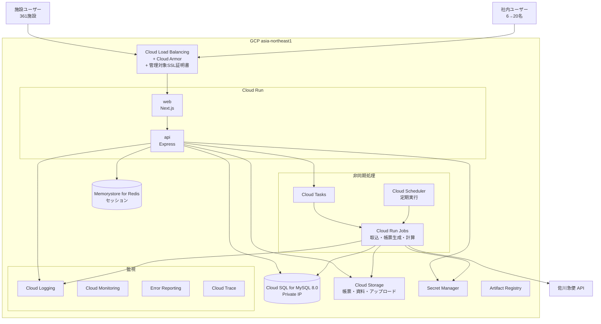

# 11. インフラ構成（GCP）

作成日: 2026-08-04
クラウド: Google Cloud Platform / リージョン: `asia-northeast1`（東京）

---

## 1. 構成の全体像



---

## 2. サービス構成

### 2.1 コンピュート

| サービス | 用途 | 構成 |
|---------|------|------|
| Cloud Run（`web`） | Next.js。SSR とクライアント配信 | CPU 1 / メモリ 512MB / 最小1 / 最大10 |
| Cloud Run（`api`） | Express REST API | CPU 2 / メモリ 1GB / 最小1 / 最大20 |
| Cloud Run Jobs | 取込・帳票生成・発注量計算 | CPU 2 / メモリ 2GB / タイムアウト30分 / 並列10 |

**最小インスタンス数を1にする理由。** 締切時刻（既定17:00）直前にアクセスが集中する（NFR-03-3: 50 req/s）。コールドスタートによる初回リクエストの遅延を避けるため、常時1インスタンスを維持する。費用とのトレードオフだが、締切直前の応答性は業務に直結する（NFR-06-3）。

**Cloud Run を選ぶ理由。** 社内利用者は20名程度、施設ユーザーも締切前に集中するため常時高負荷ではない。GKE の運用コストに見合わず、Cloud Run のリクエスト課金が費用効率に合う。

### 2.2 データベース

| 項目 | 設定 |
|------|------|
| サービス | Cloud SQL for MySQL 8.0 |
| インスタンス | `db-custom-2-8192`（vCPU 2 / メモリ 8GB）`[要確認]` 予算 |
| ストレージ | SSD 100GB。自動拡張を有効 |
| 可用性 | `[要確認]` 単一ゾーン（NFR-06-1 の99.5%は達成可能）または HA 構成 |
| 接続 | Private IP + Serverless VPC Access コネクタ |
| バックアップ | 日次自動バックアップ（保持30日）+ PITR（バイナリログ7日） |
| 文字セット | `utf8mb4` / `utf8mb4_0900_ai_ci` |
| タイムゾーン | `Asia/Tokyo` |
| 接続プール | Cloud Run のインスタンス数を考慮し、接続上限を設定（Prisma の `connection_limit`） |

**主要なフラグ設定**

| フラグ | 値 | 理由 |
|--------|-----|------|
| `innodb_buffer_pool_size` | メモリの70% | 大量データの読み取り性能（NFR-01-4） |
| `ngram_token_size` | 2 | 日本語全文検索（定型文・商品名の検索） |
| `slow_query_log` | ON | 性能問題の検知 |
| `long_query_time` | 1 | NFR-01 の目標値に対する閾値 |
| `max_connections` | 200 | Cloud Run の最大インスタンス数 × 接続数 |

パーティション（月単位）の追加は Cloud Scheduler から定期ジョブで自動化する（`05_data_model.md` §10.1）。

### 2.3 ストレージ

| バケット | 用途 | ストレージクラス | ライフサイクル |
|---------|------|----------------|--------------|
| `dan1-uploads` | アップロードファイル（らくらく献立 Excel 等） | Standard | 90日後に Nearline |
| `dan1-reports` | 生成帳票 | Standard | 1年後に Nearline、3年後に Coldline |
| `dan1-documents` | 献立資料（施設配布） | Standard | 1年後に Nearline |
| `dan1-exports` | 一時的な出力ファイル | Standard | **30日後に削除** |
| `dan1-backups` | DB エクスポート・移行データ | Nearline | 1年後に Coldline |

| 項目 | 設定 |
|------|------|
| アクセス制御 | 均一なバケットレベルアクセス。公開アクセスを禁止 |
| アップロード | 署名付きURL（有効期限15分）でクライアントから直接 |
| ダウンロード | 署名付きURL（有効期限15分）（NFR-11-6） |
| 暗号化 | Google 管理の暗号鍵（既定）。要件に応じて CMEK `[要確認]` |
| 冗長化 | `[要確認]` リージョン内冗長（既定）またはデュアルリージョン（NFR-07-4） |
| バージョニング | `dan1-reports`, `dan1-documents` で有効（誤削除対策） |

帳票・資料の保持期間は NFR-05 に従う。HACCP 関連帳票の法定保持期間が `[要確認]` のため、当面は削除しない設定とする。

### 2.4 非同期処理

| サービス | 用途 |
|---------|------|
| Cloud Tasks | ジョブのキューイング。リトライ制御（指数バックオフ・最大3回） |
| Cloud Run Jobs | 実際の処理実行 |
| Cloud Scheduler | 定期実行 |

**キューの分離**

処理特性の異なるジョブを混在させると、重い処理が軽い処理をブロックする。キューを分ける。

| キュー | 対象ジョブ | 並列度 | 最大実行時間 |
|-------|-----------|-------|------------|
| `imports` | らくらく献立取込・食数同期 | 3 | 30分 |
| `calculations` | 発注量計算 | 3 | 30分 |
| `reports` | 帳票・資料生成 | 5 | 15分 |
| `exports` | Excel / CSV 出力 | 5 | 10分 |
| `integrations` | 佐川 API 送信・メール送信 | 2 | 5分 |

**定期実行ジョブ（Cloud Scheduler）**

| ジョブ | スケジュール | 内容 |
|-------|------------|------|
| 締切リマインド | 毎時 | 締切1時間前の施設へ通知（FR-206） |
| 未入力施設判定 | 毎日 9:00 / 15:00 | アラート生成（FR-801） |
| 注文の確定処理 | 毎時 | 締切通過分を `provisional` → `confirmed` に |
| 食数同期 | 毎日 18:00 | 締切後の食数を発注側へ同期（FR-702） |
| 通知アーカイブ | 毎日 3:00 | 90日経過した既読通知をアーカイブ |
| ロック解放 | 5分毎 | 期限切れ `record_locks` の削除 |
| パーティション追加 | 毎月1日 4:00 | 12か月先までのパーティションを作成 |
| データ整合性検査 | 毎日 4:00 | FR-803 |
| 佐川伝票の自動発行 | 毎日 `[要確認]` | FR-504 |

### 2.5 ネットワーク・セキュリティ

| サービス | 設定 |
|---------|------|
| Cloud Load Balancing | HTTPS のみ。HTTP は 301 リダイレクト |
| 管理対象SSL証明書 | Google マネージド。自動更新 |
| Cloud Armor | WAF ルール（OWASP プリセット）、レート制限、地理的制限 `[要確認]` |
| Cloud DNS | 独自ドメインの管理（REQ-01） |
| Serverless VPC Access | Cloud Run → Cloud SQL / Redis の Private IP 接続 |
| Secret Manager | DB接続情報・APIキー・セッション秘密鍵（NFR-09-4） |
| IAM | サービスごとに最小権限のサービスアカウントを割当 |

**ドメイン設計（REQ-01）**

| 環境 | ドメイン |
|------|---------|
| 本番 | `[要確認]` 例: `system.dan1.jp` または `order.dan1.jp` を継承 |
| ステージング | `stg.system.dan1.jp` |
| 開発 | `dev.system.dan1.jp` |

現行は基幹が `order.dan1.jp`、在庫が `35.75.152.221`（IP直打ち・HTTP）で分かれていた。新システムは**単一ドメイン・単一デプロイ**とし、2システム間の予測困難なリダイレクト（A-03）を構造的に解消する。

社内向け画面へのIP制限は Cloud Armor で実現可能だが、拠点の固定IPの有無が `[要確認]`（NFR-11-10）。

### 2.6 監視

| サービス | 用途 |
|---------|------|
| Cloud Logging | 構造化ログ（JSON）。リクエストIDで追跡（NFR-13-1） |
| Cloud Monitoring | メトリクス・ダッシュボード・アラート |
| Error Reporting | エラーの集約と通知（NFR-13-2） |
| Cloud Trace | 分散トレース（NFR-13-6） |
| Uptime Checks | ヘルスチェック 1分間隔（NFR-13-5） |

**アラート設定**（NFR-13-4）

| 条件 | 通知先 | 重大度 |
|------|--------|-------|
| エラー率 5% 超（5分継続） | 開発者 + 社内管理者 | 高 |
| P95 応答時間が目標の2倍超 | 開発者 | 中 |
| Cloud SQL CPU 80% 超（10分継続） | 開発者 | 中 |
| Cloud SQL ストレージ 85% 超 | 開発者 | 中 |
| ジョブ失敗 | 実行者 + 開発者 | 中 |
| ジョブキューの滞留 50件超 | 開発者 | 中 |
| ヘルスチェック失敗（3回連続） | 開発者 | 高 |
| 締切1時間前のエラー発生 | 開発者 + 社内管理者 | **最高** |

最後の条件を設けるのは、締切直前の障害が業務に直結するためである（NFR-06-3）。

**ログの分離**

| 種別 | 保存先 | 保持 |
|------|--------|------|
| アプリケーションログ | Cloud Logging | 30日 |
| アクセスログ | Cloud Logging → BigQuery | 1年 |
| **業務監査ログ** | **MySQL `audit_logs`** | 2年（NFR-05-4） |

業務監査ログを Cloud Logging ではなく DB に保持する理由は、画面から検索・差分表示する必要があり（FR-804）、業務データとして扱うためである。

---

## 3. 環境構成

### 3.1 3環境（NFR-14-2）

| 環境 | 用途 | 構成 |
|------|------|------|
| 開発（`dev`） | 開発者の動作確認 | Cloud Run 最小0 / Cloud SQL `db-f1-micro` |
| ステージング（`stg`） | 受入テスト・性能テスト・移行リハーサル | 本番同等構成（インスタンスサイズは縮小可） |
| 本番（`prod`） | — | §2 の構成 |

**性能テスト（NFR-15-4）はステージングで本番同等のデータ量で実施する。** NFR-01-4（発注スケジュール P95 3秒）の検証には361施設・約2,700商品規模のデータが必要である。

### 3.2 プロジェクト分離

環境ごとに GCP プロジェクトを分離する。

```
dan1-system-dev
dan1-system-stg
dan1-system-prod
```

本番プロジェクトへの開発者アクセスは原則禁止し、必要時は承認と記録を伴う（NFR-12-4）。

### 3.3 IaC

| 項目 | 内容 |
|------|------|
| ツール | Terraform |
| 配置 | `infra/` ディレクトリ |
| 状態管理 | Cloud Storage バックエンド（環境ごとに分離） |
| 構成 | 環境ごとの `tfvars` で差分を管理 |
| 手動変更 | 禁止。すべて Terraform 経由 |

---

## 4. CI/CD

### 4.1 パイプライン（NFR-14-1）

```mermaid
flowchart LR
    PR[Pull Request] --> LINT[Lint / 型チェック]
    LINT --> UT[ユニットテスト]
    UT --> IT[統合テスト<br/>MySQL コンテナ]
    IT --> BUILD[ビルド]
    BUILD --> REV[レビュー]
    REV --> MERGE[main へマージ]
    MERGE --> IMG[イメージビルド<br/>Artifact Registry]
    IMG --> MIG[DBマイグレーション<br/>stg]
    MIG --> DEP_STG[stg へデプロイ]
    DEP_STG --> E2E[E2Eテスト<br/>Playwright]
    E2E --> APPROVE[本番リリース承認]
    APPROVE --> MIG_P[DBマイグレーション<br/>prod]
    MIG_P --> DEP_P[prod へデプロイ<br/>段階的トラフィック移行]
```



| 項目 | 内容 |
|------|------|
| ツール | GitHub Actions |
| イメージ | Artifact Registry（`asia-northeast1`） |
| 認証 | Workload Identity 連携（サービスアカウントキーを使わない） |
| デプロイ方式 | Cloud Run のリビジョン切替。10% → 50% → 100% の段階移行（NFR-14-3） |
| ロールバック | 直前のリビジョンへトラフィックを戻す（5分以内、NFR-14-4） |

### 4.2 DB マイグレーション（NFR-14-5）

後方互換を保った段階適用とする。

```
Step 1: 列の追加（NULL 許容）→ デプロイ
Step 2: アプリコードが新列を使用 → デプロイ
Step 3: データ移行（バッチ）
Step 4: 旧列の削除 → デプロイ
```

Prisma Migrate で生成した SQL をレビューし、大規模テーブルへの `ALTER TABLE` はオンラインDDL（`ALGORITHM=INPLACE`）で実行可能かを確認する。`meal_orders`（2,000万行）への変更は特に注意する。

パーティション定義は Prisma が生成しないため、マイグレーションSQL に手動で追記する。

### 4.3 バージョン管理（A-04 の解消）

現行は Ver.1.0.8 と Ver.1.0.7-admin が混在していた。新システムでは単一デプロイのため構造的に発生しないが、以下を実施する。

| 項目 | 内容 |
|------|------|
| バージョン番号 | Git タグから自動生成し、ビルド時に埋め込む |
| 表示 | 全画面のフッターに単一の値を表示（NFR-14-6） |
| API | `GET /api/v1/version` でバージョンとコミットハッシュを返す |

---

## 5. バックアップ・災害復旧

### 5.1 バックアップ（NFR-07）

| 対象 | 方式 | 頻度 | 保持 |
|------|------|------|------|
| Cloud SQL | 自動バックアップ | 日次（深夜3時） | 30日 |
| Cloud SQL | PITR（バイナリログ） | 継続 | 7日 |
| Cloud SQL | 論理エクスポート（`mysqldump`） | 週次 | 90日（`dan1-backups`） |
| Cloud Storage | バージョニング | 継続 | 90日 |
| Cloud Storage | 別リージョン複製 | `[要確認]` 日次 | — |
| Secret Manager | バージョン管理 | 継続 | — |
| Terraform 状態 | Cloud Storage バージョニング | 継続 | — |

RPO 1時間（NFR-07-1）は PITR で達成する。RTO 4時間（NFR-07-2）は Cloud SQL のリストアと Cloud Run の再デプロイの合計時間を想定している。

### 5.2 リストア手順の整備

年2回のリストア訓練を実施する（NFR-07-5）。訓練内容は次のとおり。

```
1. 本番のバックアップをステージング環境にリストア
2. 特定時点（例: 3日前の14:00）への PITR を実行
3. アプリケーションを接続して業務データの整合性を確認
4. 所要時間を計測し RTO 4時間の妥当性を検証
5. 手順書を更新
```

---

## 6. 費用見積

`[要確認]` 予算上限。以下は §2 の構成での概算（NFR-21）。

| サービス | 構成 | 月額概算 |
|---------|------|---------|
| Cloud Run（web） | 最小1 / CPU1 / 512MB | 約 4,000円 |
| Cloud Run（api） | 最小1 / CPU2 / 1GB | 約 9,000円 |
| Cloud Run Jobs | 実行時間ベース | 約 3,000円 |
| Cloud SQL | `db-custom-2-8192` 単一ゾーン / SSD 100GB | 約 32,000円 |
| Memorystore for Redis | Basic 1GB | 約 6,000円 |
| Cloud Storage | 500GB + 転送 | 約 3,000円 |
| Cloud Load Balancing | — | 約 3,000円 |
| Cloud Tasks / Scheduler | — | 約 500円 |
| Cloud Logging / Monitoring | — | 約 3,000円 |
| Artifact Registry | — | 約 500円 |
| **合計（本番のみ）** | — | **約 64,000円** |
| ステージング | 縮小構成 | 約 20,000円 |
| 開発 | 最小構成 | 約 8,000円 |
| **総計** | — | **約 92,000円** |

**費用を左右する選択**

| 選択肢 | 差額 | 判断 |
|--------|------|------|
| Cloud SQL の HA 構成 | +約 32,000円/月 | NFR-06-1（99.5%）は単一ゾーンでも達成可能。予算次第 `[要確認]` |
| 最小インスタンス数 0 | −約 10,000円/月 | 締切直前のコールドスタートを許容できるかで判断。**推奨しない** |
| Memorystore を使わず Cloud SQL でセッション管理 | −約 6,000円/月 | 利用者20名規模では性能上問題ない。コスト削減の選択肢 |
| Cloud Storage デュアルリージョン | +約 2,000円/月 | NFR-07-4。災害対策の要件次第 |

上表は 1USD=150円 で換算した概算であり、実際の使用量で変動する。正確な見積は GCP の料金計算ツールで構成確定後に算出する。

---

## 7. 現行環境との比較

| 項目 | 現行 | 新システム |
|------|------|----------|
| 基幹システムのホスティング | `[要確認]` 不明 | Cloud Run |
| 在庫システムのホスティング | `35.75.152.221`（AWS の可能性）| Cloud Run |
| プロトコル | 基幹 HTTPS / 在庫 **HTTP 平文** | 全 HTTPS |
| ドメイン | 基幹 `order.dan1.jp` / 在庫 **IP直打ち** | 単一ドメイン |
| デプロイ単位 | 2システム独立 | 単一 |
| バージョン | 1.0.8 と 1.0.7-admin が混在 | 単一 |
| バックアップ | `[要確認]` | 自動化 + PITR |
| 監視 | `[要確認]` 障害が放置されている形跡あり（500エラー） | Cloud Monitoring + アラート |

`[要確認]` 現行の基幹システムのホスティング環境と、移行時のデータ取得方法（DBダンプの提供可否）。`12_migration_plan.md` に影響する。

---

## 8. 未確定事項

| # | 項目 | 影響 |
|---|------|------|
| 1 | GCP 月額予算の上限 | インスタンスサイズ・HA構成の選択 |
| 2 | Cloud SQL の HA 構成の採否 | 費用と可用性のトレードオフ |
| 3 | 本番ドメイン名 | DNS 設定・SSL証明書・移行計画 |
| 4 | 社内拠点の固定IPの有無 | Cloud Armor のIP制限 |
| 5 | Cloud Storage の冗長化レベル | NFR-07-4 |
| 6 | CMEK（顧客管理暗号鍵）の要否 | NFR-09-3 |
| 7 | 現行環境のホスティングとDBダンプの取得可否 | 移行方式 |
| 8 | 佐川伝票の自動発行スケジュール | Cloud Scheduler の設定 |
| 9 | メール送信基盤の選定 | 追加サービスの費用 |

---

## 9. 関連ドキュメント

| 参照先 | 内容 |
|--------|------|
| `04_non_functional_requirements.md` | NFR-06〜08, 13, 14, 21 |
| `05_data_model.md` | パーティション・インデックス設計 |
| `09_integration_spec.md` | 外部連携の通信要件 |
| `12_migration_plan.md` | 移行時のインフラ準備 |
| `13_phase_plan.md` | Phase 0 でのインフラ構築 |
