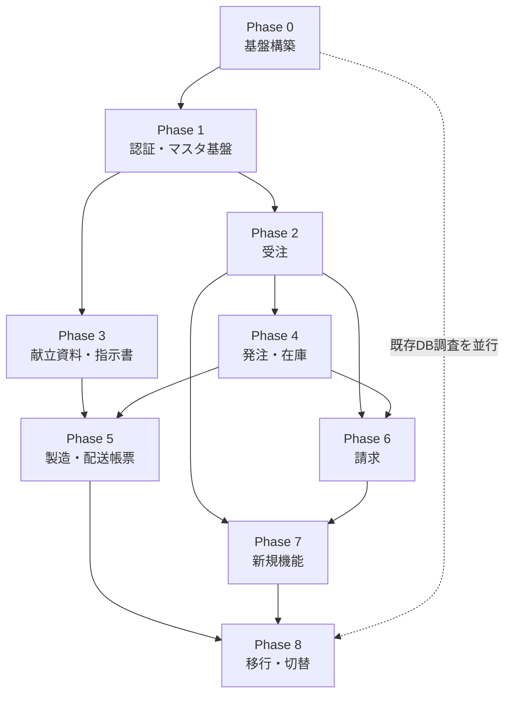

# 13. フェーズ別実装計画

作成日: 2026-08-04

---

## 1. フェーズ分割の方針

### 1.1 分割の基準

| 基準 | 内容 |
|------|------|
| 依存関係 | 認証・マスタ基盤が先。それらに依存する業務機能が後 |
| 業務サイクル | 受注 → 発注 → 製造 → 配送 → 請求 の順に実装し、上流から動く状態を作る |
| 要望の優先度 | 運用負荷が高い要望（REQ-13, 22, 23）を早期のフェーズに配置 |
| リスク | 不確定要素が大きいもの（QR、佐川API）を後半に配置し、確認期間を確保 |

### 1.2 フェーズ一覧

| Phase | 名称 | 主な成果 | 対応REQ |
|-------|------|---------|---------|
| 0 | 基盤構築 | インフラ・CI/CD・DB・監視 | REQ-01 |
| 1 | 認証・マスタ基盤 | ログイン・権限・共通マスタ・監査・ジョブ | REQ-01, 02, 07, 09, 10 |
| 2 | 受注 | 注文入力・変更・履歴・締切・アラート | REQ-03, 04, 05, 06, 12, 13, 20 |
| 3 | 献立資料・盛付指示書 | 資料の版管理・定型文・指示書 | REQ-11, 16, 17, 18 |
| 4 | 発注・在庫 | 取込・発注量計算・スケジュール・棚卸 | REQ-08, 21, 22, 23 |
| 5 | 製造・配送帳票 | 製造帳票・ラベル・QR・佐川伝票 | REQ-14, 15 |
| 6 | 請求 | 締め・発行・訂正・売価 | REQ-03 |
| 7 | 新規機能・仕上げ | 特別注文・試食会・整合性検査 | REQ-19, 24 |
| 8 | 移行・切替 | データ移行・研修・本番切替 | — |

**Phase 1 と 2 で REQ-13（締切のマスタ化）が完了する。** これは要望の中で運用負荷が最も高い項目であり、早期に効果が出る。Phase 4 で REQ-22, 23（性能）が完了する。

### 1.3 動く状態の確保

各フェーズの終了時に、そのフェーズまでの機能でステージング環境が動作する状態を作る。Phase 2 が終われば施設が注文でき、Phase 4 が終われば発注業務が回る。全機能が揃うまで何も動かない状態を避ける。

---

## 2. Phase 0: 基盤構築

### 2.1 目的

開発・デプロイの基盤を整え、以降のフェーズで機能実装に集中できる状態を作る。

### 2.2 タスク

| # | タスク | 成果物 | 参照 |
|---|--------|-------|------|
| 0-1 | GCP プロジェクト作成（dev / stg / prod） | 3プロジェクト | `11_infrastructure.md` §3 |
| 0-2 | Terraform による IaC 構築 | `infra/` | §3.3 |
| 0-3 | Cloud SQL / Redis / Storage / VPC 構築 | インフラ | §2 |
| 0-4 | モノレポの初期構築 | `apps/`, `packages/` | `00_background_scope.md` |
| 0-5 | Prisma スキーマの初期定義 + マイグレーション | `packages/database` | `05_data_model.md` |
| 0-6 | Express の基本構成（ミドルウェア・エラーハンドラ） | `apps/api` | `08_api_spec.md` §4.1 |
| 0-7 | Next.js の基本構成（レイアウト・ルートグループ） | `apps/web` | `07_screen_spec.md` §1 |
| 0-8 | デザイントークン・共通UIコンポーネント（misaki-reports 準拠） | `packages/ui` / AppLayout・Sidebar・PageHeader | `15_ui_design_spec.md` |
| 0-9 | GitHub Actions による CI/CD | パイプライン | `11_infrastructure.md` §4 |
| 0-10 | Cloud Logging / Monitoring / アラート設定 | 監視 | §2.6 |
| 0-11 | ドメイン取得・DNS・SSL証明書 | ドメイン | REQ-01 |
| 0-12 | テスト基盤（Vitest / Playwright / MySQL コンテナ） | テスト環境 | NFR-15 |

### 2.3 完了条件

| # | 条件 |
|---|------|
| 1 | ステージング環境に HTTPS でアクセスでき、ヘルスチェックが通る |
| 2 | Pull Request から自動テスト・自動デプロイが動作する |
| 3 | Prisma マイグレーションが3環境で適用できる |
| 4 | 意図的にエラーを発生させると Error Reporting とアラートが動作する |

---

## 3. Phase 1: 認証・マスタ基盤

### 3.1 目的

すべての機能が依存する認証・権限・マスタ・共通基盤を実装する。ここで設定駆動の仕組みを作り込む。**REQ-02 の達成基盤がこのフェーズで決まる。**

### 3.2 タスク

| # | タスク | FR | 対応REQ |
|---|--------|-----|---------|
| 1-1 | ユーザー・ロール・権限のデータ構造と管理画面 | FR-104 | — |
| 1-2 | ログイン・ログアウト・セッション（社員番号 / HACCP番号 / 施設） | FR-101, FR-103 | REQ-01 |
| 1-3 | パスワードポリシー・初回変更強制・アカウントロック | FR-101 | — |
| 1-4 | 多要素認証（TOTP） | FR-102 | — |
| 1-5 | 権限検証ミドルウェア・スコープ強制（リポジトリ層） | FR-104 | — |
| 1-6 | **監査ログの自動記録基盤** | FR-001 | — |
| 1-7 | **非同期ジョブ基盤**（Cloud Tasks + Cloud Run Jobs + 進捗表示） | FR-002 | REQ-22 |
| 1-8 | 通知基盤 | FR-003 | — |
| 1-9 | ファイル管理（署名付きURL） | FR-004 | — |
| 1-10 | **一覧の共通仕様**（検索・絞込・並び替えの永続化） | FR-005 | REQ-18, 23 |
| 1-11 | CSV 入出力の共通仕組み | FR-006 | — |
| 1-12 | **有効期間を持つ設定の解決ロジック** | FR-202 | REQ-11, 16 |
| 1-13 | マスタ共通の CRUD 基盤（論理削除・表示順・影響範囲試算） | FR-201 | REQ-02 |
| 1-14 | **嚥下食区分マスタ** | FR-203 | REQ-07, 09 |
| 1-15 | 食種・食事区分・献立種類・アレルギー種類マスタ | FR-210 | REQ-02 |
| 1-16 | **施設マスタ（タブ構成の編集画面・登録ウィザード）** | FR-106 | REQ-10 |
| 1-17 | ユニットマスタ | FR-106 | — |
| 1-18 | 営業日カレンダー | FR-505 | REQ-08 |
| 1-19 | 監査ログ検索画面 | FR-804 | — |
| 1-20 | システム設定画面 | FR-201 | — |

### 3.3 完了条件

| # | 条件 |
|---|------|
| 1 | 社内ユーザーが社員番号・HACCP番号の両方でログインできる |
| 2 | 施設ユーザーがログインでき、自施設以外のデータにアクセスできない |
| 3 | 嚥下食区分を追加・並び替えでき、表示順が API レスポンスに反映される |
| 4 | 施設を新規登録し、翌日にすべての項目を変更できる |
| 5 | 施設の食種を未来日付から変更でき、有効期間の履歴が確認できる |
| 6 | マスタ更新が監査ログに変更前後の値とともに記録される |
| 7 | 非同期ジョブを登録し、進捗が画面に表示され、完了時に通知される |

条件3・4・5は REQ-07, 09, 10, 11, 16 の基礎部分の検証にあたる。

---

## 4. Phase 2: 受注

### 4.1 目的

施設ユーザーが注文でき、社内が確認・代理入力できる状態を作る。締切のマスタ化により REQ-13 を完了させる。

### 4.2 タスク

| # | タスク | FR | 対応REQ |
|---|--------|-----|---------|
| 2-1 | **締切ルールマスタ + 締切例外日マスタ** | FR-205 | REQ-13 |
| 2-2 | **締切の解決ロジック**（例外日・スコープ優先・営業日調整） | FR-205 | REQ-13 |
| 2-3 | **締切の画面表示**（バナー・残り時間・カレンダー） | FR-206 | REQ-13 |
| 2-4 | 注文区分マスタ（通常 / 試食会 / 特別 / 元旦） | FR-902 | REQ-24 |
| 2-5 | **週間注文入力画面**（動的な行生成・キーボード操作・自動保存） | FR-301 | REQ-04, 07, 09 |
| 2-6 | **楽観ロックと競合解決UI** | FR-307 | REQ-22 |
| 2-7 | 注文変更画面（絞込・インライン編集・差分表示） | FR-302 | REQ-05 |
| 2-8 | 注文履歴画面（4つの表示形式・出力） | FR-303 | REQ-06 |
| 2-9 | 混ぜご飯の合数指定 | FR-304 | REQ-04 |
| 2-10 | アレルギー注文（新規 / 変更の分離） | FR-305 | REQ-04, 12 |
| 2-11 | **施設別アレルギー設定の削除機能** | FR-208 | REQ-12 |
| 2-12 | 元旦注文 | FR-306 | — |
| 2-13 | 注文停止予約・長期休暇マスタ | FR-210 | REQ-20 |
| 2-14 | **未入力施設アラート**（4条件による除外判定） | FR-801 | REQ-20 |
| 2-15 | 締切リマインドの定期ジョブ | FR-206 | REQ-13 |
| 2-16 | **施設への成り代わり** | FR-105 | REQ-03 |
| 2-17 | 社内向け注文一覧・代理入力 | FR-303 | REQ-03 |
| 2-18 | 社内ダッシュボード | FR-802 | — |
| 2-19 | お知らせ管理（掲載期間・カテゴリ） | FR-308 | — |
| 2-20 | 販売固定商品・仮注文特別対応マスタ | FR-210 | REQ-02 |

### 4.3 完了条件

| # | 条件 |
|---|------|
| 1 | 施設ユーザーが1週間分の食数を入力・保存できる |
| 2 | 締切時刻をマスタから変更でき、全施設の表示に即時反映される |
| 3 | **正月の締切前倒しを画面操作のみで設定でき、対象施設に通知される** |
| 4 | 嚥下食区分を追加すると注文入力の列が自動的に増える |
| 5 | 締切超過後の保存が拒否され、理由が画面に表示される |
| 6 | 2ユーザーが同一セルを同時に編集し、競合が検出されて選択肢が提示される |
| 7 | 未入力施設アラートに契約終了施設・注文停止施設が表示されない |
| 8 | 社内管理者が施設ビューに切り替えて注文を代理入力でき、監査ログに代理操作として記録される |
| 9 | 施設のアレルギー設定を削除でき、確定済み注文に影響しない |

条件3が REQ-13 の、条件7が REQ-20 の受入条件である。

---

## 5. Phase 3: 献立資料・盛付指示書

### 5.1 目的

資料・帳票のスナップショット管理を実装し、REQ-16, 17 を構造的に解決する。定型文の編集性を改善して REQ-18 を完了させる。

### 5.2 タスク

| # | タスク | FR | 対応REQ |
|---|--------|-----|---------|
| 3-1 | **資料出力ルールマスタ**（食種×資料種別のマトリクス） | FR-209 | REQ-11 |
| 3-2 | **スナップショット管理基盤**（settings_snapshot の生成・参照） | FR-402 | REQ-16, 17 |
| 3-3 | 献立資料の登録・アップロード | FR-401 | REQ-17 |
| 3-4 | **資料の版管理**（版履歴・設定差分比較・再生成） | FR-402 | REQ-16 |
| 3-5 | 資料の施設への公開・配布状況確認 | FR-401 | REQ-17 |
| 3-6 | 施設側の資料閲覧画面 | FR-401 | — |
| 3-7 | 献立資料フォルダマスタ | FR-210 | REQ-02 |
| 3-8 | **献立定型文マスタ**（プレビュー・全文検索・タグ） | FR-207 | REQ-18 |
| 3-9 | **定型文の重複検出・統合** | FR-207 | REQ-18 |
| 3-10 | **定型文の使用回数集計・一括アーカイブ** | FR-207 | REQ-18 |
| 3-11 | 盛付指示書の作成（定型文選択・本文スナップショット） | FR-403 | REQ-18 |
| 3-12 | 盛付指示書の表示停止・再開マスタ | FR-403 | REQ-02 |
| 3-13 | 栄養月報の変換 | FR-401 | — |

### 5.3 完了条件

| # | 条件 |
|---|------|
| 1 | 8月分の資料を生成後、施設の食種を9月から変更しても8月分の資料の内容が変わらない |
| 2 | 資料一覧に「生成時点の食種」が表示され、現在のマスタ値と異なる場合も正しく表示される |
| 3 | 食種を変更すると、変更日以降の資料生成で出力対象が自動的に切り替わる |
| 4 | 定型文の一覧で本文の先頭が表示され、クリックせずに内容が判別できる |
| 5 | 定型文を本文のキーワードで検索できる |
| 6 | 定型文の並び順を変更し、他画面へ遷移して戻っても並び順が維持される |
| 7 | 定型文を一括アーカイブしても、過去の盛付指示書の内容が変わらない |

条件1が REQ-16 の、条件4〜7が REQ-18 の受入条件である。

---

## 6. Phase 4: 発注・在庫

### 6.1 目的

現行の発注・在庫システムの機能を移植しつつ、性能課題（REQ-22, 23）と参照ロジック（REQ-21）を解決する。**本プロジェクトで最も工数が大きく、リスクも高いフェーズ。**

### 6.2 タスク

| # | タスク | FR | 対応REQ |
|---|--------|-----|---------|
| 4-1 | 仕入業者・業者別商品・パッケージ単位マスタ | FR-210 | REQ-02 |
| 4-2 | **製造パターンマスタ + 施設への割当** | FR-204 | REQ-08 |
| 4-3 | **配送日算出ロジック**（営業日調整・シミュレーション） | FR-505 | REQ-08 |
| 4-4 | **参照ロジックマスタ**（直近実績の追加・フォールバック） | FR-704 | REQ-21 |
| 4-5 | 参照ロジックの施設割当（361件の一括設定・CSV・プレビュー） | FR-704 | REQ-21 |
| 4-6 | **らくらく献立ファイルの取込**（非同期・3ファイル個別） | FR-701 | REQ-22 |
| 4-7 | **取込エラーの解消UI + 食材名の自動学習** | FR-701 | — |
| 4-8 | 取込状況カレンダー | FR-708 | — |
| 4-9 | 取込のロールバック | FR-701 | — |
| 4-10 | **食数同期**（期間制限の撤廃・定期実行） | FR-702 | REQ-22 |
| 4-11 | 食数補正 | FR-705 | — |
| 4-12 | **発注量の事前計算**（参照ロジック・補正・ロット補正の適用） | FR-703 | REQ-21, 22 |
| 4-13 | **計算根拠の記録と表示** | FR-703 | REQ-21 |
| 4-14 | **発注スケジュール画面**（ページング・商品絞込・簡易モード） | FR-706 | REQ-22, 23 |
| 4-15 | 発注スケジュールのインライン編集（楽観ロック・在庫波及計算） | FR-706 | REQ-22 |
| 4-16 | 発注確認済みの一括登録 | FR-706 | — |
| 4-17 | 発注スケジュールの非同期 Excel 出力 | FR-706 | REQ-23 |
| 4-18 | 編集中インジケータ | FR-307 | REQ-22 |
| 4-19 | 棚卸入力・結果一覧（タブレット対応） | FR-707 | — |
| 4-20 | 合数ログ出力 | FR-709 | REQ-21 |
| 4-21 | 混ぜご飯・原体送りマスタ | FR-210 | REQ-02 |
| 4-22 | **性能テスト**（NFR-01-4 の検証） | — | REQ-22, 23 |

### 6.3 完了条件

| # | 条件 |
|---|------|
| 1 | **発注スケジュール1週間分の表示が P95 3秒以内**（本番同等データ・NFR-01-4） |
| 2 | **商品名・カテゴリで絞込でき、特定材料のみのスケジュールを出力できる** |
| 3 | **3ユーザーが同一業者を同時に開いて編集でき、業者ロックが存在しない** |
| 4 | 1か月分の食数同期が期間制限なく5分以内に完了する |
| 5 | 3ファイルの取込タイミングが揃わなくても個別に取込できる |
| 6 | 取込エラーの食材を画面から商品マスタに紐付けられ、次回以降は自動解決される |
| 7 | 参照ロジックに「過去同一献立（上限180日）→直近実績」を設定でき、フォールバックが発生する |
| 8 | 発注量の計算根拠から、どの施設がどのデータを参照したか追跡できる |
| 9 | 製造パターンを変更すると配送日算出に反映され、過去の実績は変わらない |

条件1〜3が REQ-22, 23 の受入条件である。**条件1が未達の場合、本プロジェクトの主要な改善目標が達成されない**ため、リリース判定の必須項目とする（NFR-15-4）。

### 6.4 リスク

| リスク | 対策 |
|--------|------|
| 発注量計算ロジックが現行と一致しない | 現行の出力と新システムの出力を同一データで突合するテストを実施 |
| 性能目標を達成できない | Phase 4 の早期に性能検証を行い、達成できない場合は設計を見直す時間を確保 |
| らくらく献立の Excel 形式が想定と異なる | 実ファイルの提供を Phase 4 開始前に受ける |
| 参照ロジックの現行仕様が不明 | 361施設の設定内容の提供を受ける |

---

## 7. Phase 5: 製造・配送帳票

### 7.1 目的

製造・配送工程の帳票を生成し、佐川伝票の自動化（REQ-14）と QR の分割（REQ-15）を実現する。

### 7.2 タスク

| # | タスク | FR | 対応REQ |
|---|--------|-----|---------|
| 5-1 | 帳票生成の共通基盤（条件指定 → 非同期 → 履歴） | FR-501 | — |
| 5-2 | 製造帳票8種の生成 | FR-501 | — |
| 5-3 | 配送ラベル・シール・パウチ出力 | FR-502 | — |
| 5-4 | ピッキング指示書・結果追跡 | FR-502 | — |
| 5-5 | **QRレイアウトマスタ + ペイロードルールマスタ** | FR-503 | REQ-15 |
| 5-6 | **料理構成要素の管理**（味噌汁本体 / 具の分離） | FR-503 | REQ-15 |
| 5-7 | **QR生成 + プレビュー + 読み取り検証** | FR-503 | REQ-15 |
| 5-8 | ユニット配送情報マスタ | FR-210 | REQ-02 |
| 5-9 | **佐川伝票の生成**（製造パターンからの配送単位集約） | FR-504 | REQ-14 |
| 5-10 | **佐川急便 API 連携**（方式A） | FR-504 | REQ-14 |
| 5-11 | CSV フォールバック（方式B） | FR-504 | REQ-14 |
| 5-12 | 佐川伝票の発行状況・追跡番号の管理 | FR-504 | REQ-14 |
| 5-13 | 定期実行による自動発行 | FR-504 | REQ-14 |
| 5-14 | P7印刷用CSV | FR-502 | — |

### 7.3 完了条件

| # | 条件 |
|---|------|
| 1 | 主要な製造帳票を生成し、現行の出力と内容が一致する |
| 2 | **QRの分割キーに料理構成要素を設定すると、味噌汁と味噌汁具が別QRになる** |
| 3 | 生成したQRをデコードして内容が正しいことを自動検証できる |
| 4 | **手動でのファイル出力・取込操作なしに佐川の送り状が発行される** |
| 5 | 佐川 API が利用できない場合に CSV へ自動フォールバックする |
| 6 | 帳票がスナップショット管理され、マスタ変更後も内容が変わらない |

条件2が REQ-15 の、条件4が REQ-14 の受入条件である。

### 7.4 リスク

| リスク | 対策 |
|--------|------|
| **佐川急便の API 契約がない** | Phase 5 開始前に確認。方式B（CSV）を必ず実装する |
| **QR の現行仕様が不明で既存機器と非互換になる** | Phase 5 開始前に現行のペイロード仕様とラベル機器を確認 |
| ラベルの物理レイアウトが合わない | 実際のラベル用紙で印刷テストを実施 |

`09_integration_spec.md` §4.4 の未確定事項が Phase 5 の最大のリスクである。**Phase 4 の期間中に確認を完了させる必要がある。**

---

## 8. Phase 6: 請求

### 8.1 目的

請求の締め・発行・訂正を実装し、REQ-03 を完了させる。

### 8.2 タスク

| # | タスク | FR | 対応REQ |
|---|--------|-----|---------|
| 6-1 | 単価情報・税率マスタ（有効期間付き） | FR-210 | REQ-02 |
| 6-2 | 出荷・お届け・売上日設定マスタ | FR-210 | REQ-08 |
| 6-3 | 請求締め処理（非同期・プレビュー） | FR-601 | — |
| 6-4 | 請求書の発行（スナップショット・PDF生成） | FR-601 | — |
| 6-5 | 請求書一覧（社内・全施設） | FR-602 | REQ-03 |
| 6-6 | **請求書の訂正**（明細の追加・削除・訂正版の発行） | FR-602 | REQ-03 |
| 6-7 | 訂正履歴と施設への通知 | FR-602 | REQ-03 |
| 6-8 | **施設側の請求書閲覧・ダウンロード** | FR-603 | REQ-03 |
| 6-9 | 成り代わりでの請求書確認 | FR-105, FR-602 | REQ-03 |
| 6-10 | 請求書の一括登録 | FR-601 | — |
| 6-11 | 売価計算（試食会を除外） | FR-604 | REQ-24 |

### 8.3 完了条件

| # | 条件 |
|---|------|
| 1 | 月次の請求データを生成し、金額が正しく計算される |
| 2 | 施設ユーザーが自施設の請求書を閲覧・ダウンロードできる |
| 3 | **社内から施設ビューに切り替えて、施設に見えている請求書を確認できる** |
| 4 | **発行済み請求書の明細を追加・削除・修正して訂正版を発行できる** |
| 5 | 訂正時に施設へ通知され、施設側で最新版と旧版の両方が確認できる |
| 6 | 単価を未来日付から変更しても、過去の請求書の金額が変わらない |

条件3・4が REQ-03 の受入条件である。

---

## 9. Phase 7: 新規機能・仕上げ

### 9.1 目的

FAX 運用の脱却（REQ-19）と試食会対応（REQ-24）を実装する。全体の品質を仕上げる。

### 9.2 タスク

| # | タスク | FR | 対応REQ |
|---|--------|-----|---------|
| 7-1 | **特別注文枠の管理**（社内側） | FR-901 | REQ-19 |
| 7-2 | **特別注文の受付**（施設側・期間限定表示） | FR-901 | REQ-19 |
| 7-3 | 特別注文の集計・出力 | FR-901 | REQ-19 |
| 7-4 | **試食会の管理**（登録・食数・帳票連携制御） | FR-902 | REQ-24 |
| 7-5 | 試食会の実績集計 | FR-902 | REQ-24 |
| 7-6 | データ整合性の自動検知 | FR-803 | — |
| 7-7 | 問い合わせチャット | FR-309 | — |
| 7-8 | 通知の絞込・アーカイブの仕上げ | FR-003 | — |
| 7-9 | アクセシビリティ対応の仕上げ | — | — |
| 7-10 | 印刷レイアウトの仕上げ | — | — |
| 7-11 | E2Eテストの完成 | — | NFR-15-3 |
| 7-12 | 負荷テスト・セキュリティテスト | — | NFR-15-4 |
| 7-13 | 操作マニュアルの作成 | — | — |

### 9.3 完了条件

| # | 条件 |
|---|------|
| 1 | **おせち容器の注文枠を作成し、受付期間中のみ施設に注文欄が表示される** |
| 2 | 特別注文の集計を Excel 出力でき、FAX 運用を廃止できる |
| 3 | **試食会の食数が製造帳票に含まれ、佐川伝票・請求データには含まれない** |
| 4 | 施設ユーザーが他施設のデータにアクセスできない（セキュリティテスト） |
| 5 | ピーク50 req/s でエラー率1%未満（負荷テスト） |
| 6 | 主要業務フローのE2Eテストが通る |

条件1・2が REQ-19 の、条件3が REQ-24 の受入条件である。

---

## 10. Phase 8: 移行・切替

`12_migration_plan.md` の内容を実行する。

| # | タスク | 参照 |
|---|--------|------|
| 8-1 | 既存DBのスキーマ・データ提供を受ける | §1.2 |
| 8-2 | マッピング表の作成 | §2 |
| 8-3 | 移行スクリプトの実装 | §3 |
| 8-4 | 第1回リハーサル（動作確認・所要時間実測） | §5 |
| 8-5 | データクレンジング | §6 |
| 8-6 | 第2回リハーサル（データ品質確認） | §5 |
| 8-7 | 受入テスト（`06_master_management_spec.md` §12 の12シナリオ） | — |
| 8-8 | 性能テスト（本番同等データ） | NFR-15-4 |
| 8-9 | 施設への通知発送（初期パスワード） | §3.6 |
| 8-10 | 社内研修（2回 + 管理者個別） | §8.1 |
| 8-11 | 第3回リハーサル（本番手順・切り戻し訓練） | §5 |
| 8-12 | 切替判定会議 | — |
| 8-13 | 本番切替 | §4.2 |
| 8-14 | 集中サポート期間 | §4.1 |
| 8-15 | 現行システムの停止 | §7 |

**8-1 は Phase 0 の時点で着手すべきである。** 既存DBの内容が不明なままでは Phase 4（発注・在庫）以降の設計精度が上がらず、移行計画も確定できない。

---

## 11. フェーズ間の依存関係

### 11.1 並行実施が可能な組み合わせ

| 組み合わせ | 条件 |
|-----------|------|
| Phase 2 と Phase 3 | Phase 1 完了後。担当を分ければ並行可能 |
| Phase 5 と Phase 6 | Phase 4 完了後。それぞれ独立性が高い |
| Phase 8 の 8-1〜8-3 | Phase 0 以降、他フェーズと並行して進める |

### 11.2 直列にすべき箇所

| 箇所 | 理由 |
|------|------|
| Phase 0 → 1 | 基盤なしに実装できない |
| Phase 1 → 2, 3 | 認証・マスタ・有効期間の仕組みに全機能が依存する |
| Phase 2 → 4 | 発注量計算が注文データを前提とする |
| Phase 4 → 5 | 配送帳票が製造パターンと確定注文を前提とする |

---

## 12. 要望の完了フェーズ一覧

| REQ | 要望概要 | 完了Phase |
|-----|---------|----------|
| REQ-01 | 独自ドメイン運用 | **0** |
| REQ-02 | マスタ機能の拡充 | 1〜6（各フェーズで該当マスタを実装） |
| REQ-03 | 施設サイト閲覧・請求書の確認と訂正 | **6** |
| REQ-04 | 注文画面の入力性 | **2** |
| REQ-05 | 数量変更画面の見づらさ | **2** |
| REQ-06 | 注文確認の見にくさ | **2** |
| REQ-07 | 嚥下食の表示順 | **1** |
| REQ-08 | 製造パターンのマスタ化 | **4** |
| REQ-09 | 嚥下食追加時の欄追加 | **1** |
| REQ-10 | 新規施設登録時の内容修正 | **1** |
| REQ-11 | 食種変更に伴う資料出力設定 | **3** |
| REQ-12 | 施設アレルギーの消去 | **2** |
| REQ-13 | 仮注文締切のマスタ化・表示 | **2** |
| REQ-14 | 佐川伝票の完全自動化 | **5** |
| REQ-15 | 9分割QRの分離 | **5** |
| REQ-16 | 食種変更で過去資料が変わる不具合 | **3** |
| REQ-17 | CP献立資料管理の不整合 | **3** |
| REQ-18 | 指示書定型文の編集性 | **3** |
| REQ-19 | おせち容器注文のFAX脱却 | **7** |
| REQ-20 | 未入力施設に終了施設が残る | **2** |
| REQ-21 | 合数未登録施設は直近を参照 | **4** |
| REQ-22 | 複数人同時利用時のロード時間 | **4** |
| REQ-23 | 特定材料だけスケジュール出力 | **4** |
| REQ-24 | 試食会対応 | **7** |

**Phase 2 終了時点で7件（REQ-04, 05, 06, 12, 13, 20 + REQ-01, 07, 09, 10 を含めると11件）が完了する。** 運用負荷の高い要望が前半に集まっており、早期に効果が出る構成になっている。

---

## 13. 工数見積について

`[要確認]` 本ドキュメントでは工数・期間を提示していない。理由は次のとおり。

既存システムのソースコードにアクセスできておらず、移植すべきロジックの複雑さ（特に発注量計算・帳票生成）を測れない。既存DBのスキーマ・データ量が不明で、移行工数を見積れない。らくらく献立の Excel 形式、QR の仕様、佐川の API 契約状況といった外部依存の不確定要素が大きい。開発体制（人数・スキルセット）が未定である。

工数見積を提示するには、少なくとも以下の提供が必要である。

| # | 必要な情報 | 影響するフェーズ |
|---|-----------|---------------|
| 1 | 既存システムのソースコード | 全フェーズ（特に Phase 4, 5） |
| 2 | 既存DBのスキーマ定義とデータ量 | Phase 8 |
| 3 | らくらく献立の出力ファイル（実物） | Phase 4 |
| 4 | 現行のQRペイロード仕様・ラベル機器 | Phase 5 |
| 5 | 佐川急便のAPI契約状況 | Phase 5 |
| 6 | 開発体制 | 全フェーズ |

これらが揃った段階で、フェーズごとの工数とスケジュールを別途作成する。

---

## 14. 関連ドキュメント

| 参照先 | 内容 |
|--------|------|
| `01_as_is_issues.md` | REQ-ID の定義 |
| `03_functional_requirements.md` | FR-ID と Phase の対応 |
| `04_non_functional_requirements.md` | §7 のリリース判定条件 |
| `06_master_management_spec.md` | §12 の受入テストシナリオ |
| `12_migration_plan.md` | Phase 8 の詳細 |
| `14_open_questions.md` | 未確定事項の集約 |
